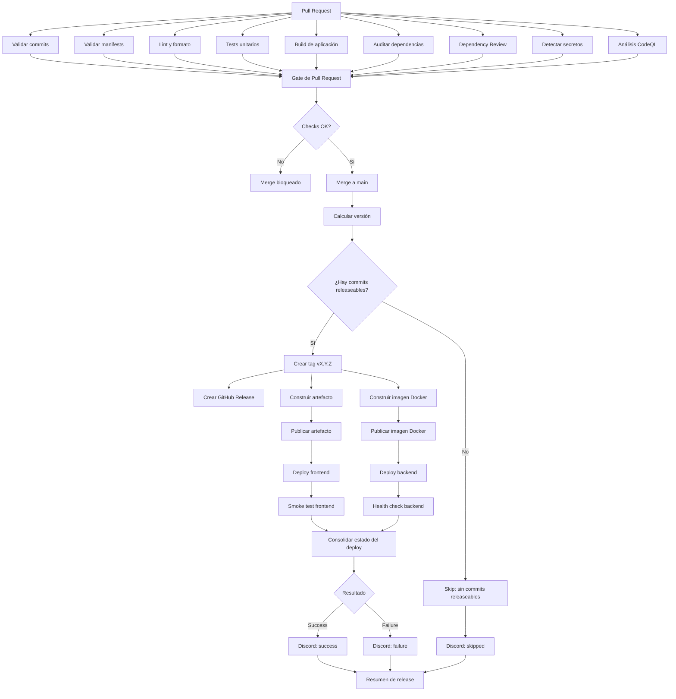

# CI/CD de Aurea

Este documento describe el flujo CI/CD objetivo para los repositorios de Aurea.
La lógica común vive en [`aurea-ci`](https://github.com/aurea-io/aurea-ci) y los
repositorios de aplicación consumen sus workflows reutilizables mediante
referencias versionadas.

## Principios

- Cada job tiene una única responsabilidad.
- Los jobs independientes se ejecutan en paralelo.
- Las dependencias entre jobs se expresan explícitamente con `needs`.
- Un merge a `main` puede generar un release, pero el deploy se dispara por el
  tag resultante.
- Los secretos viven en GitHub Secrets o Variables y nunca en el repositorio.
- Las notificaciones son informativas y no alteran el resultado real del deploy.

## Flujo general

## Pull Requests

Al abrir o actualizar un Pull Request se ejecutan en paralelo los controles que
no dependen entre sí:

| Job | Responsabilidad | Resultado esperado |
| --- | --- | --- |
| Validar commits | Comprobar Conventional Commits | Todos los commits cumplen la convención |
| Validar manifests | Verificar la estructura de módulos | Los manifests son válidos |
| Lint y formato | Revisar estilo y formato | No hay errores de calidad estática |
| Tests unitarios | Ejecutar la suite automatizada | Todos los tests pasan |
| Build | Compilar la aplicación | El artefacto se puede construir |
| Auditar dependencias | Ejecutar `npm audit` | No hay vulnerabilidades bloqueantes |
| Dependency Review | Revisar dependencias modificadas | No se incorporan vulnerabilidades de severidad bloqueante |
| Detectar secretos | Analizar cambios e historial con Gitleaks | No se encuentran secretos |
| Análisis CodeQL | Analizar vulnerabilidades en el código | No hay hallazgos bloqueantes |

El `Gate de Pull Request` sólo consolida los resultados. No compila, no ejecuta
tests y no modifica código. Si un job requerido falla, el merge queda bloqueado.

## Merge a `main` y autotag

Después de un merge a `main`:

1. `calcular versión` analiza los commits desde el último tag.
2. `release gate` determina si existe un commit `feat`, `fix`, `perf` o un
   cambio incompatible que justifique una nueva versión.
3. Si no corresponde release, se detiene la cadena de publicación y se registra
   un `skipped` con el motivo.
4. Si corresponde release, `crear tag` publica un tag anotado como `vX.Y.Z`.
5. `crear GitHub Release` genera la release y sus notas.

El versionado automático utiliza Conventional Commits:

- `fix` y `perf`: incremento patch.
- `feat`: incremento minor.
- `!` o `BREAKING CHANGE`: incremento major.

## Publicación y deploy

La creación del tag inicia el flujo de publicación. Las tareas independientes
se separan en jobs propios:

- construir artefacto;
- publicar artefacto;
- construir imagen Docker;
- publicar imagen Docker.

Una vez disponibles los artefactos requeridos, frontend y backend pueden
desplegarse en paralelo. Cada despliegue tiene su propia validación posterior:

- frontend: smoke test de la URL pública;
- backend: health check del endpoint de salud.

El job de consolidación sólo reúne los resultados de ambos checks y determina
el estado final del deploy.

## Notificaciones Discord

Discord recibe una notificación para cada resultado final:

### `success`

Se envía cuando la publicación, el deploy y las validaciones posteriores
terminaron correctamente.

### `failure`

Se envía cuando falla la publicación, el deploy o una validación posterior. El
mensaje debe identificar la etapa, el job y el repositorio afectados.

### `skipped`

Se envía cuando una etapa no corresponde o no puede continuar por una condición
conocida. El mensaje debe explicar el motivo, por ejemplo:

- no hubo commits releaseables;
- el ambiente está deshabilitado;
- no existe un artefacto requerido;
- una dependencia previa fue omitida;
- el repositorio no tiene habilitado ese tipo de deploy.

Un error al enviar la notificación no debe convertir un deploy exitoso en uno
fallido. El resultado del deploy y el resultado de la notificación se conservan
como estados independientes.

## Proyecto de seguimiento

Las tareas de CI/CD se siguen en el [Project 2 de Aurea](https://github.com/orgs/aurea-io/projects/2).
Los issues nuevos de `aurea-ci` se agregan automáticamente al proyecto.

Tareas principales:

- [#23 — Implementar flujo CI/CD por tag](https://github.com/aurea-io/aurea-ci/issues/23)
- [#24 — Separar release, publicación y deploy](https://github.com/aurea-io/aurea-ci/issues/24)
- [#25 — Notificaciones Discord triestado](https://github.com/aurea-io/aurea-ci/issues/25)
- [#26 — Actualizar consumidores y smoke tests](https://github.com/aurea-io/aurea-ci/issues/26)

