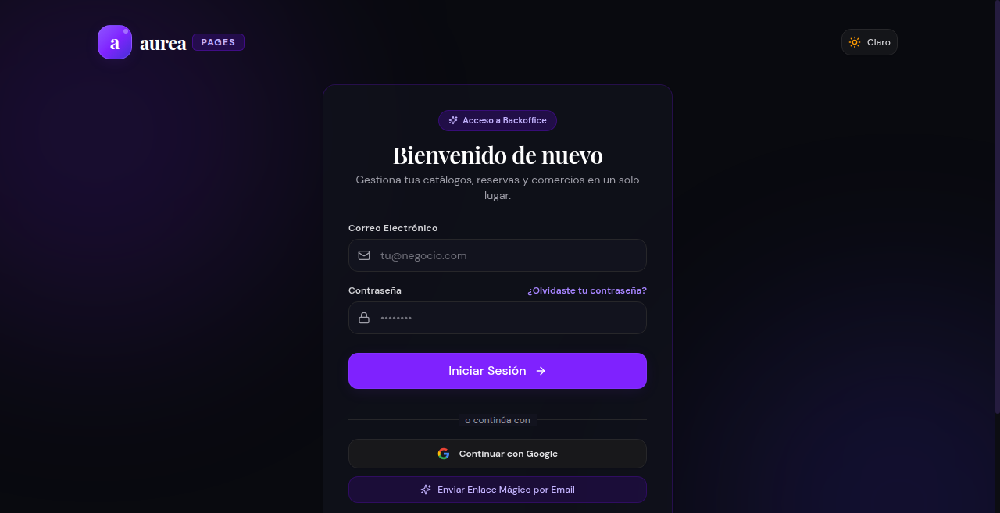
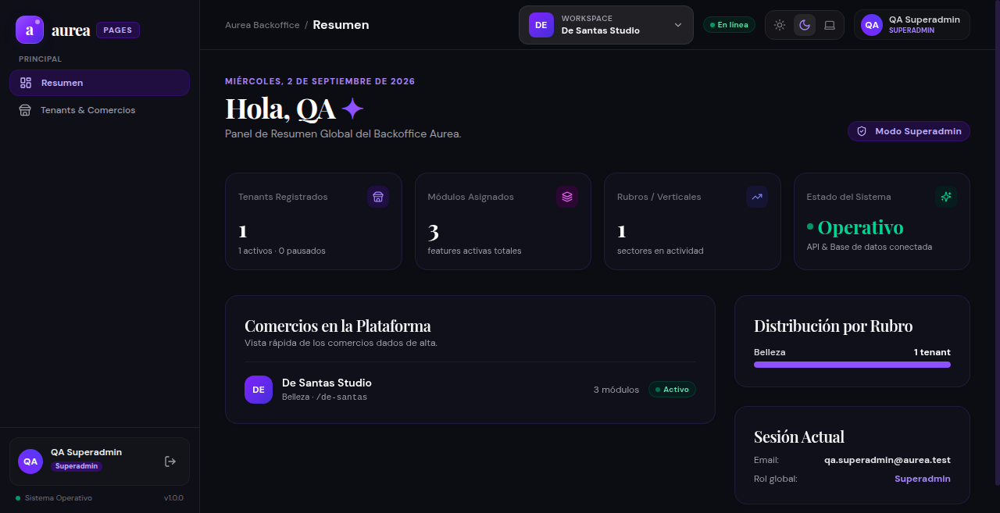
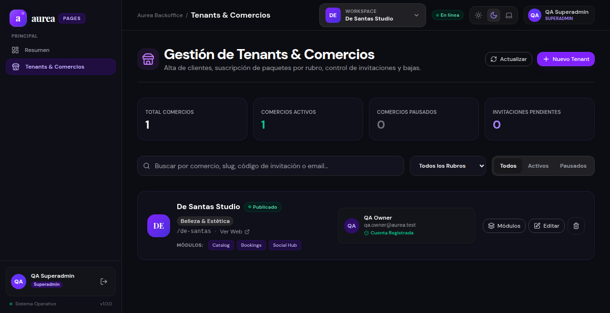
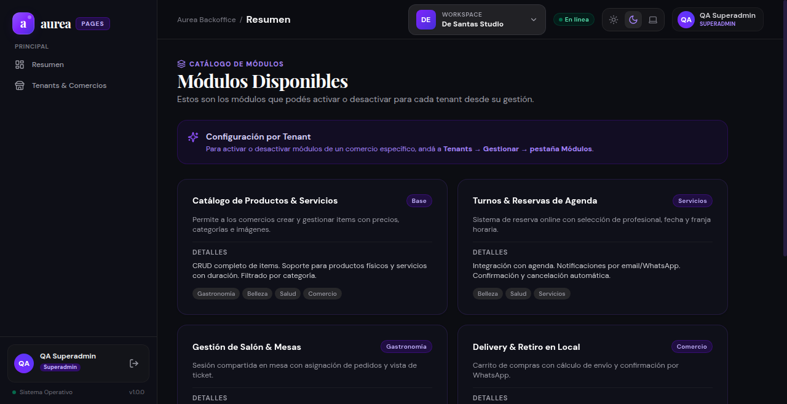
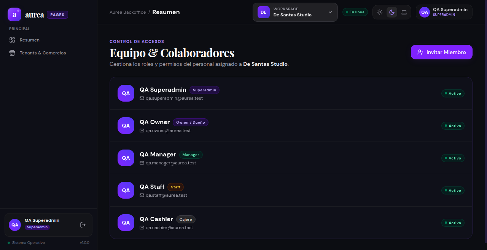
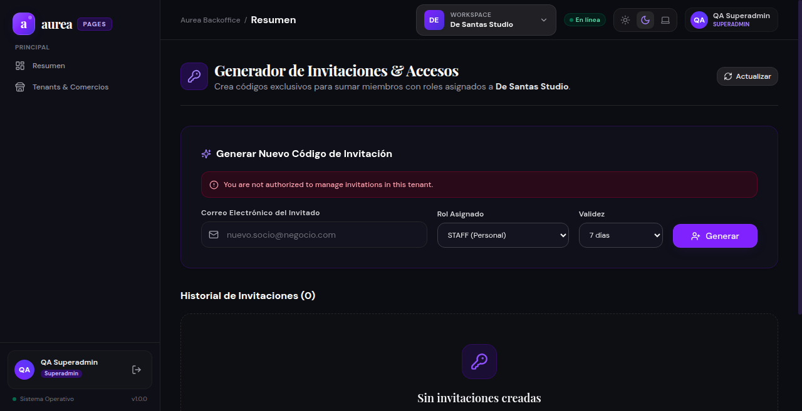
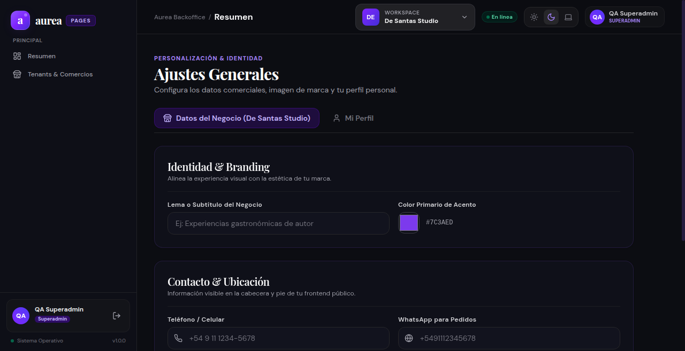
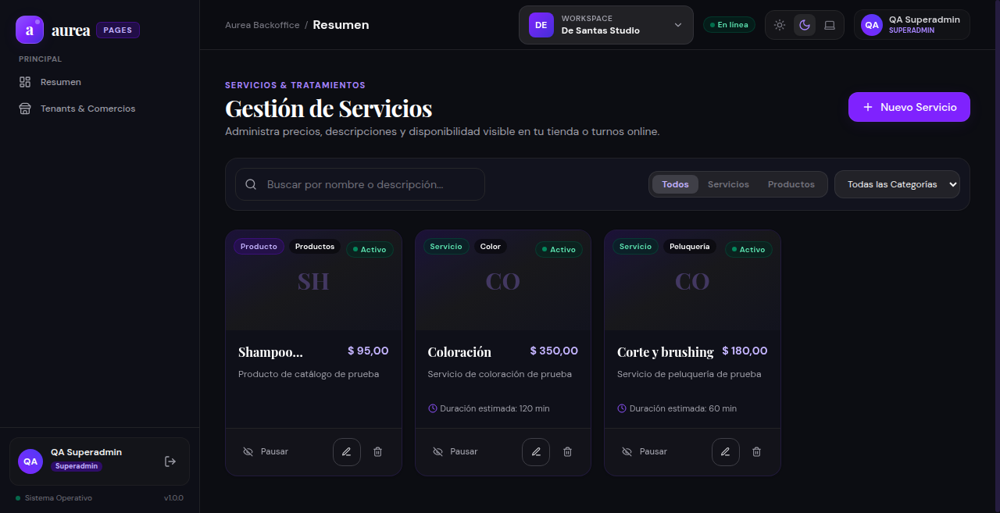
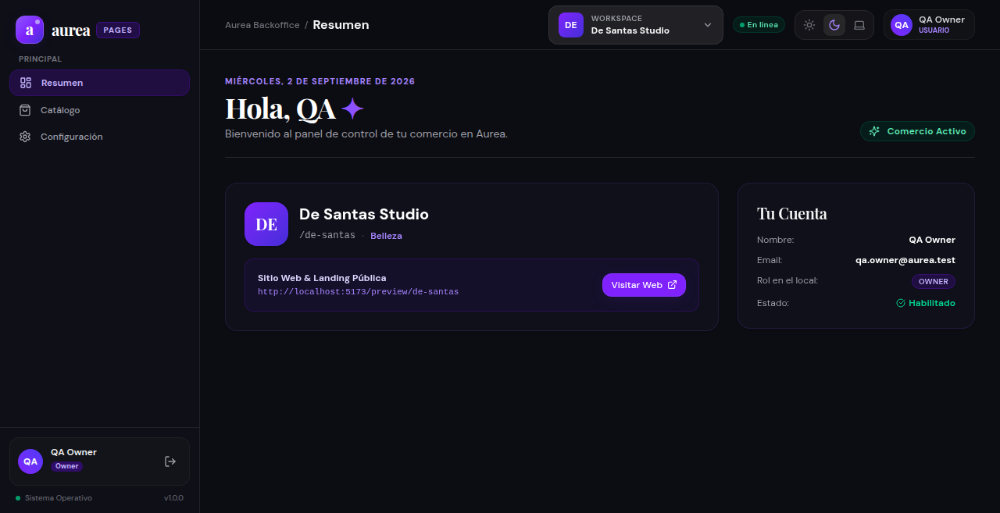
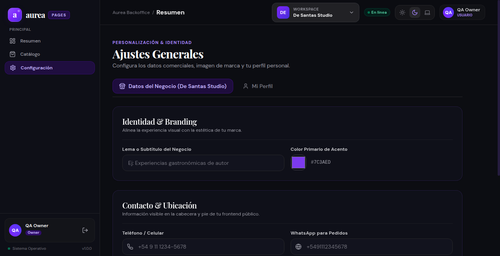

# 📊 Reporte de Evidencias de Pruebas: `26-09-02_01-03`

**Fecha de ejecución:** 2 de Septiembre de 2026, 01:03 hs  
**Navegador de pruebas:** Google Chrome `152.0.7977.64` (CDP Automation)  
**Base de Datos:** MongoDB Atlas (`aureacluster.eetryaz.mongodb.net/aurea`)  
**Estado General:** 🟢 **100% EXITOSO**

---

## 📦 Versiones de Productos en esta Ejecución

| Componente | Repositorio / Proyecto | Versión / Tag | Commit Hash |
| :--- | :--- | :---: | :---: |
| **BE Aurea** | `backoffice-be-aurea` | `v0.18.0` | `2969df8` |
| **FE Aurea** | `backoffice-fe-aurea` | `v0.1.2` | `0d90b26` |
| **BE Cliente** | N/A (Integrado en API central) | — | — |
| **FE Cliente** | `aurea-pages-template` | `v0.4.0` | `9c02589` |

---

## 🎯 1. Resumen de Ejecución y Cobertura

Esta sesión de validación verificó de forma interactiva y automatizada los flujos de autenticación, control de acceso basado en roles (RBAC) y módulos (FBAC), aislamiento multi-tenant y la correcta renderización de la interfaz en Google Chrome.

### Resultados Principales:
* **Pruebas Unitarias & Integración BE:** 12 suites / 40 tests aprobados (100%).
* **Build Frontend:** Compilación TypeScript limpia y generación de bundle PWA exitosa.
* **Pruebas E2E en Navegador (Chrome):** 10 vistas y flujos interactivos validados y capturados.
* **Seguridad y Aislamiento:** Peticiones sin `x-tenant-id` rechazadas con `400 Bad Request`; accesos cruzados denegados con `403 Forbidden`.

---

## 👥 2. Cuentas de Prueba Utilizadas (`seed:test`)

| Rol | Correo Electrónico | Contraseña | Alcance de Acceso |
| :--- | :--- | :--- | :--- |
| **`SUPERADMIN`** | `qa.superadmin@aurea.test` | `AureaTest!2026` | Acceso global a `/tenants`, `/superadmin/features` y comercios. |
| **`OWNER`** | `qa.owner@aurea.test` | `AureaTest!2026` | Acceso total al comercio `De Santas Studio` (Catálogo, Miembros, Ajustes). |
| **`MANAGER`** | `qa.manager@aurea.test` | `AureaTest!2026` | Gestión operativa de turnos, catálogo e invitaciones. |
| **`STAFF`** | `qa.staff@aurea.test` | `AureaTest!2026` | Consulta de catálogo y turnos asignados. |
| **`CASHIER`** | `qa.cashier@aurea.test` | `AureaTest!2026` | Consulta de catálogo y gestión de cobros/pedidos. |

---

## 🖼️ 3. Capturas de Pantalla y Evidencias Visuales

*(Ubicadas en la subcarpeta [`capturas/`](./capturas/))*

### 1. Pantalla de Inicio de Sesión (`/login`)
Renderizado del formulario de acceso con estética glassmorphism, soporte para tema claro/oscuro y opción de enlace mágico:

---

### 2. Panel Principal tras Login Superadmin (`/dashboard`)
Dashboard inicial con métricas del comercio y barra de navegación superior:

---

### 3. Directorio Global de Comercios (`/tenants`)
Visualización de comercios registrados, estado de publicación, métricas y filtros por rubro (Belleza & Estética):

---

### 4. Matriz de Feature Flags de la Plataforma (`/superadmin/features`)
Catálogo de módulos dinámicos activables por comercio (Catálogo, Turnos, Comandas, Delivery):

---

### 5. Gestión de Equipo y Colaboradores (`/members`)
Listado de colaboradores del tenant activo con sus respectivos roles y permisos:

---

### 6. Panel de Invitaciones (`/invitations`)
Sección de invitaciones para la incorporación de nuevos colaboradores:

---

### 7. Configuración y Branding del Tenant (`/settings`)
Panel de personalización de identidad, logotipo, paleta de colores y canales de contacto:

---

### 8. Catálogo de Servicios y Productos (`/catalog`)
Lista de servicios y productos (`Corte y brushing`, `Coloración`, `Shampoo nutritivo`) con precios en pesos argentinos (ARS) y opciones de pausado/edición:

---

### 9. Vista de Usuario OWNER (`/dashboard`)
Adaptación dinámica del Sidebar para el rol `OWNER` (ocultando el panel de SuperAdmin y mostrando sólo accesos del local):

---

### 10. Ajustes del Local por OWNER (`/settings`)
Formulario de configuración visual y de negocio accesible para el propietario:

---

## 🧪 4. Matriz de Pruebas de Seguridad y API

| Prueba | Endpoint / Método | Rol Ejecutor | Resultado Esperado | Resultado Real | Estado |
| :--- | :--- | :--- | :---: | :---: | :---: |
| Autenticación | `POST /api/auth/login` | Todos (5 roles) | `200 OK` + JWT | `200 OK` | ✅ Aprobado |
| Acceso Superadmin | `GET /api/superadmin/tenants` | `SUPERADMIN` | `200 OK` | `200 OK` | ✅ Aprobado |
| Protección Superadmin | `GET /api/superadmin/tenants` | `OWNER`, `STAFF` | `403 Forbidden` | `403 Forbidden` | ✅ Aprobado |
| Header `x-tenant-id` Obligatorio | `GET /api/catalog` | `OWNER` (sin header) | `400 Bad Request` | `400 Bad Request` | ✅ Aprobado |
| Aislamiento Cruzado de Tenant | `GET /api/catalog` | `OWNER` (tenant ajeno) | `403 Forbidden` | `403 Forbidden` | ✅ Aprobado |
| Permiso Escritura Catálogo | `POST /api/catalog` | `OWNER` | `201 Created` | `201 Created` | ✅ Aprobado |
| Restricción Escritura Catálogo | `POST /api/catalog` | `CASHIER` | `403 Forbidden` | `403 Forbidden` | ✅ Aprobado |
| Theme Service CSS | `GET /api/style/de-santas.css` | Público | `200 OK` (CSS) | `200 OK` | ✅ Aprobado |

---

## 🔍 5. Reporte de Discrepancias Detectadas vs. Documentación

Durante la auditoría exhaustiva entre la documentación técnica (`aurea-docs`, `backoffice-be-aurea/docs`, `backoffice-fe-aurea/docs`) y la base de código real se identificaron las siguientes diferencias:

1. **Endpoint de Membresías (`GET /users/me/tenants`):**
   * *Documentación:* Indica que el frontend llama a `GET /users/me/tenants` tras iniciar sesión.
   * *Código Real:* La lista de comercios se entrega directamente en el payload de respuesta de `POST /api/auth/login` (`{ accessToken, user, tenants }`) optimizando las peticiones de red.
2. **Acciones de Miembros (`PATCH|DELETE /tenant/members/:userId`):**
   * *Documentación:* Describe endpoints para modificar rol/permisos (`PATCH`) y revocar membresía (`DELETE`).
   * *Código Real:* `TenantController` sólo tiene implementados `GET` y `POST /tenant/members`.
3. **Flujo Público de Invitaciones (`/invitations/accept` y `/invitations/verify/:code`):**
   * *Documentación:* Define endpoints públicos para verificar un código y endpoint autenticado para aceptar la invitación.
   * *Código Real:* `InvitationsController` solo tiene endpoints internos del tenant (`POST`, `GET`, `DELETE`).
4. **Nombres en Zustand Store (Frontend):**
   * *Documentación:* Documenta `tenantStore.activeTenant`, `tenantStore.userTenants` y `setActiveTenant()`.
   * *Código Real:* Implementa `tenantStore.currentTenant`, `authStore.tenants` y `setCurrentTenant()`.
5. **Cardinalidad del Modelo de Tenancy (1:1 vs M:N):**
   * *Documentación inicial (`decisions.md`):* Señalaba "Un usuario pertenece a un solo tenant".
   * *Código Real / Prisma:* Implementa membresías M:N mediante `TenantUser`, permitiendo que un usuario gestione múltiples comercios.

---

## 📌 6. Tareas e Issues Creados en GitHub

Para sincronizar la documentación y completar los endpoints pendientes, se crearon formalmente los siguientes issues:

| Repositorio | Issue | Título |
| :--- | :--- | :--- |
| **`backoffice-be-aurea`** | [#82](https://github.com/aurea-io/backoffice-be-aurea/issues/82) | `feat(tenant): implementar endpoints de actualización y revocación de miembros (PATCH / DELETE /tenant/members/:userId)` |
| **`backoffice-be-aurea`** | [#83](https://github.com/aurea-io/backoffice-be-aurea/issues/83) | `feat(invitations): implementar endpoints de verificación y aceptación de invitaciones (/invitations/verify/:code y /invitations/accept)` |
| **`backoffice-fe-aurea`** | [#48](https://github.com/aurea-io/backoffice-fe-aurea/issues/48) | `docs(tenancy): sincronizar especificación de Zustand store y rutas en GESTION_USUARIOS_Y_TENANTS.md` |
| **`aurea-docs`** | [#20](https://github.com/aurea-io/aurea-docs/issues/20) | `docs(architecture): sincronizar modelo de tenancy M:N y prefijo de API en especificación de módulos dinámicos` |
