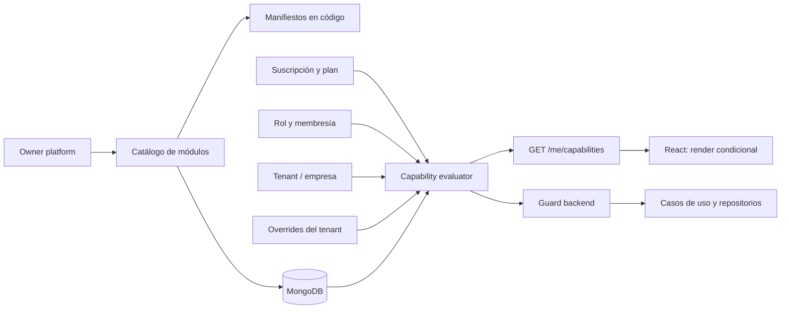
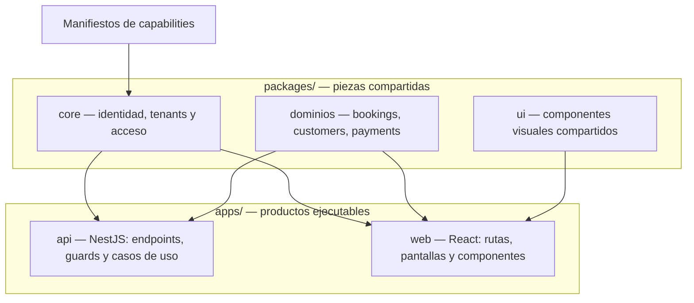
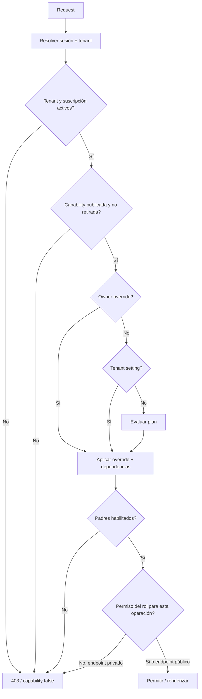
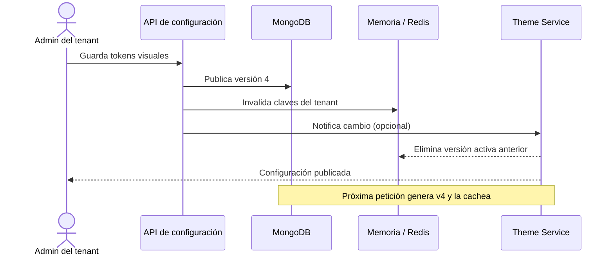
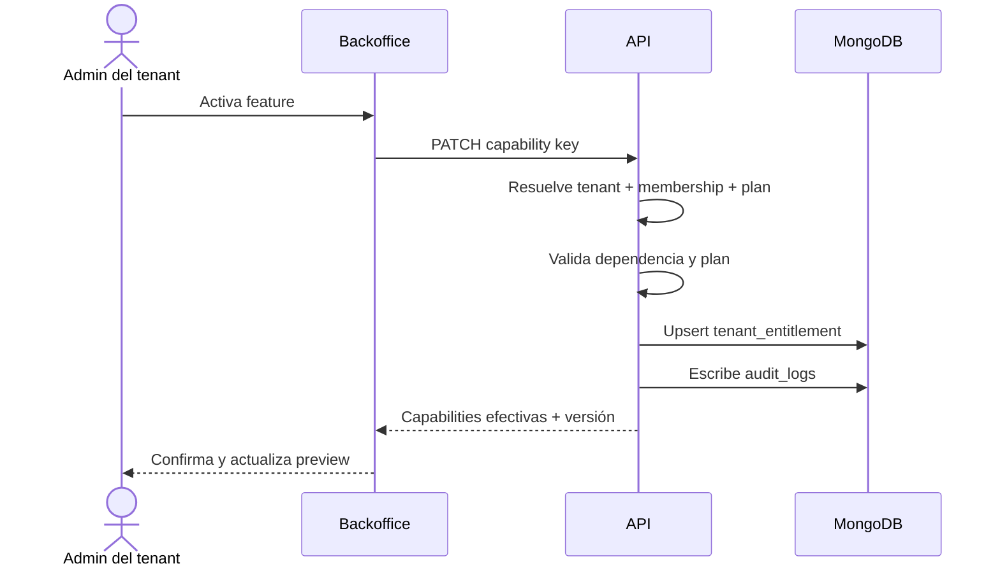
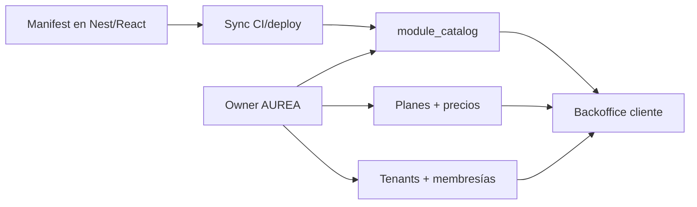

# Módulos dinámicos y capacidades por tenant

**Estado:** Propuesto para POC  
**Alcance:** configuración de producto, backoffice, API, backend, frontend y MongoDB  
**Decisión central:** el frontend puede ocultar o mostrar UI según las capacidades efectivas, pero el backend siempre vuelve a autorizar cada operación.

## 1. Problema y objetivo

Aurea Pages debe permitir que cada empresa elija qué partes de su producto quiere utilizar. Una capacidad se organiza en tres niveles:

```text
Sección: Servicios
└── Página: Reservas
    ├── Función: crear reserva
    ├── Función: reprogramar reserva
    └── Función: subir foto a la reserva
```

La misma jerarquía debe aparecer en:

- la configuración del backoffice;
- las carpetas y límites de dominio del backend;
- las rutas y componentes del frontend;
- la API que devuelve la configuración efectiva;
- la documentación y el catálogo administrado por los owners.

La recomendación es modelar el catálogo como datos versionados y establemente identificados por `key`, no como permisos inventados manualmente en cada pantalla. El catálogo puede descubrirse desde código durante el build o registrarse explícitamente mediante un manifiesto por módulo; MongoDB conserva la fuente operativa que determina qué puede usar cada empresa.

## 2. Vocabulario

| Concepto | Qué representa | Ejemplo |
| --- | --- | --- |
| `Section` | Agrupador de alto nivel visible en navegación y configuración | `services` |
| `Page` | Superficie o ruta funcional dentro de una sección | `services.bookings` |
| `Feature` | Capacidad concreta que puede habilitarse o bloquearse | `services.bookings.photo_upload` |
| `Module` | Unidad técnica desplegable que contiene páginas y features | `bookings` |
| `Plan` | Límite comercial que habilita un conjunto de capacidades | `pro` |
| `Role` | Permisos de una persona dentro del backoffice | `tenant_admin` |
| `Entitlement` | Regla que concede o deniega una capacidad a un tenant | `feature=...`, `effect=allow` |
| `Capability` | Resultado efectivo calculado para un tenant y un usuario | `services.bookings.photo_upload=true` |

`Module` es una unidad técnica/comercial; `Section`, `Page` y `Feature` son la jerarquía de navegación y configuración. No conviene usar el nombre de una ruta como permiso: las rutas cambian, las keys públicas deben ser estables.

## 2.1 Dos backoffices, dos responsabilidades

La plataforma necesita dos superficies separadas:

| Superficie | Quién la usa | Responsabilidad |
| --- | --- | --- |
| **Backoffice AUREA** | Platform owner / Platform readonly | Gestionar planes, membresías, precios, tenants, catálogo de módulos y mantenimiento global |
| **Backoffice del cliente** | Usuarios de una empresa | Gestionar el negocio de un tenant: reservas, clientes, productos, pedidos y configuración habilitada |

El backoffice AUREA no es una versión más amplia del backoffice de cliente. Tiene un contexto de plataforma y puede operar sobre muchos tenants; el backoffice de cliente siempre está limitado a uno. La separación debe existir en rutas, layouts, permisos y auditoría:

```text
/platform/*       → Backoffice AUREA
/tenant/:tenant/*  → Backoffice del cliente
/public/:slug/*    → Página pública final del tenant
```

Los únicos roles iniciales del backoffice AUREA son:

- `platform_owner`: lectura y escritura de planes, tenants, módulos, mantenimientos y membresías;
- `platform_readonly`: lectura y reportes, sin mutaciones.

Los roles del cliente (`tenant_admin`, `operator`, etc.) no deben reutilizarse para conceder acceso al backoffice AUREA. La autorización debe comprobar tanto `scope` (`platform` o `tenant`) como el permiso.

## 3. Arquitectura recomendada



### Regla de confianza

El JWT identifica al usuario y puede contener `sub`, `sessionId` y una versión de sesión. No debe ser la fuente única de plan, roles o features. El backend resuelve en cada request —con caché breve si hace falta— el tenant actual, la membresía, el plan, los overrides y el estado de la cuenta.

El cliente puede modificar el JavaScript, llamar endpoints manualmente o enviar `feature=true`. Eso solo puede alterar la interfaz local; nunca debe conceder acceso.

## 4. Organización en el repositorio

La regla más importante es separar dos cosas que suelen mezclarse:

1. **El producto ejecutable:** aplicaciones API y web.
2. **El conocimiento compartido del dominio:** paquetes reutilizables que definen reglas, contratos y capabilities.



### 4.1 Mapa de carpetas de referencia

```text
packages/
├── core/                         # reglas transversales, no una pantalla
│   ├── access/                   # capabilities, permisos y evaluación efectiva
│   │   ├── capability-catalog.ts
│   │   ├── capability-evaluator.ts
│   │   └── require-capability.ts
│   ├── tenants/                  # contexto y aislamiento por empresa
│   └── identity/                 # usuario, sesión y membresía
│
├── bookings/                     # dominio de reservas
│   ├── domain/                   # entidades y reglas puras
│   ├── application/              # casos de uso
│   ├── contracts/                # DTOs/eventos compartidos
│   └── features.ts               # manifiesto del módulo
│
├── customers/                    # dominio de clientes
├── payments/                     # dominio y adaptadores de pagos
├── orders/                       # pedidos y productos
└── ui/                           # botones, toggles, árbol y layouts comunes

apps/
├── api/                          # aplicación NestJS/Fastify
│   └── modules/
│       └── services/
│           └── bookings/
│               ├── bookings.controller.ts
│               ├── bookings.service.ts
│               └── bookings.guard.ts
└── web/                          # aplicación React
    └── src/
        ├── platform/             # Backoffice AUREA: planes, tenants y catálogo
        ├── tenant/               # Backoffice cliente: negocio de un tenant
        ├── public/               # página final pública del tenant
        └── sections/
            └── services/
                └── pages/
                    └── bookings/
                        ├── BookingsPage.tsx
                        ├── features.ts
                        └── components/
```

#### Aplicación actual de Aurea

En los repositorios de backoffice, esta convención se aplica sobre la estructura
existente sin cambiar las rutas HTTP ni las URLs del frontend:

```text
backoffice-be-aurea/src/
├── core/                                  # guards, decorators y contratos transversales
├── platform/superadmin/                   # operaciones globales de Aurea
└── tenant/
    ├── core/                              # contexto, invitaciones y configuración base
    └── sections/commerce/catalog/          # módulo commerce.catalog y su manifiesto

backoffice-fe-aurea/src/
├── core existente                          # API, stores, hooks y UI compartida
├── platform/
│   ├── superadmin/                         # tenants, features y detalle de tenant
│   └── preview/                            # preview administrado de un tenant
└── tenant/
    ├── pages/                              # dashboard, miembros, invitaciones y ajustes
    └── sections/commerce/catalog/           # página y componentes de commerce.catalog
```

Las carpetas `platform` y `tenant` son límites de autorización, no solo
agrupadores visuales. Un controlador o una página que opere sobre varios
comercios pertenece a `platform`; toda operación de negocio debe vivir bajo
`tenant` y resolver el tenant activo.

Reglas obligatorias:

1. Los endpoints de lectura en `platform` aceptan `platform_owner` o
   `platform_readonly` y no requieren `x-tenant-id`. Los endpoints de mutación
   requieren `platform_owner` o el permiso explícito de escritura
   correspondiente; `platform_readonly` nunca puede mutar.
2. Los endpoints de `tenant` requieren `x-tenant-id`; el backend debe validar
   que el usuario tenga una membresía válida antes de ejecutar el caso de uso.
3. Cada módulo de negocio se ubica en
   `tenant/sections/<section>/<page>/` y declara `section`, `page`, `scope` y
   sus features en `<module>.manifest.ts` en backend. En frontend, el contrato
   equivalente se publica como `features.ts` dentro de la misma página.
4. La feature key es estable y compartida por catálogo, guard del backend y
   `useCapability` en el frontend. El manifiesto conserva además los campos
   `section` y `page` para representar la jerarquía formal; por compatibilidad,
   los módulos existentes pueden usar una key corta como
   `catalog.items.manage`.
5. `core` puede ser importado por ambos scopes; `platform` no puede importar
   módulos operativos de `tenant` para evitar acoplamiento accidental.
6. **Correspondencia unívoca entre Feature Key y Package/Módulo (Front y Back):**
   El namespace de la capability o feature requerida en guards o decoradores
   define estrictamente el paquete, carpeta y archivo donde debe residir su
   lógica, descontando únicamente el calificador de acción final (`.read`,
   `.write`, `.create`, etc.). Por ejemplo, la lógica y endpoints de
   `createTenant` o `listTenants` (`platform.tenants.*`) deben residir en el
   paquete de dominio dedicado `platform/tenants/` (o archivo
   `platform.tenants.ts`), y nunca agruparse en un controlador paraguas genérico
   `platform.controller.ts` ni en un servicio monolítico `PlatformService`.
   Queda prohibido el uso de controladores o módulos comodín que agrupen
   subdominios disjuntos con diferentes namespaces de capabilities. Esta regla
   aplica con idéntico rigor a Backend y Frontend.

   #### Patrón estándar de decoradores (Backend y Frontend):
   Para evitar la repetición manual y propensa a typos de strings completos en
   cada método, se utiliza la composición de dominio y acción:
   * **Nivel de clase/controlador:** `@FeatureDomain('platform.tenants')` fija el
     namespace del paquete.
   * **Nivel de método:** `@RequireRead()` resuelve `${domain}.read`, y
     `@RequireWrite()` resuelve `${domain}.write` (admitiendo subacciones
     opcionales como `@RequireWrite('photo')`).
   * **Frontend:** Se utiliza el hook contextual simétrico
     `useDomainPermissions('platform.tenants')` que expone `{ canRead, canWrite }`,
     vinculando los componentes visuales directamente a su dominio sin
     hardcodear strings sueltos.

7. **Principio de Bounded Context en Carpetas (1 Carpeta = 1 Negocio / Subdominio):**
   Una carpeta física en el proyecto nunca debe agrupar más de un negocio o subdominio funcional. Queda estrictamente prohibido el uso de carpetas comodín (por ejemplo, una carpeta `restaurant/` que contenga mesas, comandas y cocina al mismo tiempo).
   
   Cada negocio debe disponer de su propia carpeta modular aislada conteniendo exclusivamente sus controladores, servicios, DTOs y manifiestos:
   * `tenant/sections/<sección>/<negocio>/` en backend y frontend.
   
   #### Mapeo Canónico de Secciones y Negocios:
   | Sección | Negocio / Subdominio | Carpeta Backend (`src/tenant/sections/`) | Carpeta Frontend (`src/tenant/sections/`) | Feature Key / Domain | Responsabilidad |
   |---|---|---|---|---|---|
   | `gastronomy` | Salón y Mesas | `gastronomy/tables/` | `gastronomy/tables/` | `tables` (`gastronomy.tables`) | Estado de mesas, layout de salón, QR y reservas de mesa |
   | `gastronomy` | Comandas y Facturación | `gastronomy/orders/` | `gastronomy/orders/` | `orders` (`gastronomy.orders`) | Pedidos, tickets de mesa, cupones y emisión fiscal |
   | `gastronomy` | Cocina / KDS | `gastronomy/kitchen/` | `gastronomy/kitchen/` | `kitchen` (`gastronomy.kitchen`) | Pantalla de cocina, estados de preparación y despacho |
   | `services` | Turnos y Citas de Servicios | `services/bookings/` | `services/bookings/` | `bookings` (`services.bookings`) | Citas, profesionales, servicios (estética, salud, etc.) |
   | `commerce` | Catálogo | `commerce/catalog/` | `commerce/catalog/` | `catalog` (`commerce.catalog`) | Artículos, categorías, modificadores |
   | `commerce` | Inventario y Stock | `commerce/inventory/` | `commerce/inventory/` | `inventory` (`commerce.inventory`) | Existencias, movimientos de stock, ajustes |
   | `commerce` | Punto de Venta | `commerce/pos/` | `commerce/pos/` | `pos_cashier` (`commerce.pos`) | Arqueo de caja, turnos de cobro presencial |
   | `crm` / `marketing` | Clientes y Fidelidad | `crm/clients/` | `crm/clients/` | `clients` (`crm.clients`) | Directorio de clientes, cupones, loyalty |

   > [!IMPORTANT]
   > **Distinción Crítica entre Turnos de Servicios (`services.bookings`) y Reservas de Salón (`tables`):**
   > El módulo `services.bookings` corresponde a la sección `services` (citas y turnos de servicios para peluquerías, consultorios, estudios). Las reservas de salón gastronómico forman parte del subdominio de salón (`tables`), evitando colisiones de capabilities entre un tenant gastronómico y uno de servicios.


### 4.2 Qué vive en cada lugar

| Carpeta | Responsabilidad | Puede decidir activación comercial | Debe conocer MongoDB |
| --- | --- | ---: | ---: |
| `packages/core/access` | Resolver si una capability está habilitada y proteger operaciones | No | No directamente |
| `packages/core/tenants` | Resolver tenant actual y evitar cruces de datos | No | A través de repositorios |
| `packages/<dominio>` | Reglas propias de reservas, clientes, pagos, etc. | No | No en `domain`; sí en infraestructura |
| `apps/api` | Exponer endpoints, autenticar, autorizar y conectar repositorios | No | Sí, mediante infraestructura |
| `apps/web/src/platform` | Administrar planes, módulos, tenants y mantenimiento | Sí, llamando API | No |
| `apps/web/src/tenant` | Operar el negocio del cliente dentro de un tenant | Solo selección permitida | No |
| `apps/web/src/public` | Renderizar la página final para clientes finales | No | No |
| `apps/web/src/sections` | Componer páginas y bloques por rubro | No; consume capabilities | No |
| `packages/ui` | Componentes visuales sin reglas de negocio | No | No |

Una forma sencilla de recordarlo:

```text
El frontend pregunta:  “¿Lo muestro?”
El backend decide:     “¿Se puede hacer?”
El catálogo describe:  “¿Qué existe?”
El plan concede:       “¿Qué puede contratarse?”
El tenant elige:       “¿Qué está activo aquí?”
El rol limita:         “¿Quién puede operarlo?”
```

### 4.3 La misma feature en todo el sistema

Tomemos `services.bookings.photo_upload`:

```text
1. packages/bookings/features.ts
   Declara que la feature existe, sus dependencias y permisos.

2. module_catalog
   Guarda nombre, categoría, estado, plan permitido y mantenimiento.

3. apps/api/modules/services/bookings
   Protege POST /bookings/:id/photo con requireCapability(...).

4. apps/web/src/sections/services/pages/bookings
   Usa useCapability(...) para mostrar el control de subida.

5. apps/web/src/platform
   Permite al owner administrar la definición global.

6. apps/web/src/tenant
   Permite al admin del cliente activarla si el plan lo permite.

7. apps/web/src/public
   Muestra el bloque de foto solo si la API pública devuelve true.
```

No se crea una carpeta global llamada `features/` llena de flags sueltos. Cada feature vive junto al dominio que la implementa; el acceso transversal se centraliza en `core/access`.

### 4.4 Manifiesto del módulo

Cada módulo publica un manifiesto con la misma key que consume el backoffice:

```ts
export const bookingsManifest = {
  module: 'bookings',
  section: 'services',
  page: 'bookings',
  scope: 'tenant',
  features: [
    { key: 'create', default: true, requiredPermissions: ['bookings:create'] },
    { key: 'photo_upload', default: false, requiredPermissions: ['bookings:write'] },
    { key: 'reschedule', default: true, requiredPermissions: ['bookings:write'] },
  ],
} as const;
```

La key completa se genera como `services.bookings.photo_upload`. El catálogo se valida en CI para detectar duplicados, features sin owner, rutas sin manifiesto o referencias a capabilities inexistentes.

## 5. Modelo MongoDB

Se recomienda separar catálogo global de configuración por tenant. Así se evita copiar el catálogo entero en cada empresa y se mantiene el aislamiento natural: las colecciones de configuración siempre llevan `tenantId`.

### 5.1 `tenants`

```js
{
  _id: ObjectId('...'),
  key: 'acme-salon',
  name: 'Acme Salon',
  status: 'active', // active | suspended | deleted
  timezone: 'America/Argentina/Buenos_Aires',
  subscriptionId: ObjectId('...'),
  createdAt: ISODate('2026-08-01T12:00:00Z'),
  updatedAt: ISODate('2026-08-20T12:00:00Z')
}
```

### 5.1.1 `users` y memberships

Cada usuario puede pertenecer a varios tenants. Los roles y permisos se
mantienen en memberships para que el mismo usuario pueda tener una combinación
distinta por tenant y para conservar la auditoría. La sesión mantiene un único
tenant activo por vez.

```js
// users
{
  _id: ObjectId('...'),
  email: 'empleado@acme.com',
  tenantId: ObjectId('...'),
  status: 'active',
  sessionVersion: 4,
  createdAt: ISODate('2026-08-01T12:00:00Z')
}

// tenant_memberships
{
  _id: ObjectId('...'),
  tenantId: ObjectId('...'),
  userId: ObjectId('...'),
  roleKeys: ['tenant_admin', 'bookings_manager'],
  status: 'active',
  createdAt: ISODate('2026-08-02T10:00:00Z'),
  updatedAt: ISODate('2026-08-20T12:00:00Z')
}
```

Para AUREA se utiliza una colección separada:

```js
// platform_memberships
{
  userId: ObjectId('...'),
  roleKey: 'platform_owner', // platform_owner | platform_readonly
  allowedCountries: ['AR'],
  status: 'active'
}
```

### 5.2 `module_catalog`

Catálogo global controlado por owners. No contiene datos propios de una empresa.

```js
{
  _id: ObjectId('...'),
  key: 'services.bookings.photo_upload',
  moduleKey: 'bookings',
  sectionKey: 'services',
  pageKey: 'bookings',
  kind: 'feature', // module | page | feature
  name: 'Subir foto a la reserva',
  description: 'Permite adjuntar una imagen desde la página de una reserva',
  status: 'active', // draft | active | deprecated | retired
  maintenance: {
    enabled: false,
    message: null,
    startsAt: null,
    endsAt: null,
    changedBy: null
  },
  version: 1,
  dependencies: ['services.bookings'],
  requiredPermissions: ['bookings:write'],
  availability: {
    plans: ['pro', 'enterprise'],
    requiresSubscription: true
  },
  source: {
    ownerTeam: 'bookings',
    manifest: 'packages/bookings/features.ts',
    autoDiscovered: true
  },
  createdAt: ISODate('2026-08-01T12:00:00Z'),
  updatedAt: ISODate('2026-08-20T12:00:00Z')
}
```

El catálogo puede generarse automáticamente desde manifiestos en código y sincronizarse con un job idempotente. Los owners siguen aprobando el alta, el nombre comercial, el plan y el estado de publicación; automatizar el descubrimiento no significa permitir que código no revisado se active solo.

El estado `maintenance.enabled` es una pausa operativa global. Sirve para deshabilitar temporalmente una función o módulo por un incidente o despliegue, sin modificar lo que cada tenant contrató. El frontend puede mostrar un mensaje de mantenimiento; el backend debe responder `503 CAPABILITY_MAINTENANCE` para operaciones de escritura.

### 5.3 `plans`

```js
{
  _id: ObjectId('...'),
  key: 'pro',
  name: 'Pro',
  status: 'active',
  price: { amount: 29900, currency: 'ARS', interval: 'month' },
  membershipPolicy: { trialDays: 14, gracePeriodDays: 3 },
  capabilityRules: [
    { key: 'services', effect: 'allow' },
    { key: 'services.bookings', effect: 'allow' },
    { key: 'services.bookings.photo_upload', effect: 'allow' },
    { key: 'payments', effect: 'deny' }
  ],
  credits: { monthly: 100, rollover: false },
  includedModules: ['services.bookings', 'inventory'],
  limits: { bookingsPerMonth: 500, storageBytes: 1073741824 },
  version: 3,
  createdAt: ISODate('2026-08-01T12:00:00Z'),
  updatedAt: ISODate('2026-08-20T12:00:00Z')
}
```

Planes, membresías y precios se administran desde el backoffice AUREA. El precio debe tener moneda e intervalo explícitos; los cambios no deben sobrescribir el precio histórico de facturas o suscripciones existentes. Para producción conviene guardar una versión o `priceId` inmutable.

Para catálogos grandes, `capabilityRules` puede normalizarse en `plan_entitlements`; para el POC embebido facilita leer el plan completo. El plan no debe ser editable por un usuario del tenant.

Los créditos habilitan la selección de módulos; no sustituyen los límites operativos del módulo. Reservas, stock, empleados y sucursales se contabilizan y controlan dentro de sus dominios.

### 5.3.1 `plan_prices` y `tenant_addons`

Los precios se versionan y no se sobrescriben:

```js
// plan_prices
{
  planKey: 'pro',
  priceId: 'pro-ars-monthly-v3',
  amount: 29900,
  currency: 'ARS',
  interval: 'month',
  validFrom: ISODate('2026-08-01T00:00:00Z'),
  validUntil: null
}

// tenant_addons
{
  tenantId: ObjectId('...'),
  addonKey: 'credits_100',
  credits: 100,
  status: 'active',
  renews: true,
  validUntil: ISODate('2026-09-01T00:00:00Z')
}
```

### 5.4 `subscriptions`

```js
{
  _id: ObjectId('...'),
  tenantId: ObjectId('...'),
  planKey: 'pro',
  status: 'active', // trialing | active | past_due | canceled
  currentPeriodStart: ISODate('2026-08-01T00:00:00Z'),
  currentPeriodEnd: ISODate('2026-09-01T00:00:00Z'),
  provider: { name: 'internal', customerRef: 'cus_123' },
  createdAt: ISODate('2026-08-01T12:00:00Z'),
  updatedAt: ISODate('2026-08-20T12:00:00Z')
}
```

La política de acceso se deriva de `status` y `gracePeriodEndsAt`:

```js
{
  status: 'past_due',
  gracePeriodEndsAt: ISODate('2026-09-15T00:00:00Z'),
  accessPolicy: 'admin_blocked_public_active'
}
```

### 5.5 `roles` y `memberships`

Los roles son globales o de plataforma; la pertenencia es siempre tenant-scoped.

```js
// roles
{
  _id: ObjectId('...'),
  key: 'operator',
  scope: 'tenant',
  permissions: ['bookings:read', 'bookings:write', 'customers:read'],
  managedBy: 'platform'
}

// memberships
{
  _id: ObjectId('...'),
  tenantId: ObjectId('...'),
  userId: ObjectId('...'),
  roleKeys: ['operator'],
  status: 'active',
  createdAt: ISODate('2026-08-02T10:00:00Z'),
  updatedAt: ISODate('2026-08-20T12:00:00Z')
}
```

Nunca se debe aceptar `tenantId` del body para decidir el tenant. Si el usuario administra varias empresas, el tenant activo sale de la sesión/subdominio y se comprueba contra `memberships`.

### 5.6 `tenant_entitlements`

Esta colección representa la elección de la empresa y los casos excepcionales aprobados por owners.

```js
{
  _id: ObjectId('...'),
  tenantId: ObjectId('...'),
  capabilityKey: 'services.bookings.photo_upload',
  effect: 'allow', // allow | deny
  source: 'tenant_setting', // plan | tenant_setting | owner_override | migration
  creditCost: 0,
  creditAllocationId: null,
  expiresAt: null,
  reason: 'Habilitado por el administrador de Acme',
  changedBy: ObjectId('...'),
  createdAt: ISODate('2026-08-20T12:00:00Z'),
  updatedAt: ISODate('2026-08-20T12:00:00Z'),
  version: 2
}
```

Un tenant puede desactivar una feature que su plan permite. No puede activar una feature que el plan no concede, salvo un `owner_override` explícito. El sistema debe materializar o calcular la cascada: si se desactiva `services`, todo lo que cuelga de esa sección queda inactivo aunque tenga un `allow` propio.

### 5.7 `audit_logs`

```js
{
  _id: ObjectId('...'),
  tenantId: ObjectId('...'), // null solo para acciones platform-scoped
  actor: { userId: ObjectId('...'), type: 'tenant_user' },
  action: 'capability.updated',
  target: { capabilityKey: 'services.bookings.photo_upload' },
  before: { effect: 'deny' },
  after: { effect: 'allow' },
  requestId: 'req_abc',
  createdAt: ISODate('2026-08-20T12:00:00Z')
}
```

## 6. Índices y aislamiento

```js
db.module_catalog.createIndex({ key: 1 }, { unique: true });
db.tenants.createIndex({ key: 1 }, { unique: true });
db.memberships.createIndex({ tenantId: 1, userId: 1 }, { unique: true });
db.tenant_entitlements.createIndex({ tenantId: 1, capabilityKey: 1 }, { unique: true });
db.tenant_entitlements.createIndex({ tenantId: 1, expiresAt: 1 });
db.subscriptions.createIndex({ tenantId: 1, status: 1 });
db.users.createIndex({ tenantId: 1, email: 1 }, { unique: true });
db.tenant_memberships.createIndex({ tenantId: 1, userId: 1 }, { unique: true });
db.platform_memberships.createIndex({ userId: 1 }, { unique: true });
db.plan_prices.createIndex({ planKey: 1, priceId: 1 }, { unique: true });
db.tenant_branding.createIndex({ tenantId: 1, version: 1 }, { unique: true });
db.tenant_branding.createIndex({ publicThemeId: 1 }, { unique: true });
db.audit_logs.createIndex({ tenantId: 1, createdAt: -1 });
```

Toda consulta de negocio debe comenzar con el filtro de contexto:

```ts
bookings.find({ tenantId: auth.tenantId, _id: bookingId });
```

El repositorio debe recibir un `TenantContext` obligatorio para impedir consultas sin tenant por accidente. Se agregan pruebas de acceso cruzado para cada colección y endpoint.

## 7. Evaluación efectiva

### Precedencia

1. tenant suspendido o suscripción fuera de política: aplicar `accessPolicy`;
2. capability existente, publicada y fuera de mantenimiento;
3. owner override explícito;
4. regla del plan y créditos disponibles;
5. selección/deny del tenant;
6. estado de dependencias y padres;
7. rol y permisos del usuario para operaciones privadas;
8. límite operativo del módulo.

La UI pública no debería depender del rol de backoffice. Para ella se calcula una vista pública de capabilities; para `/api/v1/admin/*` se agregan membership y permisos.



Pseudocódigo:

```ts
async function can(ctx: RequestContext, key: string, action?: string) {
  const catalog = await catalogRepo.get(key);
  if (!catalog || catalog.status !== 'active') return false;
  if (!ctx.tenant || ctx.tenant.status !== 'active') return false;
  if (!subscriptionPolicyAllows(ctx.subscription, catalog, ctx.operation)) return false;

  const rule = await entitlementResolver.resolve(ctx.tenant.id, key, catalog);
  if (rule.effect !== 'allow') return false;
  if (!(await creditsAreAvailable(ctx.tenant.id, catalog))) return false;
  if (!(await parentsAreEnabled(ctx.tenant.id, catalog))) return false;
  if (action && !ctx.permissions.includes(action)) return false;
  return true;
}
```

Para rendimiento, `resolveCapabilities` puede cargar catálogo + plan + overrides en paralelo, expandir padres e hijos en memoria y guardarse 30–60 segundos por `tenantId:userId:catalogVersion`. Al cambiar una configuración se invalida la caché de ese tenant.

## 8. API

### Capacidades efectivas

```http
GET /api/v1/me/capabilities?surface=public
Authorization: Bearer <session-token>
```

Respuesta sugerida:

```json
{
  "tenant": { "id": "...", "key": "acme-salon", "name": "Acme Salon" },
  "catalogVersion": 12,
  "capabilities": {
    "services": true,
    "services.bookings": true,
    "services.bookings.create": true,
    "services.bookings.photo_upload": false,
    "services.bookings.reschedule": true,
    "payments": false
  },
  "limits": { "bookingsPerMonth": 500, "storageBytes": 1073741824 },
  "generatedAt": "2026-08-20T12:00:00Z"
}
```

No devolver reglas internas, nombres de colecciones ni permisos de plataforma a una página pública. Para el backoffice puede existir `surface=admin`, con `source` y `reason` visibles a usuarios autorizados.

### Configuración del tenant

```http
GET   /api/v1/admin/capabilities/tree
PATCH /api/v1/admin/capabilities/:key
```

```json
{ "enabled": true }
```

El servidor valida que la key exista, que sea configurable por tenant, que el plan la permita y que la persona tenga `capabilities:manage`. Devuelve la configuración recalculada, no solo el documento escrito.

### Operaciones de negocio

```http
POST /api/v1/bookings/:id/photo
```

El endpoint ejecuta `requireCapability('services.bookings.photo_upload')` además de comprobar tenant, ownership del booking, tamaño/tipo del archivo y permiso de escritura. Ocultar el botón no reemplaza este guard.

## 9. Frontend React

El frontend carga capabilities una vez por contexto de tenant y las expone con un hook:

```tsx
const { enabled, loading } = useCapability('services.bookings.photo_upload');

if (loading) return <Skeleton />;
return enabled ? <BookingPhotoUpload bookingId={booking.id} /> : null;
```

Para páginas completas:

```tsx
<CapabilityRoute capability="services.bookings">
  <BookingsPage />
</CapabilityRoute>
```

El hook solo controla UX y navegación. Ante un `403 CAPABILITY_DISABLED`, la app refresca capabilities, muestra un mensaje neutro y no intenta “forzar” la operación.

La respuesta de capabilities no debe persistirse indefinidamente en `localStorage`: usar memoria, React Query o una caché con TTL corto y limpiar al cambiar de tenant.

## 9.1 Theming multi-tenant sin CSS almacenado como archivo

La personalización visual debe vivir en MongoDB como **tokens estructurados**, no como un bloque de CSS libre. Un servicio backend se encarga de transformar esos tokens en CSS y servirlo como respuesta HTTP.

```text
GET /themes/{tenantKey}.css?v=3
        ↓
Theme Service
        ↓ hit                         ↓ miss
Cache memoria / Redis              MongoDB
        ↓                             ↓
     CSS generado ←────── Generador seguro de CSS
```

Esto evita duplicar código por cliente y también evita administrar archivos CSS individuales. El servidor solo consulta MongoDB y genera el CSS cuando la versión solicitada todavía no está en caché.

### Endpoint de tema

```http
GET /api/v1/style/:publicThemeId.css?v=3
```

Respuesta:

```http
Content-Type: text/css; charset=utf-8
Cache-Control: public, max-age=300, stale-while-revalidate=3600
ETag: "acme-salon-theme-v3"
```

El frontend lo carga como una hoja de estilos normal:

```tsx
<link
  rel="stylesheet"
  href={`${apiBaseUrl}/api/v1/style/${theme.publicThemeId}.css?v=${theme.version}`}
/>
```

Si el navegador ya tiene esa versión, envía `If-None-Match` y el servicio responde `304 Not Modified`, sin devolver nuevamente el CSS.

### Documento de MongoDB

```js
{
  tenantId: ObjectId('...'),
  publicThemeId: '123123123',
  version: 3,
  status: 'published', // draft | published | archived
  tokens: {
    colors: {
      primary: '#B94E32',
      primaryContrast: '#FFFFFF',
      background: '#FAF8F4',
      surface: '#FFFFFF',
      text: '#262626',
      mutedText: '#6B6B6B',
      border: '#E4DED7'
    },
    typography: {
      headingFont: 'DM Sans',
      bodyFont: 'DM Sans'
    },
    shape: {
      radius: 'medium',
      buttonStyle: 'rounded'
    },
    layout: {
      density: 'comfortable',
      maxContentWidth: '1180px'
    }
  },
  updatedBy: ObjectId('...'),
  createdAt: ISODate('2026-08-31T12:00:00Z'),
  updatedAt: ISODate('2026-08-31T12:00:00Z')
}
```

El CSS base, el responsive y la estructura de componentes siguen siendo código compartido. MongoDB solo define valores y variantes soportadas:

```css
:root {
  --color-primary: #b94e32;
  --color-background: #faf8f4;
  --color-text: #262626;
  --radius-card: 16px;
}
```

### Caché y resistencia al tráfico

El Theme Service nunca debe hacer una consulta a MongoDB por cada visita:

1. **Browser cache:** conserva el CSS por `max-age`.
2. **ETag:** evita transferir contenido sin cambios.
3. **Memoria local:** cada instancia conserva el CSS generado.
4. **Redis opcional:** comparte la caché entre instancias.
5. **MongoDB:** se usa solo ante un miss o cuando se publica una nueva versión.

Clave sugerida:

```text
theme:{tenantId}:v{version}
```

Para varias instancias, Redis evita que cada instancia regenere el mismo tema. Si el tráfico público crece mucho, un CDN puede cachear la respuesta HTTP sin convertir el tema en un archivo administrado manualmente; el origen sigue siendo el Theme Service.

### Publicación e invalidación

Cada cambio crea una nueva versión:

```text
v1 → v2 → v3 → v4
```

La página solicita la versión publicada actual. Las versiones anteriores pueden permanecer cacheadas hasta expirar; no hace falta invalidar globalmente.



### Organización del servicio

```text
apps/api/
└── modules/
    └── themes/
        ├── themes.controller.ts       # GET /style/:publicThemeId.css
        ├── themes.service.ts          # resolver tenant y versión publicada
        ├── theme-cache.ts             # memoria + Redis
        ├── css-generator.ts            # tokens → CSS variables
        ├── theme-validator.ts         # whitelist y contraste
        └── themes.repository.ts       # acceso tenant-scoped a MongoDB
```

Si el volumen lo justifica, el módulo puede extraerse a `apps/theme-service/` y escalar independientemente de reservas, pagos y operaciones administrativas.

### Seguridad del generador

No se debe aceptar `customCss` libre en MongoDB. El generador solo admite propiedades conocidas y valores validados:

- colores con formato válido y contraste mínimo;
- fuentes desde una whitelist;
- radios, tamaños y densidades desde enums;
- URLs de imágenes provenientes de storage permitido;
- sin `@import`, `url()` arbitrarios, scripts ni expresiones CSS;
- tenant activo y slug válido.

El admin del cliente solo puede modificar el documento de su tenant. `Owner` puede administrar defaults y políticas globales; `Readonly` solo puede consultar.

### Decisión

La estrategia adoptada para el POC es:

```text
Tokens en MongoDB
+ Theme Service que genera CSS bajo demanda
+ Caché en memoria y Redis cuando haya múltiples instancias
+ ETag y versionado en la URL
+ CSS base compartido en código
+ Assets servidos por storage/CDN
```

El objetivo es que el tráfico de visitas públicas no se traduzca en consultas constantes a MongoDB ni en regeneraciones repetidas de CSS.

## 10. Pantalla del backoffice

La pantalla recomendada es un árbol navegable:

```text
Módulos y funciones
├── Servicios                         [Sección activa]
│   ├── Reservas                      [Página]
│   │   ├── Crear reservas             [Activo]
│   │   ├── Reprogramar turno          [Activo]
│   │   └── Subir foto a la reserva    [Disponible en Pro · Inactivo]
│   └── Catálogo                       [Página]
├── Ventas
└── Operación
```

Cada fila debe mostrar: nombre, descripción breve, estado efectivo, plan requerido, dependencia faltante, quién lo cambió y fecha de actualización. Si el plan no lo permite, el control aparece bloqueado con CTA comercial; no debe parecer un error técnico.

Flujo de activación:



En el backoffice AUREA, la navegación principal debe priorizar:

```text
Planes y membresías
Tenants
Módulos y categorías
Mantenimiento
Usuarios y roles
Auditoría
```

En el backoffice del cliente, el árbol se filtra por las capabilities efectivas del tenant y se presenta con el vocabulario del rubro:

```text
Negocio
├── Reservas        (si services.bookings está activo)
├── Clientes        (si customers está activo)
├── Menú / Catálogo (según vertical)
├── Pedidos         (si orders está activo)
└── Pagos           (si payments está activo)
```

La página final pública también se selecciona por vertical (`turnos`, `restaurante`, `stock`, etc.), pero sus bloques concretos se resuelven con el mismo mapa de capabilities. Así se evita que una página pública muestre un formulario para una función que el tenant desactivó.

## 11. Descubrimiento automático del catálogo

La opción equilibrada es un registro híbrido:

1. cada módulo define un manifiesto tipado en su carpeta;
2. un script CI escanea manifiestos y genera un `catalog.snapshot.json`;
3. el deploy sincroniza el snapshot con `module_catalog` usando `upsert` por key;
4. los owners aprueban publicación y reglas comerciales desde un panel de plataforma;
5. retirar una feature la marca como `deprecated`/`retired`, nunca la borra si hay datos históricos.

Esto reduce duplicación entre código y admin, pero conserva control sobre precios, copy comercial y compatibilidad. No se recomienda inferir capabilities leyendo nombres de carpetas en runtime: es frágil, difícil de versionar y no expresa dependencias ni permisos.

El descubrimiento debe sincronizar solo la definición técnica. La activación global, la categoría comercial, el precio del plan y el mantenimiento siguen siendo decisiones del owner:



## 12. Ciclo de vida y datos históricos

- Desactivar una página evita nuevas operaciones y la quita de navegación.
- Las reservas existentes permanecen accesibles a través de un flujo de migración o lectura mínima.
- Desactivar una feature de escritura no borra datos creados por ella.
- Una feature `retired` debe tener migración, reemplazo o política de solo lectura.
- Los cambios comerciales se auditan y tienen versión.
- Las dependencias se validan al desactivar: el sistema debe avisar qué páginas hijas quedarían inactivas.

## 13. Pruebas mínimas

| Caso | Resultado esperado |
| --- | --- |
| Tenant A llama recurso de tenant B | `404` o `403`, nunca datos |
| Usuario edita el JWT para agregar plan Pro | backend lo ignora |
| Plan Basic activa feature Pro | `409 CAPABILITY_NOT_INCLUDED` |
| Admin desactiva una página padre | hijos quedan efectivos en `false` |
| Feature desactivada llama endpoint directo | `403 CAPABILITY_DISABLED` |
| Rol operador abre pantalla permitida pero intenta administrar catálogo | `403 INSUFFICIENT_PERMISSION` |
| Suscripción vencida | features comerciales denegadas según grace period |
| Repetir PATCH con mismo payload | operación idempotente, un evento lógico |
| Cambiar de tenant en la misma sesión | se purga caché y se recalculan capacidades |
| Catálogo contiene key duplicada | CI/deploy falla antes de publicar |

## 14. Decisiones sugeridas para el POC

- Usar `tenantId` obligatorio en todas las colecciones de negocio.
- Mantener `module_catalog` global y `tenant_entitlements` por tenant.
- Resolver capacidades en backend y entregar un mapa plano al frontend.
- Definir precedencia explícita: override owner > setting tenant > plan > default, siempre respetando padres y estado del catálogo.
- Separar `capability` de `permission`: una empresa puede tener contratada una feature, pero un operador puede no tener permiso para administrarla.
- Empezar con manifiestos tipados y sincronización automática al deploy.
- Agregar caché breve e invalidación por tenant cuando el volumen lo justifique.
- Implementar en la POC dos layouts separados: `PlatformBackoffice` y `TenantBackoffice`.
- Usar únicamente `Owner` y `Readonly` para el alcance platform en la primera versión.
- Tratar mantenimiento global como estado distinto de la selección del tenant.

## 15. Pendientes antes de producción

1. Definir proveedor y estados exactos de suscripción.
2. Definir si un tenant puede tener varios planes/add-ons simultáneos.
3. Establecer grace period y comportamiento cuando vence un plan.
4. Definir si se permiten overrides temporales y quién los aprueba.
5. Definir qué features son públicas y cuáles solo de backoffice.
6. Elegir mecanismo de upload y límites de almacenamiento.
7. Acordar formato de errores y observabilidad de denegaciones.
8. Definir migraciones para módulos retirados.
