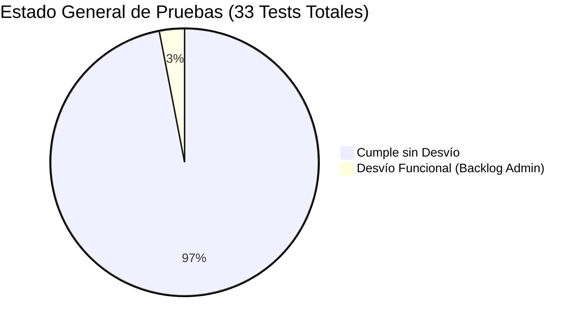

# 🧪 Hub Central de Testing E2E Automatizado y Reportes de Auditoría

Este directorio centraliza las suites de pruebas automatizadas de interfaz de usuario (Frontend E2E) y los reportes formales de aseguramiento de calidad (QA) y experiencia de usuario (UX/UI) para todo el ecosistema digital de **Áurea**.

Las pruebas han sido diseñadas bajo el principio estricto de **Tolerancia Cero** y documentadas con el estándar riguroso de Aurea para permitir su inspección y análisis inequívoco tanto por ingenieros humanos como por modelos y agentes de **Inteligencia Artificial**.

---

## 🗺️ Estructura de Suites y Reportes

| Subcarpeta | Ámbito de Prueba | Puerto Local | Tests Ejecutados | Dictamen | Reporte Detallado |
| :--- | :--- | :---: | :---: | :---: | :--- |
| Subcarpeta | Ámbito de Prueba | Puerto Local | Tests Ejecutados | Dictamen | Reporte Detallado |
| :--- | :--- | :---: | :---: | :---: | :--- |
| **`admin/`** | Backoffice Central de Plataforma (Aurea Admin) | `:5174` / `:3002` | 11 pruebas | 🟡 10/11 Cumple (1 Desvío Backlog) | [Ver Reporte Admin](./admin/README.md) |
| **`business/`** | Backoffice Multitenant para Comercios | `:5173` / `:3001` | 14 pruebas | 🟢 14/14 Cumple | [Ver Reporte Business](./business/README.md) |
| **`client/`** | Portal Público y Experiencia de Consumidor (PWA) | `:5175` / `:3003` | 8 pruebas | 🟢 8/8 Cumple (100% Desacoplado) | [Ver Reporte Client](./client/README.md) |

---

## 🚀 Cómo Reproducir las Suites de Pruebas

Cada subcarpeta contiene su propio runner automatizado en Node.js impulsado por **Playwright** (Chromium Headless). Para reproducir las pruebas en cualquier momento:

### 1. Requisitos Previos
Asegurarse de que los servicios locales se encuentren levantados y conectados al cluster de MongoDB Atlas:
- `admin-frontend` en `http://localhost:5174` y `admin-backend` en `http://localhost:3002`.
- `business-frontend` en `http://localhost:5173` y `business-backend` en `http://localhost:3001`.
- `client-frontend` en `http://localhost:5175` y `client-backend` en `http://localhost:3003`.

### 2. Comandos de Ejecución

```bash
# Ejecutar suite de pruebas de Admin Platform:
node docs/testing/admin/run_admin_tests.mjs

# Ejecutar suite de pruebas de Business Backoffice:
node docs/testing/business/run_business_tests.mjs

# Ejecutar suite de pruebas de Client & Portal Público:
node docs/testing/client/run_client_tests.mjs
```

Cada ejecución actualiza automáticamente las capturas en `capturas/` a resolución nativa y regenera el manifiesto JSON de resultados.

---

## 📊 Matriz Consolidada de Estado de Calidad



### Resumen de Hallazgos Clave para Agentes IA
1. **Admin Platform:** 10/11 pruebas cumplidas. Seguridad y guardias de ruta operativas al 100%, directorio de tenants y catálogo de planes en vivo. Desvío menor documentado en la creación manual de planes desde la UI.
2. **Business Platform:** 14/14 pruebas cumplidas al 100%. Autogestión de módulos, inventario en tiempo real, terminal POS táctil, turnos y cocina KDS completamente funcionales. Rutas públicas removidas de su alcance de gestión.
3. **Client Experience (PWA):** 8/8 pruebas cumplidas al 100%. Aplicación desacoplada corriendo autónomamente en `:5175` con API en `:3003`. Carrito en vivo, emisión de tickets de pedido takeaway/delivery, reservas de turnos y diseño responsive mobile verificado.
