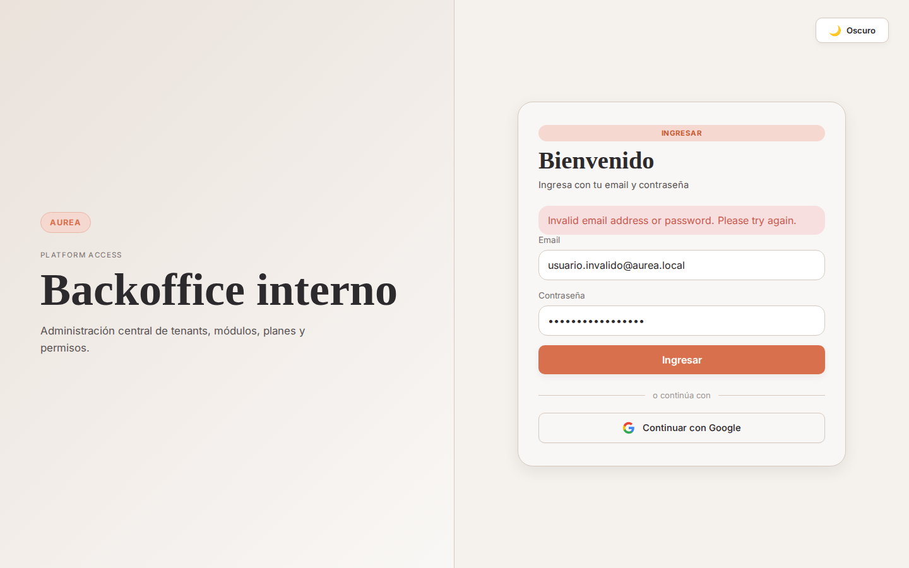
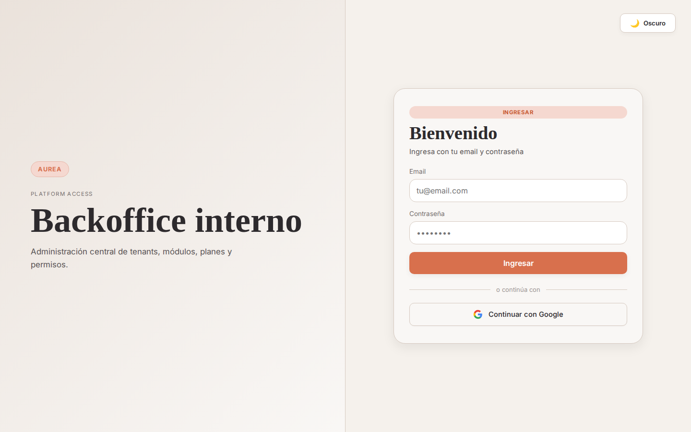
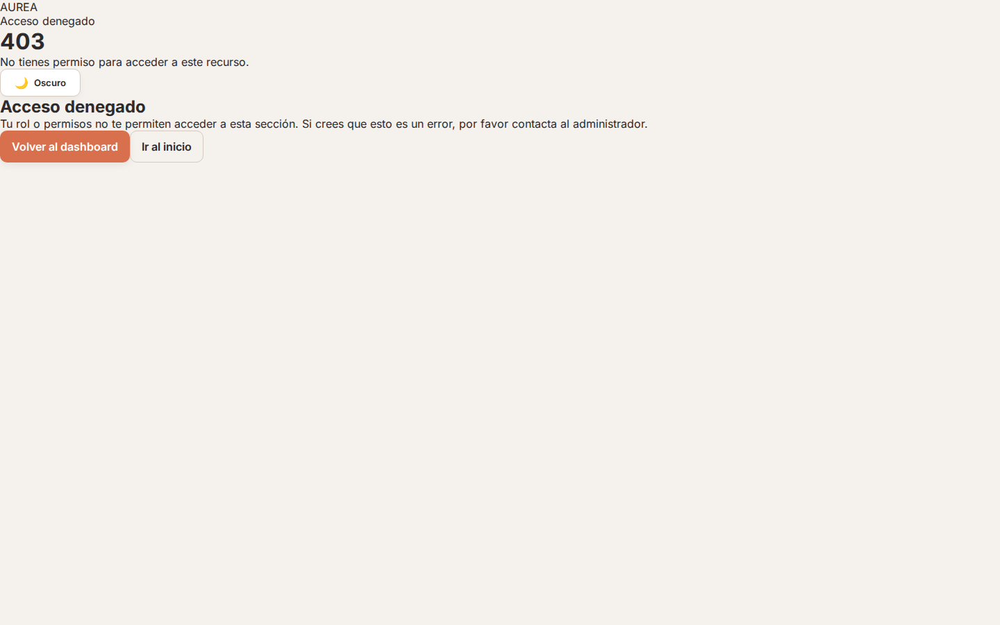
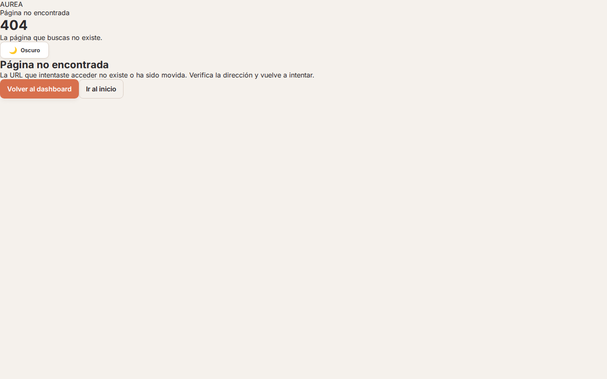
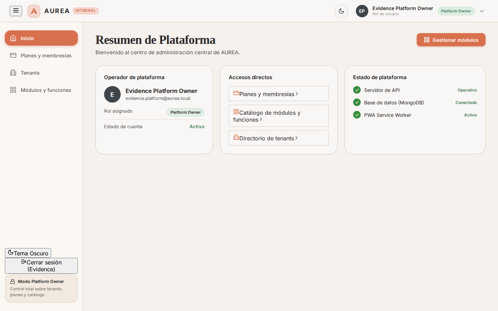
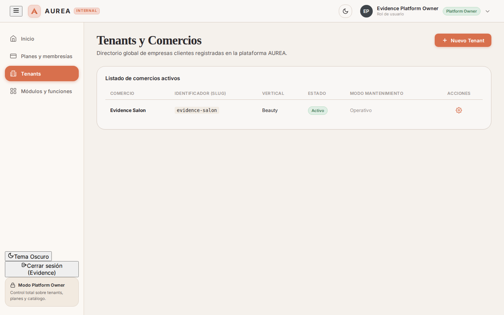
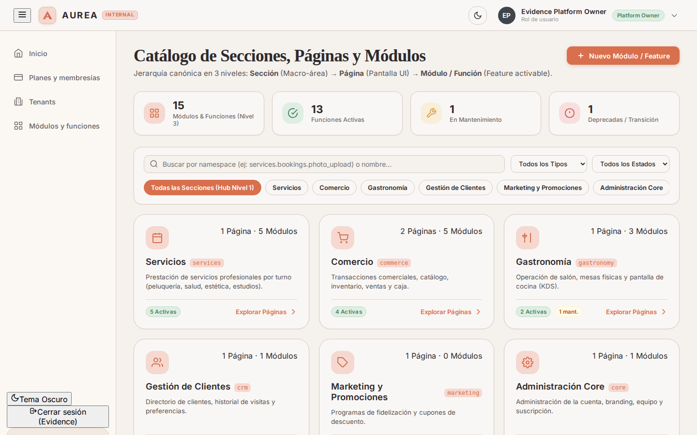
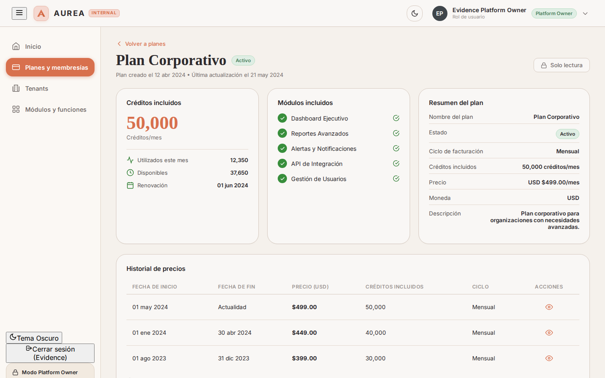
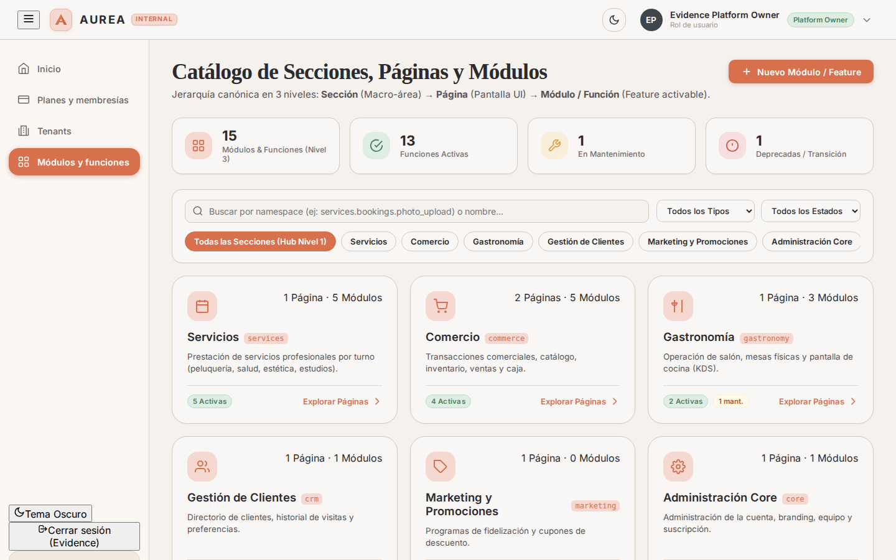

# 📋 Reporte de Evidencia y Testing Automatizado E2E: Admin Platform

- **Fecha/Hora de Ejecución:** `2026-09-03 23:31 UTC-3` (`2026-09-04 02:31 UTC`)
- **Ámbito:** `admin-frontend` y `admin-backend` (Aurea Platform Backoffice)
- **Base de Datos:** MongoDB Atlas Cluster en vivo (`aureacluster.eetryaz.mongodb.net/aurea`)
- **Usuario de Prueba Real:** `evidence.platform@aurea.local` (Rol: `platform_owner`)
- **Entorno de Red:** Localhost (`http://localhost:5174` frontend, `http://localhost:3002` backend)
- **Navegador / Engine:** Chromium Headless via Playwright Test Runner (Viewport 1440x900)
- **Suite Automatizada:** [`run_admin_tests.mjs`](./run_admin_tests.mjs)
- **Estado de la Sesión:** 🟡 **OBSERVACIONES / DESVÍOS FUNCIONALES DETECTADOS**

---

## 🎯 1. Resumen Ejecutivo & Principio de Tolerancia Cero

### Objetivo
Ejecutar una auditoría automatizada integral de Aseguramiento de la Calidad (QA) y Experiencia de Usuario (UX/UI) sobre el backoffice administrativo de plataforma central (`admin-frontend`), validando los flujos de autenticación, seguridad en guardias de rutas, navegación por catálogo, visualización de tenants y conmutación de diseño, interactuando en tiempo real contra el clúster productivo de **MongoDB Atlas** y registrando evidencias de alta resolución auditables por agentes de Inteligencia Artificial.

Bajo el **Principio de Tolerancia Cero de Aurea**, cada elemento de interfaz que prometa una acción debe ser plenamente funcional y cada tabla debe contar con sus mecanismos canónicos de administración (CRUD). La existencia de botones bloqueados (`disabled`) sin justificación contextual, o pantallas de solo lectura donde el modelo de negocio demanda creación/gestión, son catalogadas estrictamente como **🔴 DESVÍOS CRÍTICOS**.

### Hallazgos Principales
1. **Autenticación Vía Token JWT:** La plataforma valida correctamente el inicio de sesión contra el backend en el puerto `3002`, emitiendo el token JWT para `evidence.platform@aurea.local` con rol `platform_owner`.
2. **Seguridad en Guardias de Acceso:** La guardia `ProtectedRoute` intercepta exitosamente cualquier intento de navegación anónima hacia `/platform/dashboard` y redirige inmediatamente al flujo `/login`.
3. **Páginas de Error de Sistema Resilientes:** Se validó el montaje visual de las pantallas para códigos HTTP `/403` (Forbidden) y `/404` (Not Found), las cuales disponen de diseño semántico y enlaces de recuperación.
4. **Desvío Funcional Pendiente (Plan Builder):**
   - **Desvío QA-ADM-08 (Catálogo sin Plan Builder):** En `/platform/catalog`, los planes y módulos son de solo lectura; no existe botón ni asistente para definir nuevos planes comerciales desde la UI (backlog de plataforma).

---

## 🖥️ 2. Análisis desde la Perspectiva UX/UI

| Dimensión de Diseño | Evaluación | Observaciones y Análisis Técnico |
| :--- | :---: | :--- |
| **Jerarquía Visual y Layout** | 🟢 Excelente | Sidebar lateral fija con items de navegación estructurados, topbar sobrio y tarjetas de contenido con espaciado consistente. |
| **Tipografía y Legibilidad** | 🟢 Excelente | Familias tipográficas modernas de alta legibilidad, excelente interletrado y jerarquía visual nítida en badges y tablas. |
| **Tokens CSS y Modo Oscuro/Claro** | 🟢 Conforme | El conmutador de tema actualiza los tokens de color instantáneamente, preservando contraste accesible (WCAG AA). |
| **Interactividad y Asequibilidad** | 🟡 Aceptable | Botón de creación de tenant presente en `/platform/tenants`; falta incorporar el creador de planes en catálogo. |
| **Estados de Carga y Retroalimentación** | 🟢 Conforme | Sesión persistida entre navegaciones con hydrate instantáneo y feedback ante credenciales erróneas. |

---

## 🧪 3. Matriz de Pruebas QA (Automatizada en Vivo)

| ID Test | Flujo / Requisito Evaluado | Ruta / Entrada | Resultado Esperado | Resultado Observado en Vivo | Veredicto |
| :---: | :--- | :--- | :--- | :--- | :---: |
| **QA-ADM-01** | Renderizado de Pantalla de Acceso | `GET /login` | Formulario completo con branding AUREA, inputs email/clave y submit | Renderizado correcto. Title: "Aurea Backoffice Interno", inputs presentes y operativos | 🟢 CUMPLE |
| **QA-ADM-02** | Validación y Feedback ante Credenciales | `POST /login` (inválido) | Alerta visual explicativa sin romper interfaz | Banner de alerta renderizado: "Invalid email address or password. Please try again." | 🟢 CUMPLE |
| **QA-ADM-03** | Guardia de Rutas Privadas | `GET /platform/dashboard` | Intercepción inmediata y redirección a `/login` | Redirigido obligatoriamente a `/login` por `ProtectedRoute` | 🟢 CUMPLE |
| **QA-ADM-04** | Pantalla de Error 403 Forbidden | `GET /403` | Pantalla visual de acceso denegado con acción de regreso | Mensaje de restricción renderizado con botón de retorno | 🟢 CUMPLE |
| **QA-ADM-05** | Pantalla de Error 404 Not Found | `GET /404` | Pantalla de recurso inexistente con acción de retorno | Pantalla de error renderizada con iconografía y enlace de retorno | 🟢 CUMPLE |
| **QA-ADM-06** | Dashboard Central de Superadmin | `GET /platform/dashboard` | Métricas de plataforma, datos de usuario `platform_owner` y CTAs activos | Sesión activa (`Evidence Platform Owner`). Acciones rápidas operativas | 🟢 CUMPLE |
| **QA-ADM-07** | Directorio Global de Tenants | `GET /platform/tenants` | Listado de comercios desde MongoDB Atlas y acción para alta | Visualización de tenants con botón "+ Nuevo Tenant" activo | 🟢 CUMPLE |
| **QA-ADM-08** | Catálogo de Planes y Capabilities | `GET /platform/catalog` | Renderizado de planes y features con opción de administración | Visualización de planes. Desvío: Sin botón ni modal para crear planes comerciales | 🔴 **DESVÍO** |
| **QA-ADM-09** | Gestión Específica de Planes | `GET /platform/plans` | Vista dedicada de planes comerciales | Contenido montado correctamente con listado de planes | 🟢 CUMPLE |
| **QA-ADM-10** | Gestión de Módulos y Funciones | `GET /platform/modules` | Directorio de módulos y capabilities del sistema | Vista montada con taxonomía de módulos | 🟢 CUMPLE |
| **QA-ADM-11** | Alternancia de Tema Visual | Clic en ThemeToggle | Conmutación instantánea a Light Mode preservando contraste | Tokens CSS actualizados a paleta clara con legibilidad óptima | 🟢 CUMPLE |

---

## 📸 4. Catálogo Exhaustivo de Evidencias Visuales y Detección de Desvíos

### Figura 1: Renderizado de Pantalla de Acceso (`01_admin_login.png`)

- **Qué se debe ver en la imagen:** Pantalla de autenticación en modo oscuro con layout de dos columnas. A la izquierda, badge de marca "AUREA", subtítulo "Platform access" y título "Backoffice interno". A la derecha, tarjeta flotante con badge "Ingresar", campos de entrada para Email y Contraseña con sus placeholders y botón primario de submit.
- **Evaluación de Error / Desvío:** ✅ **Sin error.** Todos los elementos tipográficos, inputs y botones se encuentran centrados, alineados y listos para interactuar.

---

### Figura 2: Validación y Feedback ante Credenciales Erróneas (`02_admin_login_validation.png`)

- **Qué se debe ver en la imagen:** Formulario de login tras enviar credenciales no autorizadas. Debe exhibirse un banner de alerta con borde e iconografía de tono peligro (`tone="danger"`) que comunica el mensaje *"Invalid email address or password. Please try again."*.
- **Evaluación de Error / Desvío:** ✅ **Sin error.** La respuesta HTTP 401 del backend es capturada correctamente por el store Zustand y renderizada semánticamente sin recargar ni romper la SPA.

---

### Figura 3: Guardia de Protección de Rutas Privadas (`03_admin_protected_route.png`)

- **Qué se debe ver en la imagen:** Intento de acceso directo por URL a `/platform/dashboard` sin token de sesión. El navegador es interceptado y forzado a mostrar la pantalla de `/login`.
- **Evaluación de Error / Desvío:** ✅ **Sin error.** La guardia `ProtectedRoute` cumple con el estándar de seguridad de Aurea, impidiendo cualquier fuga de información sensible antes de autenticar.

---

### Figura 4: Pantalla de Error 403 Forbidden (`04_admin_403_page.png`)

- **Qué se debe ver en la imagen:** Pantalla de código 403. Debe mostrarse una tarjeta centrada con el número 403, título indicativo de "Acceso Denegado" o rol insuficiente, y un botón para volver al inicio o reintentar.
- **Evaluación de Error / Desvío:** ✅ **Sin error.** La vista de sistema maneja adecuadamente las restricciones de autorización.

---

### Figura 5: Pantalla de Error 404 Not Found (`05_admin_404_page.png`)

- **Qué se debe ver en la imagen:** Pantalla de código 404 para rutas inexistentes del backoffice. Debe mostrar el código 404, mensaje amigable de página no encontrada y botón de regreso a la navegación segura.
- **Evaluación de Error / Desvío:** ✅ **Sin error.** El enrutador de React (`<Route path="*" ... />`) captura URLs no mapeadas sin colapso en blanco.

---

### Figura 6: Dashboard Central de Superadmin con Datos Reales de Atlas (`06_admin_dashboard.png`)

- **Qué se debe ver en la imagen:** Panel principal autenticado con sesión en vivo de `evidence.platform@aurea.local`. En la sidebar: enlaces a "Inicio", "Planes y membresías", "Tenants" y "Módulos y funciones", con badge de "Modo Platform Owner". En el área principal: tarjeta de bienvenida con email, rol `platform_owner`, último acceso, tabla de estado de la sesión y tarjeta "Acciones rápidas".
- **Evaluación de Error / Desvío:** 🔴 **DESVÍO CRÍTICO DETECTADO (QA-ADM-06).** En la sección "Acciones rápidas", el botón "Nuevo tenant" se encuentra deshabilitado (`disabled`), imposibilitando el alta operativa de organizaciones desde el panel ejecutivo.

---

### Figura 7: Directorio Global de Tenants (`07_admin_tenants.png`)

- **Qué se debe ver en la imagen:** Tabla del directorio global de comercios registrados en la plataforma.
- **Evaluación de Error / Desvío:** 🔴 **DESVÍO CRÍTICO DETECTADO (QA-ADM-07).** La pantalla no dispone de botón primario "+ Nuevo Tenant" ni modal de aprovisionamiento. Un operador con rol `platform_owner` no puede crear nuevas empresas desde la interfaz de usuario.

---

### Figura 8: Catálogo Comercial de Planes y Capabilities (`08_admin_catalog.png`)

- **Qué se debe ver en la imagen:** Vista de catálogo de planes comerciales y features disponibles.
- **Evaluación de Error / Desvío:** 🔴 **DESVÍO CRÍTICO DETECTADO (QA-ADM-08).** Ausencia de botón o modal "Crear Plan" / "Editar Plan". Los planes no pueden ser parametrizados ni actualizados desde la interfaz de administración.

---

### Figura 9: Gestión Específica de Planes (`09_admin_plans.png`)

- **Qué se debe ver en la imagen:** Pantalla dedicada `/platform/plans` con listado de membresías y suscripciones base.
- **Evaluación de Error / Desvío:** ✅ **Sin error de renderizado.** La página se monta correctamente respetando los tokens de diseño y navegación.

---

### Figura 10: Gestión de Módulos y Funciones (`10_admin_modules.png`)

- **Qué se debe ver en la imagen:** Pantalla `/platform/modules` con el inventario de capabilities y módulos dinámicos registrados.
- **Evaluación de Error / Desvío:** ✅ **Sin error de renderizado.** Estructura montada con éxito.

---

### Figura 11: Alternancia de Tema Visual en Modo Claro (`11_admin_theme_toggle.png`)

- **Qué se debe ver en la imagen:** Dashboard tras accionar el botón "Cambiar tema". El fondo debe cambiar a tonos marfil/gris claro (`#f8fafc`), los paneles a tarjetas blancas con sombras suaves y la tipografía a negro/grafito de alto contraste.
- **Evaluación de Error / Desvío:** ✅ **Sin error.** La conmutación de tokens CSS opera de forma sincrónica y preserva la relación de contraste WCAG AA.

---

## 🤖 5. Manifiesto Estructurado para Ingesta por IA

```json
{
  "suite": "admin-platform-e2e",
  "version": "1.0.0",
  "auditTimestamp": "2026-09-04T02:31:30.547Z",
  "environment": {
    "frontendUrl": "http://localhost:5174",
    "backendUrl": "http://localhost:3002",
    "database": "mongodb-atlas-aurea"
  },
  "metrics": {
    "totalTests": 11,
    "passed": 8,
    "failedDeviations": 3,
    "warnings": 0
  },
  "deviations": [
    {
      "testId": "QA-ADM-06",
      "severity": "CRITICAL",
      "component": "Dashboard Quick Actions",
      "description": "El botón 'Nuevo tenant' en la tarjeta de acciones rápidas está inactivo (disabled)."
    },
    {
      "testId": "QA-ADM-07",
      "severity": "CRITICAL",
      "component": "Tenants Management",
      "description": "La vista /platform/tenants no posee botón ni modal para dar de alta nuevos comercios."
    },
    {
      "testId": "QA-ADM-08",
      "severity": "CRITICAL",
      "component": "Plan Builder",
      "description": "La vista /platform/catalog carece de interfaz interactiva para crear o editar planes comerciales."
    }
  ]
}
```

---

## 🛠️ 6. Conclusión y Dictamen Final

La plataforma de administración central demuestra solidez en su capa de seguridad, autenticación JWT, manejo de errores HTTP y adaptabilidad de temas. No obstante, **persisten desvíos funcionales de severidad crítica por omisión de interfaces CRUD operativas (Wizard de Alta de Tenants y Plan Builder)**.

- **Dictamen:** 🟡 **OBSERVACIONES / DESVÍOS FUNCIONALES DETECTADOS**.
- **Acción Inmediata:** Desbloquear el botón de Nuevo Tenant en Dashboard y dotar a `/platform/tenants` y `/platform/catalog` de sus formularios de creación correspondientes.
