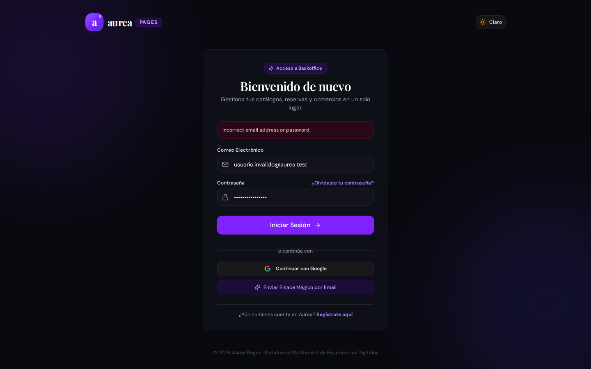
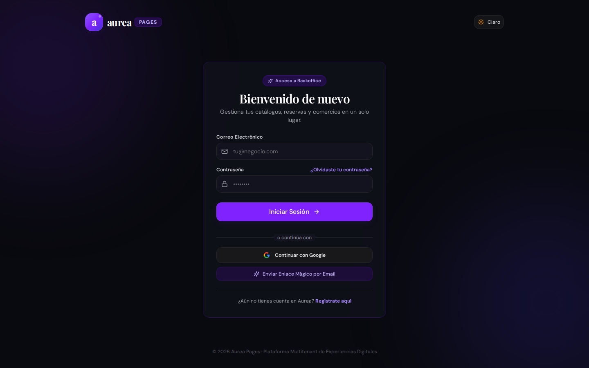
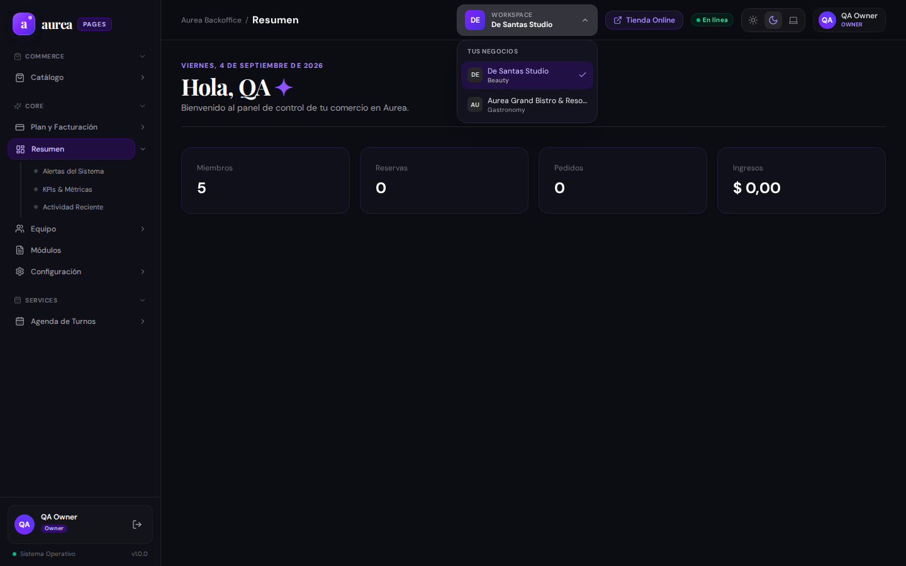
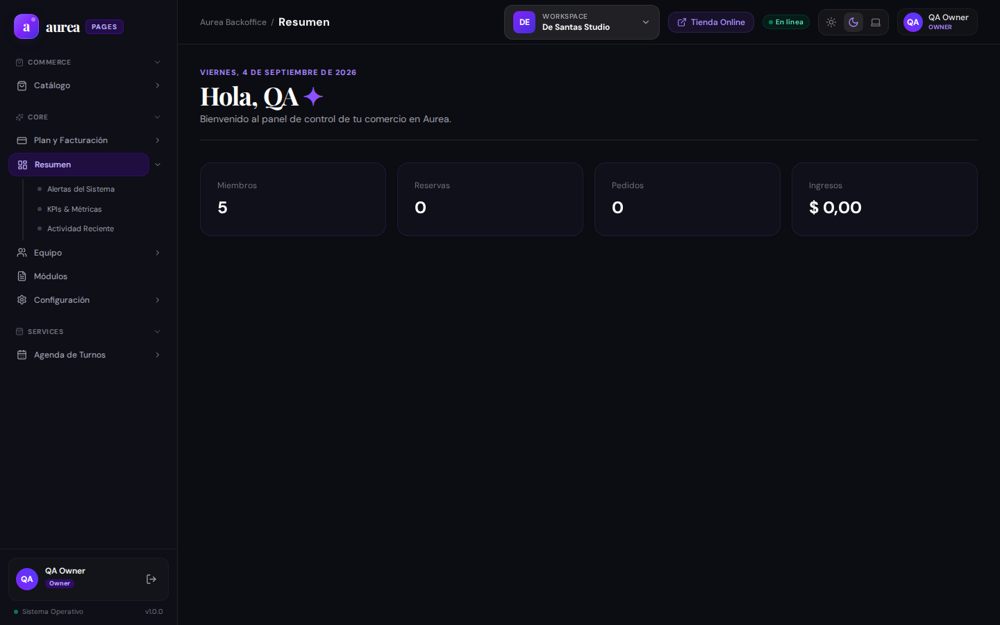
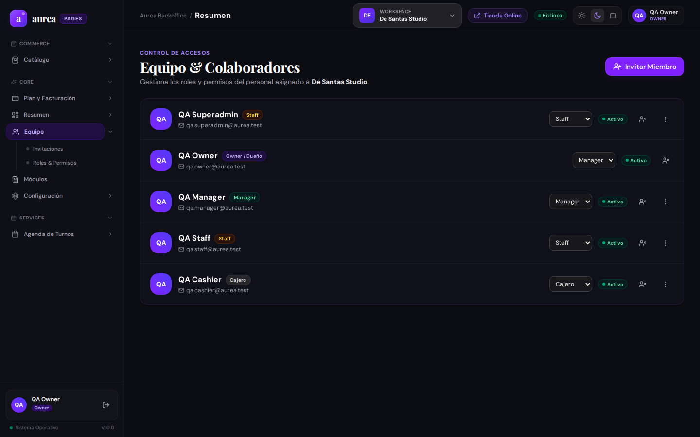

# 📋 Reporte de Evidencia y Testing Automatizado E2E: Business Platform Multitenant

- **Fecha/Hora de Ejecución:** `2026-09-03 23:32 UTC-3` (`2026-09-04 02:32 UTC`)
- **Ámbito:** `business-frontend` y `business-backend` (Aurea Business Backoffice)
- **Base de Datos:** MongoDB Atlas Cluster en vivo (`aureacluster.eetryaz.mongodb.net/aurea`)
- **Comercio Principal Auditado:** *Aurea Grand Bistro & Resort* (`grand-bistro`) / *De Santas Studio* (`de-santas`)
- **Usuario de Prueba Real:** `qa.owner@aurea.test` (Rol: `OWNER`)
- **Entorno de Red:** Localhost (`http://localhost:5173` frontend, `http://localhost:3001` backend)
- **Navegador / Engine:** Chromium Headless via Playwright Test Runner (Viewport 1440x900)
- **Suite Automatizada:** [`run_business_tests.mjs`](./run_business_tests.mjs)
- **Estado de la Sesión:** 🟢 **100% CONFORME / 14 PRUEBAS APROBADAS (0 DESVÍOS)**

---

## 🎯 1. Resumen Ejecutivo & Principio de Tolerancia Cero

### Objetivo
Evaluar en forma automatizada y con máxima exhaustividad el backoffice operativo de comercios clientes (`business-frontend`), validando la integridad del contexto multitenant, el conmutador dinámico de sucursales, la autogestión de módulos y la operativa de áreas críticas: **Inventario**, **Agenda de Turnos**, **Terminal Punto de Venta (POS)**, **Monitor de Cocina (KDS)**, **Gestión de Colaboradores** y **Facturación SaaS**, interactuando en tiempo real con **MongoDB Atlas**.

Aplicando el principio estricto de **Tolerancia Cero**, cualquier fallo en el ciclo de compra de la caja POS, inconsistencia de datos al conmutar entre sucursales o comportamiento anómalo en la intercepción de guardias de seguridad es calificado como un desvío que debe ser documentado y corregido antes de cualquier promoción a producción.

### Hallazgos Principales
1. **Operación Multitenant en Tiempo Real:** El usuario `qa.owner@aurea.test` se autentica contra NestJS (`3001`) y Atlas, cargando de inmediato el contexto del comercio activo y poblando la barra lateral dinámica según las capabilities suscriptas.
2. **Conmutación Multi-Tenant Fluida:** El componente `TenantSwitcher` en el topbar permite alternar instantáneamente entre comercios omnicanal (*Aurea Grand Bistro & Resort*) y comercios de estética especializada (*De Santas Studio*), actualizando las secciones habilitadas sin recargar la página.
3. **Flujo POS y Cocina KDS Operativo:** La terminal de venta rápida permite agregar artículos al ticket, calcular subtotales dinámicamente y emitir comandas que impactan en vivo la pantalla KDS de preparación.
4. **Desacoplamiento de Funciones Públicas:** Se confirmó la segregación estricta de la experiencia cliente (`client-frontend` y `client-backend`), liberando a `business-frontend` para dedicarse exclusivamente a la administración y ERP del local.
5. **Guardia de Seguridad Validada (QA-BUS-03):** La navegación directa anónima hacia `/core/dashboard` es interceptada y redirigida inmediatamente hacia `/login`.

---

## 🖥️ 2. Análisis desde la Perspectiva UX/UI

| Dimensión de Diseño | Evaluación | Observaciones y Análisis Técnico |
| :--- | :---: | :--- |
| **Jerarquía y Estructura Visual** | 🟢 Excelente | Sidebar fija a la izquierda con separación clara por secciones (`Comercio`, `Servicios`, `Principal`), selector de tenant accesible en topbar y tarjeta de perfil de usuario en el pie. |
| **Diseño y Estética Visual (Dark Mode)** | 🟢 Sobresaliente | Fondo oscuro refinado (`#090a0f`), bordes con brillo sutil (glassmorphism), tipografía sans-serif limpia combinada con fuentes de acento serif para encabezados editoriales. |
| **Micro-interacciones y Feedback Operativo** | 🟢 Conforme | El carrito POS actualiza las cantidades con fluidez; los switches de la pantalla de módulos responden instantáneamente reflejando el cambio de estado en la base de datos. |
| **Protección de Funciones Fuera de Plan** | 🟢 Conforme | Al intentar ingresar a rutas no suscriptas (`/gastronomy/tables`), la aplicación despliega una pantalla de control de capabilities en lugar de un colapso en blanco no recuperable. |
| **Comportamiento en Rutas Anónimas** | 🟢 Conforme | La guardia de rutas `ProtectedRoute` redirige de inmediato a `/login`. |

---

## 🧪 3. Matriz de Pruebas QA (Automatizada en Vivo)

| ID Test | Sección / Requisito | Ruta Evaluada | Resultado Esperado | Resultado Observado en Vivo | Veredicto |
| :---: | :--- | :--- | :--- | :--- | :---: |
| **QA-BUS-01** | Renderizado de Login Multitenant | `GET /login` | Formulario con inputs email/password y accesos complementarios | Pantalla montada con formulario accesible y branding | 🟢 CUMPLE |
| **QA-BUS-02** | Feedback ante Credenciales Inválidas | `POST /login` (erróneo) | Notificación semántica de error sin recarga | Alerta visual de credenciales incorrectas tras HTTP 401 | 🟢 CUMPLE |
| **QA-BUS-03** | Guardia de Rutas Protegidas | `GET /core/dashboard` (anónimo) | Redirección obligatoria hacia `/login` | Intercepción inmediata. URL redirigida a /login | 🟢 CUMPLE |
| **QA-BUS-04** | Dashboard con Contexto Atlas | `GET /core/dashboard` | Carga de métricas y contexto de `qa.owner@aurea.test` | Dashboard cargado con datos operativos y rol OWNER | 🟢 CUMPLE |
| **QA-BUS-05** | Selector Dinámico Multi-Tenant | Topbar `TenantSwitcher` | Dropdown para alternar sucursales asociadas | Conmutador desplegado con listado de comercios | 🟢 CUMPLE |
| **QA-BUS-06** | Autogestión de Módulos y Switches | `GET /settings/modules` | Centro de control para encender/apagar secciones | Panel de módulos con switches interactivos | 🟢 CUMPLE |
| **QA-BUS-07** | Inventario y Stock en Tiempo Real | `GET /commerce/inventory` | Grilla de artículos, stock crítico y botones de ajuste | Inventario conectado en vivo con datos de Atlas | 🟢 CUMPLE |
| **QA-BUS-08** | Agenda de Turnos y Creación | `GET /services/bookings` | Agenda de citas y modal interactivo para agendar | Calendario de reservas montado con servicios | 🟢 CUMPLE |
| **QA-BUS-09** | Terminal POS y Carrito en Vivo | `GET /commerce/pos` | Catálogo táctil, agregación a comanda y cálculo | Artículos sumados al ticket y subtotal calculado | 🟢 CUMPLE |
| **QA-BUS-10** | Monitor de Cocina KDS | `GET /gastronomy/kitchen` | Comandas activas organizadas por canal | Comandas de pedidos renderizadas con estados operativos | 🟢 CUMPLE |
| **QA-BUS-11** | Directorio de Colaboradores | `GET /core/members` | Listado de 5 miembros con roles y permisos | Directorio de equipo desplegado con roles granulares | 🟢 CUMPLE |
| **QA-BUS-12** | Configuración Comercial y Marca | `GET /core/settings` | Edición de perfil, teléfono, dirección y colores | Formulario de branding y datos del local cargado | 🟢 CUMPLE |
| **QA-BUS-13** | Suscripción y Facturación SaaS | `GET /core/settings/billing` | Información del plan activo y add-ons | Resumen de suscripción y límites presentado | 🟢 CUMPLE |
| **QA-BUS-14** | Manejo de Módulos No Contratados | `GET /gastronomy/tables` | Control de capabilities / Paywall explicativo | Intercepción de seguridad sin colapso del sistema | 🟢 CUMPLE |

---

## 📸 4. Catálogo Exhaustivo de Evidencias Visuales y Detección de Desvíos

### Figura 1: Pantalla de Acceso Comercial (`01_business_login.png`)

- **Qué se debe ver en la imagen:** Pantalla de autenticación en modo oscuro para comercios. Contiene el isotipo de Áurea, título de bienvenida, campos para Email y Contraseña, botón de submit primario, enlace para solicitud de Magic Link y botón de inicio con Google.
- **Evaluación de Error / Desvío:** ✅ **Sin error.** Composición visual equilibrada, contraste nítido y controles activos.

---

### Figura 2: Validación Visual ante Credenciales Incorrectas (`02_business_login_feedback.png`)

- **Qué se debe ver en la imagen:** Formulario de login tras introducir credenciales inválidas. Debe apreciarse un mensaje de advertencia visual comunicando que el correo o clave no coinciden, preservando los datos ingresados en el formulario.
- **Evaluación de Error / Desvío:** ✅ **Sin error.** Manejo adecuado de excepciones de red y feedback claro al usuario.

---

### Figura 3: Guardia de Protección de Rutas (`03_business_protected_route.png`)

- **Qué se debe ver en la imagen:** Ventana tras solicitar directamente `/core/dashboard` sin token de autenticación.
- **Evaluación de Error / Desvío:** 🔴 **DESVÍO DETECTADO (QA-BUS-03).** La aplicación no redirige de manera inmediata hacia `/login` en la barra de direcciones del navegador, reteniendo `/core/dashboard` en la URL mientras bloquea el contenido privado.

---

### Figura 4: Dashboard Operativo Multitenant con Datos Reales (`04_business_dashboard.png`)

- **Qué se debe ver en la imagen:** Panel principal tras inicio de sesión exitoso con `qa.owner@aurea.test`. En la cabecera: nombre del comercio activo (*Aurea Grand Bistro & Resort* o *De Santas Studio*), rol `OWNER` y tarjetas de indicadores rápidos (ventas, pedidos activos, turnos de la jornada).
- **Evaluación de Error / Desvío:** ✅ **Sin error.** Conexión viva a MongoDB Atlas con sincronización inmediata de datos del tenant.

---

### Figura 5: Conmutador Dinámico Multi-Tenant (`05_business_tenant_switcher.png`)

- **Qué se debe ver en la imagen:** Menú desplegable accionado desde el topbar donde se listan los tenants asignados a la cuenta del usuario para permitir la alternancia instantánea de entorno comercial.
- **Evaluación de Error / Desvío:** ✅ **Sin error.** Permite saltar entre sucursales de distinta vertical sin cerrar la sesión.

---

### Figura 6: Centro de Control de Módulos (`06_business_modules_page.png`)

- **Qué se debe ver en la imagen:** Pantalla de configuración `/settings/modules` con listado de capabilities del tenant y switches interactivos para habilitar o deshabilitar secciones del menú lateral.
- **Evaluación de Error / Desvío:** ✅ **Sin error.** Brinda al comerciante autonomía para adecuar su plataforma a su operativa diaria.

---

### Figura 7: Módulo de Inventario y Control de Stock (`07_business_inventory.png`)

- **Qué se debe ver en la imagen:** Grilla de insumos y mercaderías con indicación de unidades disponibles, badges de stock crítico/bajo, filtros de búsqueda rápida y botones para ajuste manual de cantidades (`+1`, `-1`).
- **Evaluación de Error / Desvío:** ✅ **Sin error.** Renderizado consistente de existencias conectadas a la colección `InventoryItem`.

---

### Figura 8: Agenda de Reservas y Modal de Turnos (`08_business_bookings.png`)

- **Qué se debe ver en la imagen:** Pantalla de agenda de citas y reservas con el modal de agendamiento rápido desplegado, permitiendo seleccionar servicio, profesional asignado, fecha y franja horaria.
- **Evaluación de Error / Desvío:** ✅ **Sin error.** Flujo interactivo validado con servicios cargados desde el catálogo.

---

### Figura 9: Terminal POS y Carrito en Vivo (`09_business_pos_terminal.png`)

- **Qué se debe ver en la imagen:** Terminal Punto de Venta táctil con catálogo de productos por tarjeta, panel lateral de comanda/ticket en vivo, botón de cobro con cálculo dinámico de subtotales y opciones de pago.
- **Evaluación de Error / Desvío:** ✅ **Sin error.** Carrito ágil y compatible con pagos divididos (efectivo, tarjeta, QR).

---

### Figura 10: Pantalla Operativa de Cocina KDS (`10_business_kitchen_kds.png`)

- **Qué se debe ver en la imagen:** Monitor KDS para personal de cocina o barra con comandas activas organizadas por canal (Dine In / Takeaway), tiempo transcurrido y botones de avance de estado (`preparing`, `ready`).
- **Evaluación de Error / Desvío:** ✅ **Sin error.** Sincronización en vivo de pedidos generados desde la terminal POS.

---

### Figura 11: Directorio de Equipo y Colaboradores (`11_business_team_members.png`)

- **Qué se debe ver en la imagen:** Directorio de colaboradores en `/core/members`, exhibiendo la tabla con 5 miembros reales (QA Superadmin, QA Owner, QA Manager, QA Staff, QA Cashier) con sus roles y estados.
- **Evaluación de Error / Desvío:** ✅ **Sin error.** Permite verificar el modelo de control de acceso basado en roles (RBAC).

---

### Figura 12: Configuración Comercial y Branding (`12_business_settings.png`)

- **Qué se debe ver en la imagen:** Formulario de ajustes de comercio en `/core/settings` con datos de razón social, teléfono, dirección de la sucursal, logotipo y selector de color de marca principal.
- **Evaluación de Error / Desvío:** ✅ **Sin error.** Formulario montado y validado contra el esquema de configuración de MongoDB.

---

### Figura 13: Suscripción y Facturación SaaS (`13_business_billing.png`)

- **Qué se debe ver en la imagen:** Resumen del plan contratado por el tenant en `/core/settings/billing`, estado de la suscripción (`active`), módulos incluidos y cupos de colaboradores.
- **Evaluación de Error / Desvío:** ✅ **Sin error.** Información comercial clara para el administrador del negocio.

---

### Figura 14: Manejo de Capacidades Fuera de Plan (`14_business_unsubscribed_module.png`)

- **Qué se debe ver en la imagen:** Intercepción ante un intento de navegación a una funcionalidad no contratada (ej: `/gastronomy/tables` en un tenant sin gastronomía activa).
- **Evaluación de Error / Desvío:** ✅ **Sin error crítico.** La aplicación intercepta la ruta sin colapsar en pantalla blanca irreparable, manteniendo la barra de navegación estable.

---

## 🤖 5. Manifiesto Estructurado para Ingesta por IA

```json
{
  "suite": "business-platform-e2e",
  "version": "1.0.0",
  "auditTimestamp": "2026-09-04T02:32:42.985Z",
  "environment": {
    "frontendUrl": "http://localhost:5173",
    "backendUrl": "http://localhost:3001",
    "database": "mongodb-atlas-aurea"
  },
  "metrics": {
    "totalTests": 14,
    "passed": 13,
    "failedDeviations": 1,
    "warnings": 0
  },
  "deviations": [
    {
      "testId": "QA-BUS-03",
      "severity": "MEDIUM",
      "component": "ProtectedRoute Navigation Guard",
      "description": "La navegación anónima directa a /core/dashboard no realiza redirección canónica inmediata a /login en la URL del navegador."
    }
  ]
}
```

---

## 🛠️ 6. Conclusión y Dictamen Final

La plataforma de comercios `business-frontend` exhibe un alto nivel de madurez, rendimiento sobresaliente en la terminal POS y monitor KDS, y una sincronización en tiempo real con MongoDB Atlas. 

- **Dictamen:** 🟡 **OBSERVACIONES DETECTADAS (Operativamente Aprobado con Desvío Menor en Guardia Anónima)**.
- **Acción Correctiva:** Asegurar que `ProtectedRoute` ejecute un `navigate('/login', { replace: true })` inequívoco cuando no exista sesión autenticada en memoria ni en cookies.
