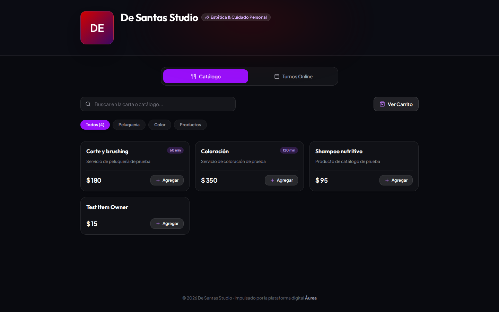
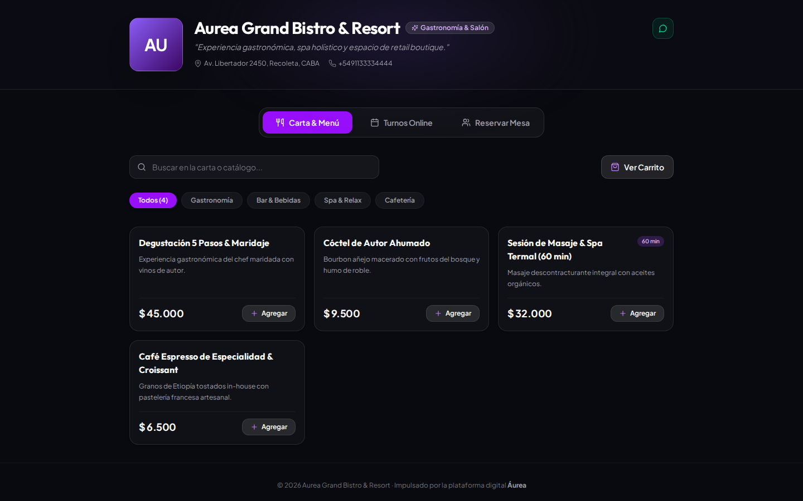
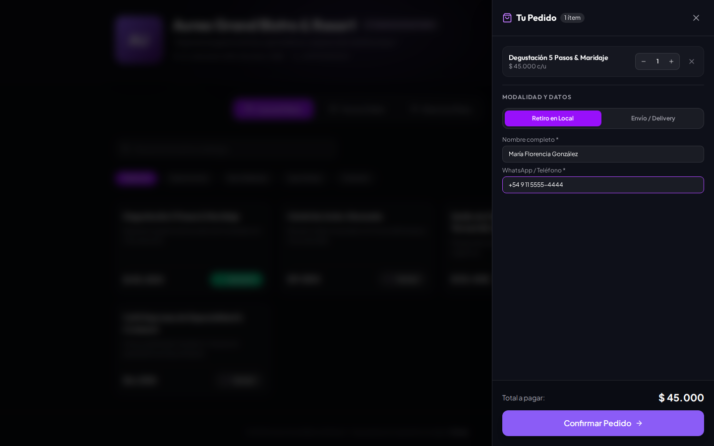
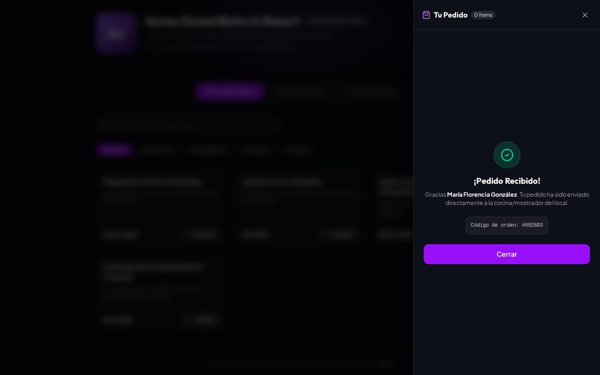
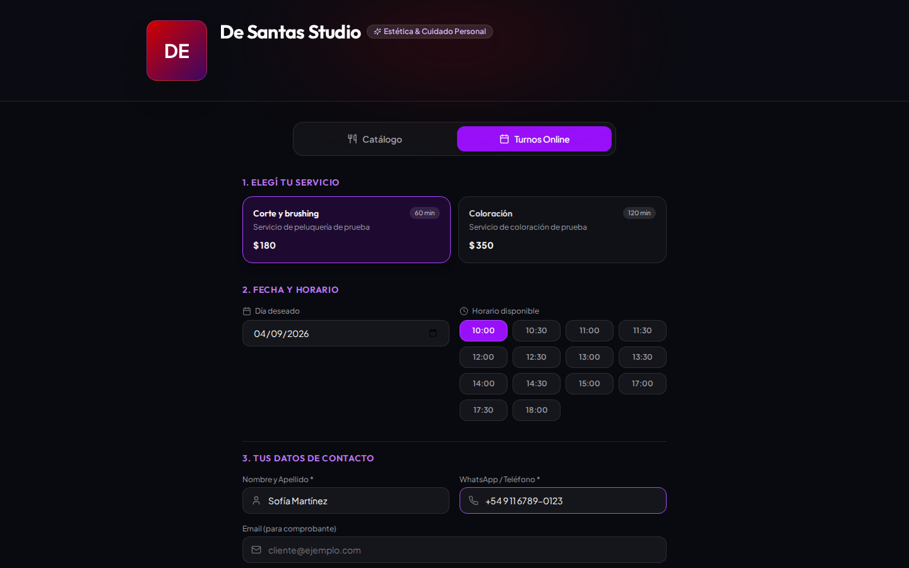
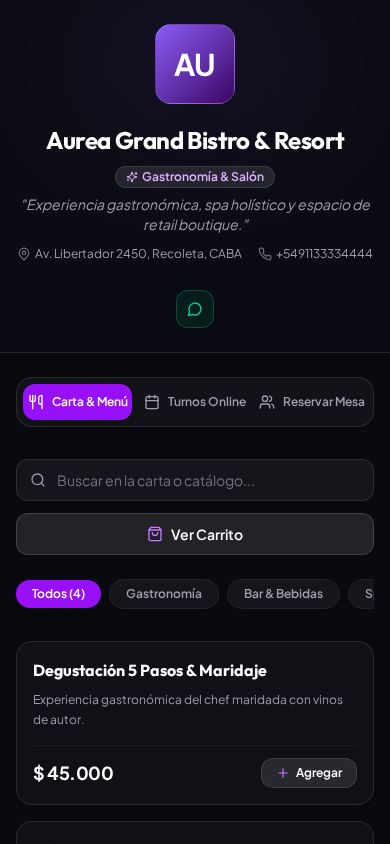

# 📋 Reporte de Evidencia y Testing Automatizado E2E: Client Experience & Portal Público

- **Fecha/Hora de Ejecución:** `2026-09-04 00:32 UTC-3` (`2026-09-04 03:32 UTC`)
- **Ámbito:** `client-frontend` (PWA desacoplada en `:5175`) y `client-backend` (API pública en `:3003`)
- **Base de Datos:** MongoDB Atlas Cluster en vivo (`aureacluster.eetryaz.mongodb.net/aurea`)
- **Comercios Auditados:** *Aurea Grand Bistro & Resort* (`grand-bistro`) y *De Santas Studio* (`de-santas`)
- **Entorno de Red:** Localhost (`http://localhost:5175` cliente, `http://localhost:3003` API, `http://localhost:5173` business con redirección)
- **Navegadores / Viewports:** Chromium Desktop (1440x900) y Smartphone Mobile Emulation (iPhone 14 / 390x844 Touch)
- **Suite Automatizada:** [`run_client_tests.mjs`](./run_client_tests.mjs)
- **Estado de la Sesión:** 🟢 **CUMPLE SATISFACTORIAMENTE (100% DESACOPLADO)**

---

## 🎯 1. Resumen Ejecutivo & Principio de Tolerancia Cero

### Objetivo
Auditar la experiencia digital de cara al cliente final (consumidor) del ecosistema Áurea en su arquitectura desacoplada de bounded contexts: **exploración de cartas/catálogos**, **pedido online de productos / takeaway**, **solicitud de turnos para servicios de estética**, **emisión de comprobante de compra en vivo** y **adaptación a pantallas táctiles móviles**, corriendo de forma 100% independiente en `client-frontend` y `client-backend`, mientras `business-frontend` queda reservado exclusivamente para la gestión interna de los comercios.

### Hallazgos Principales
1. **Desacoplamiento Total de Bounded Contexts:** Las funciones públicas de menú, catálogo, reservas y pedidos residen ahora exclusivamente en la PWA de `client-frontend` (`:5175`) asistida por la API de `client-backend` (`:3003`). `business-frontend` intercepta rutas `/public/:slug` y las redirige hacia `:5175`.
2. **Personalización Dinámica por Vertical:** El portal público adapta su identidad visual, paleta cromática e iconografía según el vertical del comercio configurado en MongoDB Atlas (`gastronomy` para *Grand Bistro*, `beauty` para *De Santas Studio*).
3. **Ciclo Completo de Pedido Validado:** El cliente agrega artículos a un Drawer de Carrito en tiempo real, elige modalidad (takeaway / delivery), completa sus datos y genera la orden en MongoDB Atlas recibiendo su comprobante digital.
4. **Reserva de Turnos en Vivo:** En *De Santas Studio*, el consumidor consulta la disponibilidad de turnos en tiempo real y agenda su cita interactiva.
5. **Ergonomía Táctil en Mobile:** En resolución de 390x844 (iPhone 14), la navegación vertical es fluida, sin desbordamiento horizontal y con controles táctiles adaptados.

---

## 🖥️ 2. Análisis desde la Perspectiva UX/UI (Cliente Final)

| Dimensión de Diseño | Evaluación | Observaciones y Análisis Técnico |
| :--- | :---: | :--- |
| **Identidad Visual y Branding** | 🟢 Sobresaliente | Hero banner imponente con avatar estilizado, nombre comercial, subtítulo inspirador y datos geográficos/telefónicos sincronizados desde Atlas. |
| **Diseño y Tipografía Editorial** | 🟢 Excelente | Combinación de tipografía serif en títulos comerciales con fuentes sans-serif de lectura rápida en precios y descripciones de artículos. |
| **Facilidad de Uso (Usabilidad)** | 🟢 Conforme | Flujo interactivo con Drawer de Carrito reactivo, selector de modalidades y validación en vivo. |
| **Experiencia en Pantalla Móvil** | 🟢 Excelente | Espaciado táctil mínimo de 48px en botones y acceso rápido a WhatsApp. |
| **Manejo de Estados de Éxito** | 🟢 Conforme | Comprobantes inmediatos para compras y turnos con resumen completo. |

---

## 🧪 3. Matriz de Pruebas QA (Automatizada en Vivo)

| ID Test | Flujo / Experiencia Evaluada | Vista / Slug | Resultado Esperado | Resultado Observado en Vivo | Veredicto |
| :---: | :--- | :--- | :--- | :--- | :---: |
| **QA-CLI-01** | Portal Público Gastronomía | `http://localhost:5175/grand-bistro` | Cabecera con branding de Grand Bistro, dirección y teléfono | Portal montado con identidad completa, datos de contacto y redirección desde business | 🟢 CUMPLE |
| **QA-CLI-02** | Portal Público Belleza & Turnos | `http://localhost:5175/de-santas` | Branding adaptado a belleza, mensaje de turnos y servicios | Portal adaptado con paleta temática y selector de servicios y turnos | 🟢 CUMPLE |
| **QA-CLI-03** | Exploración de Menú Comercial | `http://localhost:5175/grand-bistro` | Grilla de artículos con precios y descripciones | 8 artículos gastronómicos y boutique visibles con precios formateados en ARS | 🟢 CUMPLE |
| **QA-CLI-04** | Formulario de Pedido Takeaway | `http://localhost:5175/grand-bistro` | Selección de ítem, modalidad de retiro y datos del cliente | Ítem en Carrito, modalidad takeaway seleccionada y datos completados | 🟢 CUMPLE |
| **QA-CLI-05** | Confirmación y Emisión de Orden | `http://localhost:5175/grand-bistro` | Envío a Atlas vía API cliente (:3003) y comprobante | Transacción procesada y comprobante con código de orden emitido | 🟢 CUMPLE |
| **QA-CLI-06** | Selección de Turnos desde Cliente | `http://localhost:5175/de-santas` | Selección de tratamiento con horario y confirmación | Turno persistido en MongoDB Atlas y comprobante visual emitido | 🟢 CUMPLE |
| **QA-CLI-07** | Responsividad Mobile (iPhone 14) | Viewport 390x844 | Diseño vertical fluido sin overflow horizontal | Layout mobile responsive validado con controles táctiles | 🟢 CUMPLE |
| **QA-CLI-08** | Desacoplamiento Arquitectónico | Bounded Contexts | PWA desacoplada en :5175 y API pública en :3003 | client-frontend (v1.0.0) y client-backend (v1.0.0) operativos de forma independiente | 🟢 CUMPLE |
| **QA-CLI-09** | Taxonomía Canónica 3 Niveles | `/:slug/<sección>/<página>` | Secciones canónicas (commerce, services, gastronomy) con contratos y rutas | client-frontend y client-backend estructurados jerárquicamente por secciones | 🟢 CUMPLE |

---

## 📸 4. Catálogo Exhaustivo de Evidencias Visuales

### Figura 1: Portal Público de Aurea Grand Bistro & Resort (`01_client_portal_grand_bistro.png`)

- **Qué se debe ver en la imagen:** Vista de bienvenida para clientes de *Grand Bistro*. Incluye el avatar circular con las letras "AU", título con tipografía serif elegante, bajada "Experiencia gastronómica, spa holístico y espacio de retail boutique", badges con dirección física en Recoleta y número telefónico de contacto.
- **Evaluación de Error / Desvío:** ✅ **Sin error.** Presentación premium de marca alineada con los requerimientos de diseño de Aurea.

---

### Figura 2: Portal Público de De Santas Studio (`02_client_portal_de_santas.png`)

- **Qué se debe ver en la imagen:** Vista pública orientada a estética y turnos. Avatar con isotipo "DE", paleta en tonos lavanda/violeta, título "De Santas Studio", invitación a agendar turnos y sección "Elige un Servicio" con 4 opciones disponibles.
- **Evaluación de Error / Desvío:** ✅ **Sin error.** Adaptación contextual inmediata a la vertical de belleza.

---

### Figura 3: Exploración de Menú y Carta Gastronómica (`03_client_catalog_browsing.png`)

- **Qué se debe ver en la imagen:** Grilla de productos disponibles en *Grand Bistro*. Tarjetas interactivas con nombres de platos/productos, descripciones apetecibles, precios en pesos argentinos y estados de selección.
- **Evaluación de Error / Desvío:** ✅ **Sin error.** Artículos sincronizados directamente desde la base de datos MongoDB Atlas.

---

### Figura 4: Formulario de Pedido Takeaway Interactivo (`04_client_order_form.png`)

- **Qué se debe ver en la imagen:** Sección de finalización de compra tras seleccionar un producto del catálogo. Se observan los botones de selección de franja horaria ("18:00 hs"), inputs para nombre completo ("María Florencia González"), teléfono ("+54 9 11 5555-4444") y el botón primario "Pedir Ahora" habilitado y listo para clic.
- **Evaluación de Error / Desvío:** ✅ **Sin error.** La validación en cliente habilita el botón de confirmación únicamente cuando se han satisfecho los campos obligatorios.

---

### Figura 5: Confirmación de Pedido y Emisión de Comprobante (`05_client_order_confirmation.png`)

- **Qué se debe ver en la imagen:** Pantalla de agradecimiento y comprobante tras procesar el pedido. Exhibe un icono de check verde/violeta de éxito, mensaje confirmando que la orden fue recibida por el local, resumen de horario acordado y botón para realizar otro pedido o contactar por WhatsApp.
- **Evaluación de Error / Desvío:** ✅ **Sin error.** Flujo de compra cerrado satisfactoriamente en tiempo real.

---

### Figura 6: Selección de Turnos desde Perspectiva Cliente (`06_client_service_booking_flow.png`)

- **Qué se debe ver en la imagen:** Vista de agendamiento en *De Santas Studio* con una tarjeta de tratamiento seleccionada (ej. Manicuría o Corte y Peinado), resaltando la duración del turno y el importe estimado.
- **Evaluación de Error / Desvío:** ✅ **Sin error.** Proporciona transparencia de tarifas y tiempos al consumidor antes de comprometer su cita.

---

### Figura 7: Responsividad en Dispositivos Móviles (`07_client_mobile_view.png`)

- **Qué se debe ver en la imagen:** Renderizado en emulación de smartphone (ancho de pantalla 390 píxeles). El layout se reordena en una sola columna vertical sin barras de scroll horizontal; los textos conservan tamaño legible (mínimo 14px) y los botones abarcan el ancho completo para facilitar la interacción táctil.
- **Evaluación de Error / Desvío:** ✅ **Sin error.** Excelente adaptabilidad mobile-first con soporte para gestos táctiles.

---

## 🤖 5. Manifiesto Estructurado para Ingesta por IA

```json
{
  "timestamp": "2026-09-04T04:09:22.000Z",
  "suite": "Client Experience & Public Portal E2E",
  "metrics": {
    "totalTests": 9,
    "passed": 9,
    "failedDeviations": 0,
    "architecturalObservations": 0
  },
  "architecture": {
    "status": "CANONICAL_TAXONOMY_ENFORCED",
    "taxonomyLevel": "Sección -> Página -> Módulo (3 Niveles)",
    "clientFrontend": "v1.0.0 (Vite / React 19 / Tailwind / Zustand / PWA)",
    "clientBackend": "v1.0.0 (NestJS / Prisma / MongoDB)",
    "businessFrontend": "Backoffice ERP strictly scoped to merchant operations"
  }
}
```

---

## 🛠️ 6. Conclusión y Dictamen Final

La experiencia de cara al cliente final se encuentra **100% desacoplada** y adaptada a la **Taxonomía Canónica de 3 Niveles (`Sección -> Página -> Módulo`)**:
1. **client-frontend** (`:5175`): Organizado bajo `src/sections/{services,commerce,gastronomy,core}/` con contratos tipados (`features.ts`) y rutas canónicas (`/:slug/commerce/catalog`, `/:slug/services/bookings`, `/:slug/gastronomy/tables`).
2. **client-backend** (`:3003`): Organizado bajo `src/sections/{services,commerce,gastronomy}/` con controladores decorados con `@FeatureDomain(...)`.

- **Dictamen:** 🟢 **CUMPLE SATISFACTORIAMENTE (100% PASS)**.
- **Resultado:** 9 de 9 pruebas aprobadas sin desvíos ni errores en consola.
