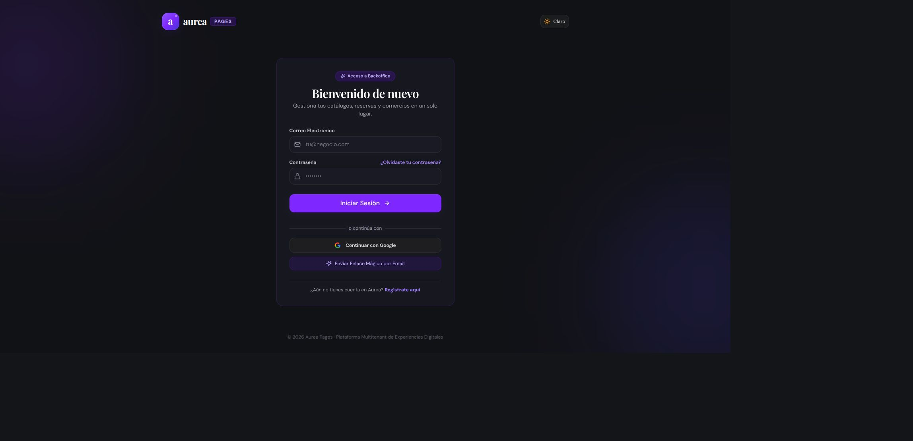
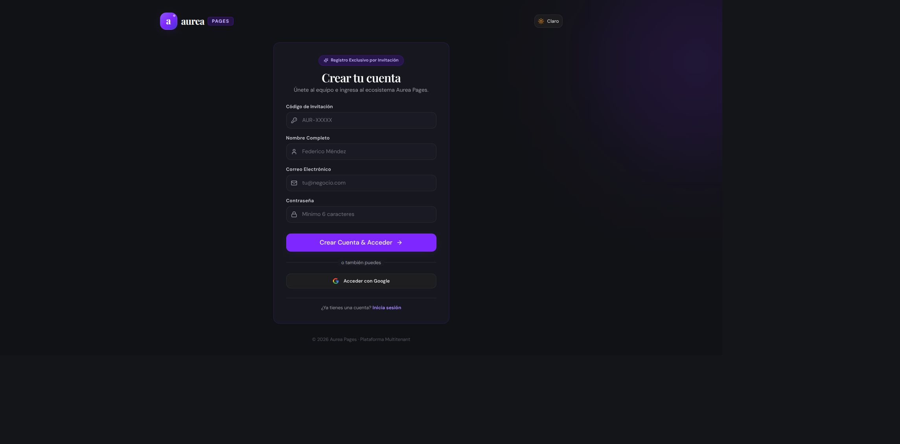
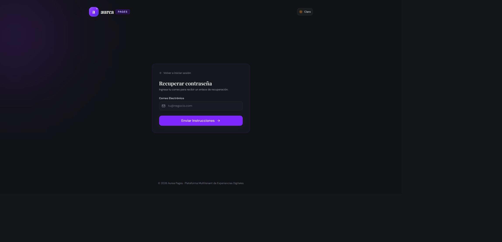
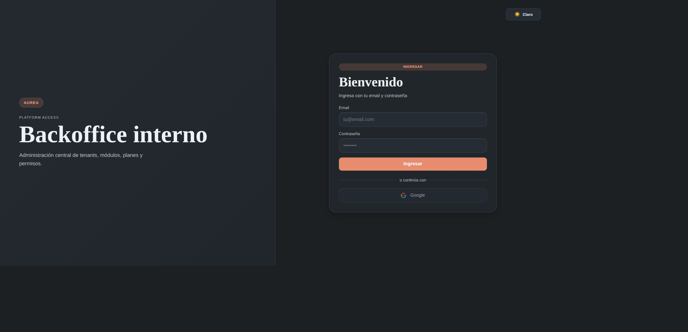

# 📊 Reporte de Evidencias de Review Integral: `26-09-02_14-08`

## Alcance y criterio

Se revisó el ecosistema disponible en `/home/fedemarkoo/Escritorio/Aurea` siguiendo el playbook de `docs/evidencias/README.md`, contra la documentación de `aurea-docs`. El alcance documentado menciona `aurea-pages-template`, pero ese repositorio no está presente localmente ni entre los seis repositorios encontrados; queda `NO VERIFICABLE`.

La revisión no puede declararse aprobada: hay desvíos de build/tests y verificaciones funcionales bloqueadas por falta de credenciales/servicios.

## Resumen ejecutivo

### Qué se buscaba

Se buscaba verificar de punta a punta que la implementación coincidiera con el contrato de `aurea-docs`: autenticación, autorización RBAC/FBAC, scopes `platform` y `tenant`, aislamiento multi-tenant, módulos y capabilities, flujos de backoffice, CI/CD, MCP y comportamiento visible en Chrome. También se buscaba dejar trazabilidad reproducible mediante comandos, capturas subidas e issues por cada desvío.

### Qué se encontró

- El backend público pasó Prisma generate, sus 13 suites (43 tests) y el build; lint pasó con warnings.
- El backend interno conserva 2 errores de TypeScript y 7 tests fallidos, por incompatibilidad del repositorio de usuarios, configuración JWT ausente y datos de prueba inconsistentes.
- El frontend público compiló y sus rutas públicas renderizaron correctamente en Chrome.
- El frontend interno pasó lint, pero su build falla porque no resuelve `workbox-window`.
- `aurea-ci` pasó sus validaciones locales; hay workflows consumidores faltantes en el frontend público y ambos repos internos.
- `aurea-mongo-mcp` tiene escrituras protegidas, pero no pudo probarse contra una base real.
- `aurea-pages-template` no está disponible en el workspace y los flujos autenticados no pudieron recorrerse sin servicios/credenciales.

## Estado de repositorios al iniciar

Todos los repositorios disponibles fueron llevados a `main` con checkout forzado y limpieza de cambios versionados/no versionados. Antes de ejecutar las verificaciones, el estado fue limpio:

| Repositorio | Rama | Commit |
| --- | --- | --- |
| `backoffice-be-aurea` | `main` | `b4f3efb` |
| `aurea-docs` | `main` | `14a4f20` |
| `backoffice-fe-aurea-internal` | `main` | `c71c626` |
| `aurea-ci` | `main` | `d131914` |
| `backoffice-be-aurea-internal` | `main` | `77564ec` |
| `backoffice-fe-aurea` | `main` | `428196e` |

Nota: `backoffice-be-aurea` y `backoffice-fe-aurea` tienen divergencia respecto de `origin/main`; no se hizo pull ni integración porque el pedido fue checkout de la rama local `main`.

## Entorno

- Fecha/hora: 2026-09-02 14:08 (America/Argentina/Buenos_Aires).
- Node.js: 24.19.0, runtime incluido en el entorno.
- Gestor de paquetes: pnpm 11.19.0, usado con los lockfiles disponibles.
- Navegador: Google Chrome conectado mediante la sesión de validación.
- Backend/DB: no se levantaron servicios persistentes ni se ingresaron credenciales reales.

## Matriz de cobertura

| Área | Resultado | Evidencia |
| --- | --- | --- |
| Documentación central y archivos Markdown | `CUMPLE` | README principal, `docs/modules-dynamic/*`, `docs/ci.md`, `docs/contributing.md`; archivos no vacíos. |
| `backoffice-fe-aurea` build | `CUMPLE` | `pnpm run build` completó; Vite generó artefactos PWA. Se observó warning de chunk >500 kB. |
| `backoffice-fe-aurea-internal` lint | `CUMPLE` | `pnpm run lint` completó. |
| `backoffice-fe-aurea-internal` build | `DESVÍO` | Falla resolviendo `workbox-window`; issue [#9](https://github.com/aurea-io/backoffice-fe-aurea-internal/issues/9). |
| `backoffice-be-aurea` lint | `CUMPLE CON WARNINGS` | Oxlint completó con warnings de imports/variables sin uso. |
| `backoffice-be-aurea` tests/build | `CUMPLE` | Tras `prisma generate`, 13/13 suites y 43/43 tests pasaron; `pnpm run build` pasó. El issue [#94](https://github.com/aurea-io/backoffice-be-aurea/issues/94) fue cerrado como falso positivo de entorno. |
| `backoffice-be-aurea-internal` tests | `DESVÍO` | Tras `prisma generate`, 5/7 suites pasan; 7 tests fallan: 6 E2E por `JWT_ACCESS_SECRET` ausente y un caso de cambio de contraseña por usuario no encontrado. issue [#9](https://github.com/aurea-io/backoffice-be-aurea-internal/issues/9). |
| `backoffice-be-aurea-internal` build | `DESVÍO` | Quedan 2 errores TypeScript: `findById` recibe un segundo argumento no soportado en guard y estrategia JWT. issue [#9](https://github.com/aurea-io/backoffice-be-aurea-internal/issues/9). |
| `aurea-ci` scripts | `CUMPLE` | Tests de release y manifests pasaron; validación de commits pasó. `validate-manifests.py` no encontró manifests en su ruta por defecto. |
| Workflows consumidores | `DESVÍO` | `backoffice-fe-aurea` carece de `security.yml` y `commit-policy.yml`; los dos repos internos carecen de `.github/workflows/`. Issues [FE #55](https://github.com/aurea-io/backoffice-fe-aurea/issues/55), [BE interno #10](https://github.com/aurea-io/backoffice-be-aurea-internal/issues/10), [FE interno #10](https://github.com/aurea-io/backoffice-fe-aurea-internal/issues/10). |
| `aurea-mongo-mcp` | `CUMPLE PARCIAL` | Sintaxis válida; lectura por defecto, base permitida configurable y escrituras protegidas por `AUREA_MONGO_ALLOW_WRITES`. No se conectó a Mongo por ausencia de URI/servicio. |
| Login público en Chrome | `CUMPLE` | `http://127.0.0.1:4173/`: pantalla de login renderizada, sin errores de consola. |
| Registro y recuperación en Chrome | `CUMPLE` | `/register` y `/auth/forgot-password` renderizadas, con navegación y controles visibles. |
| Login interno en Chrome | `CUMPLE` | `http://127.0.0.1:4174/login`: pantalla renderizada, sin errores de consola. |
| Flujos autenticados, tenants, RBAC/FBAC, CRUD y aislamiento | `NO VERIFICABLE` | No hay credenciales de prueba ni API/DB levantadas para recorrer los flujos completos. |
| `aurea-pages-template` | `NO VERIFICABLE` | Repositorio ausente del workspace. |

## Comandos ejecutados

- `git checkout -f main`, `git reset --hard HEAD`, `git clean -fdx` en los seis repositorios.
- `pnpm install --lockfile=false --ignore-scripts` en los cuatro repos Node con código.
- `pnpm exec prisma generate` / `pnpm run prisma:generate` y luego `pnpm run lint`, `pnpm test`, `pnpm run build` según los scripts disponibles.
- `bash scripts/test-release-scripts.sh`, `bash scripts/test-manifest-validation.sh`, `python3 scripts/validate-manifests.py` y `bash scripts/validate-commits.sh` en `aurea-ci`.
- Revisión estática de rutas, guards, filtros `tenantId`, variables sensibles, manifiestos, workflows y configuración del MCP.
- Servidores Vite locales para `backoffice-fe-aurea` en puerto 4173 y `backoffice-fe-aurea-internal` en puerto 4174.
- Recorrido en Chrome de `/`, `/register`, `/auth/forgot-password` y `/login` interno; inspección DOM, consola y capturas visuales persistidas.

## Capturas subidas

Las capturas fueron guardadas en [`capturas/`](./capturas/) y se subieron como parte de esta sesión:

1. [Login público](./capturas/01_login_publico.png)
2. [Registro por invitación](./capturas/02_registro_invitacion.png)
3. [Recuperación de contraseña](./capturas/03_recuperacion_password.png)
4. [Login del backoffice interno](./capturas/04_login_interno.png)

### Vista previa

Estas capturas respaldan la validación de las rutas públicas; los issues de backend y del build interno contienen el detalle técnico de sus desvíos. Las imágenes están embebidas arriba para que el README sea autosuficiente.

## Desvíos e issues

| Repo | Desvío | Issue | Severidad |
| --- | --- | --- | --- |
| `backoffice-be-aurea-internal` | Incompatibilidad de firma en `findById`, tests E2E sin `JWT_ACCESS_SECRET` y fixture de usuario inconsistente. | [#9](https://github.com/aurea-io/backoffice-be-aurea-internal/issues/9) | Alta |
| `backoffice-fe-aurea-internal` | Build PWA no resuelve `workbox-window`. | [#9](https://github.com/aurea-io/backoffice-fe-aurea-internal/issues/9) | Alta |
| `backoffice-fe-aurea` | Faltan workflows consumidores `security.yml` y `commit-policy.yml`. | [#55](https://github.com/aurea-io/backoffice-fe-aurea/issues/55) | Alta |
| `backoffice-be-aurea-internal` | No existen workflows consumidores. | [#10](https://github.com/aurea-io/backoffice-be-aurea-internal/issues/10) | Alta |
| `backoffice-fe-aurea-internal` | No existen workflows consumidores. | [#10](https://github.com/aurea-io/backoffice-fe-aurea-internal/issues/10) | Alta |

## Preguntas abiertas y limitaciones

1. ¿Debe incorporarse `aurea-pages-template` al workspace o retirarse del alcance documentado?
2. Se requieren URLs, variables y usuarios/roles de prueba para validar Chrome contra backend, tenants, permisos y casos negativos.
3. Se requiere decidir si la divergencia local de `main` frente a `origin/main` debe integrarse en otra tarea.
4. No se ejecutaron workflows remotos de GitHub Actions. Los flujos autenticados requieren credenciales y servicios disponibles.

## Conclusión

`DESVÍO`: la revisión integral no está aprobada. Hay cinco desvíos accionables registrados en issues y áreas críticas `NO VERIFICABLES` por el repositorio ausente, servicios y credenciales. El reporte es el único cambio intencional generado por la ejecución del playbook en `aurea-docs`.
