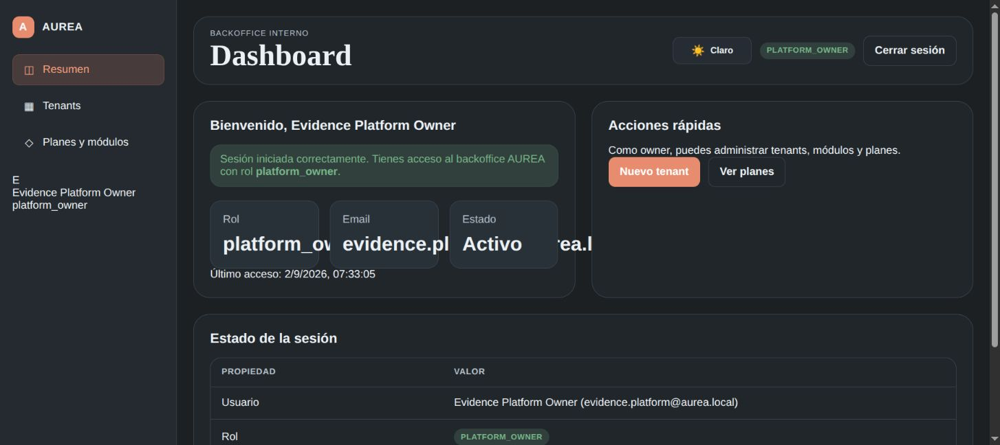
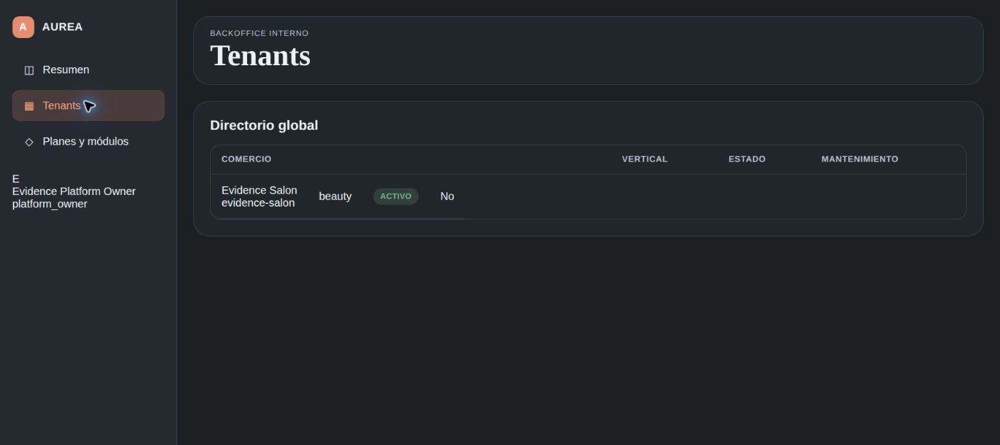
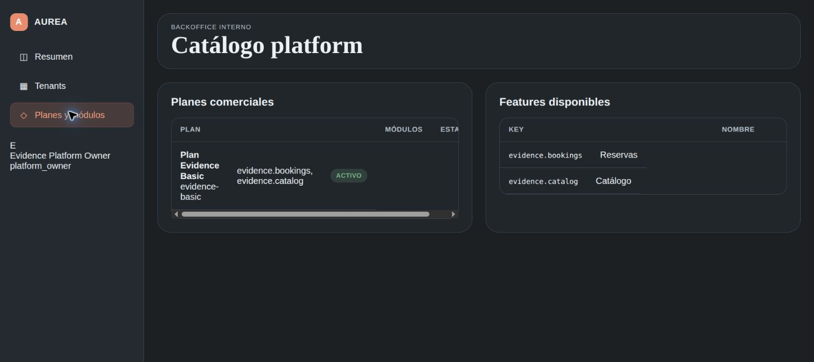
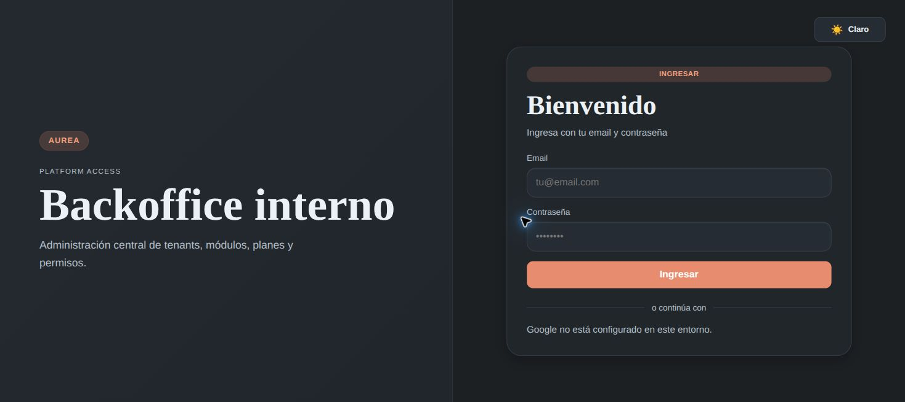

# Evidencia de deploy y validación visual — plataforma interna

## Resumen ejecutivo

Se buscó verificar que la superficie de administración global de AUREA estuviera separada del backoffice de tenants, publicada y accesible en producción. Se confirmó que el backend interno está live en Render, que el frontend interno carga desde Vercel, que el login autenticado funciona y que el owner puede consultar tenants y catálogo. La corrida sigue siendo parcial porque el usuario de evidencia no debe considerarse una credencial operativa y el backend cliente aún espera aprobación para ingresar a `main`.

## Alcance y versiones

| Componente | Rama/commit verificado |
| --- | --- |
| `backoffice-be-aurea-internal` | `main @ 9959c18` |
| `backoffice-fe-aurea-internal` | `codex/fix-internal-pwa @ 381494d` (build productivo con API Render) |
| `backoffice-be-aurea` | `codex/platform-audit @ e1a442f` |
| `backoffice-fe-aurea` | `codex/frontend-e2e-validation @ 240320a` |
| Backend interno Render | `https://aurea-backoffice-be-internal.onrender.com` |
| Frontend interno Vercel | `https://aurea-backoffice-internal-aurea-pages-template.vercel.app` |

Fecha de corrida: 2026-09-02. Navegador: Google Chrome.

## Matriz de cobertura

| Requisito | Resultado | Evidencia |
| --- | --- | --- |
| Backend interno publicado desde `main` | CUMPLE | Deploy Render `live`; commit `9959c18` |
| Health check de plataforma | CUMPLE | `GET /api/v1/health/live` respondió HTTP 200 con `scope: platform` |
| Frontend interno publicado | CUMPLE | La URL productiva carga la pantalla de login |
| Ruta protegida sin sesión | CUMPLE | `/platform/tenants` redirigió a `/login` |
| Login autenticado y permisos platform | CUMPLE | Usuario efímero de evidencia `evidence.platform@aurea.local`, rol `platform_owner` |
| Consulta de tenants con datos | CUMPLE | Tenant `Evidence Salon` visible en Chrome |
| Consulta de planes y features con datos | CUMPLE | Plan `Plan Evidence Basic` y dos features visibles en Chrome |
| Integración cliente en `main` | NO VERIFICABLE | Backend cliente pendiente de aprobación en [PR #97](https://github.com/aurea-io/backoffice-be-aurea/pull/97) |

## Verificaciones automatizadas

- `backoffice-be-aurea-internal`: TypeScript y build Nest OK antes del deploy.
- Render: deploy `dep-daca3d3bc2fs739f7fe0` en estado `live`.
- Health: `200 {"status":"ok","scope":"platform","check":"liveness","commit":"9959c1857938beed4029747a0db962296364a042"}`.
- Frontend interno: `VITE_API_URL=https://aurea-backoffice-be-internal.onrender.com/api/v1 pnpm run build` OK.
- Seed controlado de evidencia: se creó/actualizó el usuario `evidence.platform@aurea.local` y datos sintéticos `Evidence Salon`, `evidence-basic`, `evidence.bookings` y `evidence.catalog`.

## Validación visual en Chrome

### Login productivo

Resultado observado: se muestran la marca AUREA, el título “Backoffice interno”, formulario de email/contraseña y el aviso de que Google no está configurado en este entorno.

### Dashboard autenticado

Resultado observado: sesión activa como `platform_owner`, usuario activo y navegación habilitada para Resumen, Tenants y Planes y módulos.

### Directorio de tenants

Resultado observado: el tenant sintético `Evidence Salon` aparece activo, con vertical `beauty` y sin mantenimiento.

### Planes y módulos

Resultado observado: aparece `Plan Evidence Basic` con `evidence.bookings` y `evidence.catalog`, además de ambas features activas.

### Protección de ruta

Resultado observado: el acceso sin sesión a `/platform/tenants` termina en `/login`.

## Desvíos, bloqueos y trazabilidad

| Hallazgo | Estado | Referencia |
| --- | --- | --- |
| El usuario de evidencia es sintético y debe retirarse o rotarse antes de uso operativo | ABIERTO | Usuario `evidence.platform@aurea.local` |
| El backend cliente ya fue integrado en `main`; queda validar el estado posterior al merge | CERRADO | [aurea-io/backoffice-be-aurea#97](https://github.com/aurea-io/backoffice-be-aurea/pull/97) |

La cobertura visual autenticada sí fue ejecutada con el usuario sintético de evidencia: dashboard, tenants, planes y features. El pendiente restante es retirar o rotar esa cuenta sintética.

Issues y estado de seguimiento: [#45 — rotar usuario sintético](https://github.com/aurea-io/aurea-docs/issues/45) (OPEN, Project 2: pendiente); [#97 — retirar Superadmin del backend cliente](https://github.com/aurea-io/backoffice-be-aurea/pull/97) (MERGED); [#40 — ownership por repositorio y scope](https://github.com/aurea-io/aurea-docs/issues/40) (OPEN, Project 2: pendiente); [#41 — contrato de autenticación](https://github.com/aurea-io/aurea-docs/issues/41) (OPEN, Project 2: pendiente); [#42 — rutas y migración](https://github.com/aurea-io/aurea-docs/issues/42) (OPEN, Project 2: pendiente).

## Conclusión

El deploy público del backend interno está operativo y la interfaz productiva responde correctamente en Chrome para los flujos no autenticados y autenticados de consulta. La evidencia es **PARCIAL**, no una aprobación integral, porque la corrida usa un usuario sintético que debe rotarse/eliminarse; el backend cliente ya fue integrado en `main` mediante el PR #97.
