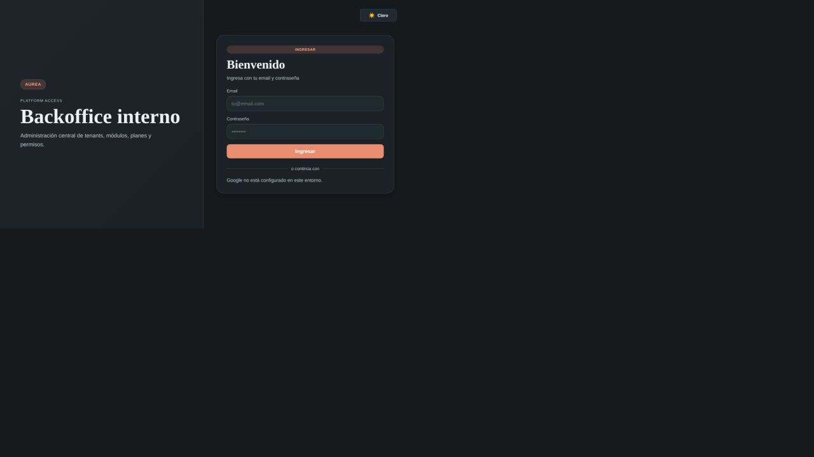

# Corrida de evidencias — separación platform/internal

## Resumen ejecutivo

Esta corrida es un snapshot histórico del avance de la separación entre el Backoffice interno de AUREA y el backoffice operativo de los tenants. Su fuente de verdad actualizada es la corrida de producción [`26-09-02_19-27_internal-platform-production`](../26-09-02_19-27_internal-platform-production/README.md), que incorpora Render, MongoDB remoto y la validación autenticada en Chrome.

La separación todavía no puede declararse completa: el backend internal aún no está desplegado con una conexión MongoDB de producción y, por ese motivo, no se pudo ejecutar el flujo autenticado end-to-end ni validar mutaciones contra datos reales.

## Alcance

- `backoffice-be-aurea-internal` en `main`.
- `backoffice-fe-aurea-internal` en `main`.
- API platform de lectura y mutación básica.
- Login y protección de rutas platform.
- Health check y contenedor de producción.
- Publicación estática del frontend internal.

## Versiones verificadas

| Componente | Commit | Estado |
| --- | --- | --- |
| Backend internal | `0288b99` | Publicado en `main` |
| Frontend internal | `381494d` | Publicado en `main` |

## Validaciones automatizadas

| Validación | Resultado |
| --- | --- |
| TypeScript backend internal | ✅ Sin errores |
| Tests backend internal | ✅ 40/40 |
| Build frontend internal | ✅ Exitoso |
| Build Docker backend internal | ✅ Exitoso |
| Health en contenedor local | ✅ `200`, `scope: platform` |
| Backend cliente desplegado `/api/health/live` | ✅ `200` |

## Validaciones funcionales en navegador

### 1. Login del Backoffice interno

Resultado: ✅ La aplicación muestra una superficie separada, identificada como `Backoffice interno`, con autenticación específica de plataforma.

### 2. Protección de ruta platform

Resultado: ✅ El acceso no autenticado a `/platform/tenants` vuelve a la pantalla de login.

## Contratos implementados

Backend internal (contratos vigentes; autenticación JWT de plataforma):

| Endpoint | Auth / capability | Request | Response | Errores y límite de datos |
| --- | --- | --- | --- | --- |
| `GET /api/v1/platform/tenants` | JWT `scope=platform`; `platform.tenants.read` | Sin body | Lista `PlatformTenant` | `401` sin JWT; `403` sin capability; sólo datos globales de tenants |
| `GET /api/v1/platform/tenants/:id` | JWT `scope=platform`; `platform.tenants.read` | `id` de ruta | `PlatformTenant` | `401`/`403`; no devuelve reservas, empleados ni datos operativos |
| `POST /api/v1/platform/tenants` | JWT `scope=platform`; `platform.tenants.write` | DTO de alta: `name`, `slug`, `vertical` | `PlatformTenant` creado | `401`/`403`; crea entidad global, sin payload tenant-operativo |
| `PATCH /api/v1/platform/tenants/:id` | JWT `scope=platform`; `platform.tenants.write` | DTO parcial de tenant | `PlatformTenant` actualizado | `401`/`403`; muta sólo configuración global |
| `GET /api/v1/platform/plans` | JWT `scope=platform`; `platform.catalog.read` | Sin body | Lista `PlatformPlan` | `401`/`403`; catálogo global, no suscripción operativa del tenant |
| `POST /api/v1/platform/plans` | JWT `scope=platform`; `platform.catalog.write` | DTO de plan y features | `PlatformPlan` creado | `401`/`403`; catálogo global |
| `PATCH /api/v1/platform/plans/:id` | JWT `scope=platform`; `platform.catalog.write` | DTO parcial de plan | `PlatformPlan` actualizado | `401`/`403`; catálogo global |
| `GET /api/v1/platform/features` | JWT `scope=platform`; `platform.catalog.read` | Sin body | Lista `PlatformFeature` | `401`/`403`; catálogo global |
| `GET /api/v1/health/live` | Público, liveness | Sin body | `{ status, scope, check, commit }` | No expone datos de tenants |

La corrida de producción verifica los `GET` autenticados de tenants, planes y features; las mutaciones quedan pendientes de una sesión específica de QA.

Frontend internal:

- `/platform/dashboard`
- `/platform/tenants`
- `/platform/catalog`

## Limitaciones y pendientes

- El snapshot no incluía todavía un servicio Render para `backoffice-be-aurea-internal`; ese punto quedó resuelto en la corrida de producción enlazada arriba.
- La publicación Vercel del frontend internal del snapshot no tenía aún la API productiva configurada; ese punto quedó resuelto en la corrida de producción enlazada arriba.
- No se verificaron alta/edición real de tenants y planes contra MongoDB remoto en este snapshot; siguen pendientes como prueba de mutación separada.
- El retiro de los endpoints y pantallas Superadmin del backoffice cliente quedó integrado mediante [PR #97](https://github.com/aurea-io/backoffice-be-aurea/pull/97); este snapshot conserva el pendiente histórico para contexto.
- La corrida autenticada con `platform_owner` ya está documentada en producción; queda una sesión específica para `platform_operator`, `401`, `403` y mutaciones. Seguimiento: [#41 — contrato de autenticación](https://github.com/aurea-io/aurea-docs/issues/41) y [#42 — rutas y migración](https://github.com/aurea-io/aurea-docs/issues/42), ambos OPEN en Project 2.

## Conclusión

La base de la separación estaba implementada y publicada en `main` al momento de este snapshot. Los pendientes de despliegue y lectura autenticada fueron resueltos por la corrida de producción enlazada; permanecen como trabajo separado la prueba de mutaciones y el cierre de las épicas con la aprobación del backend cliente.
