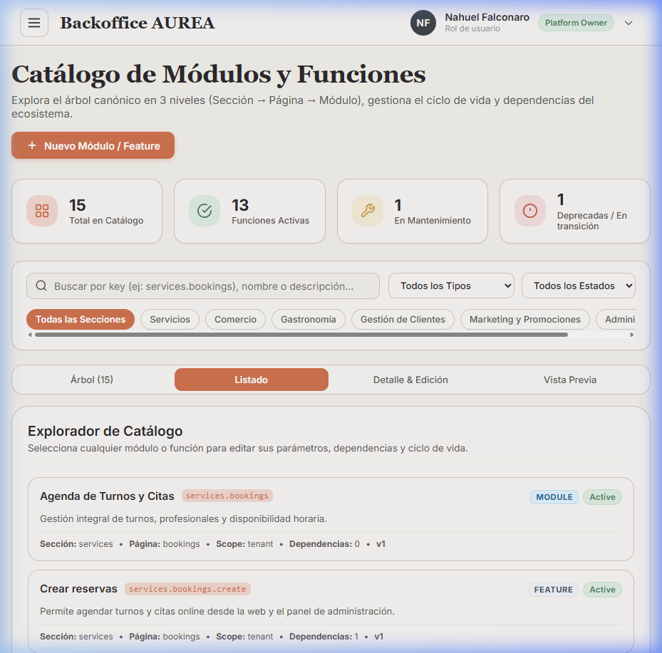
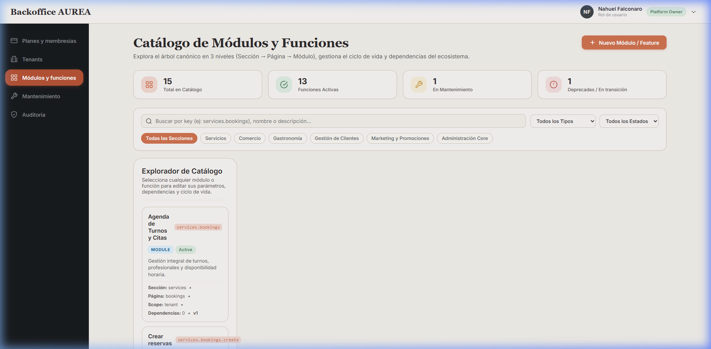
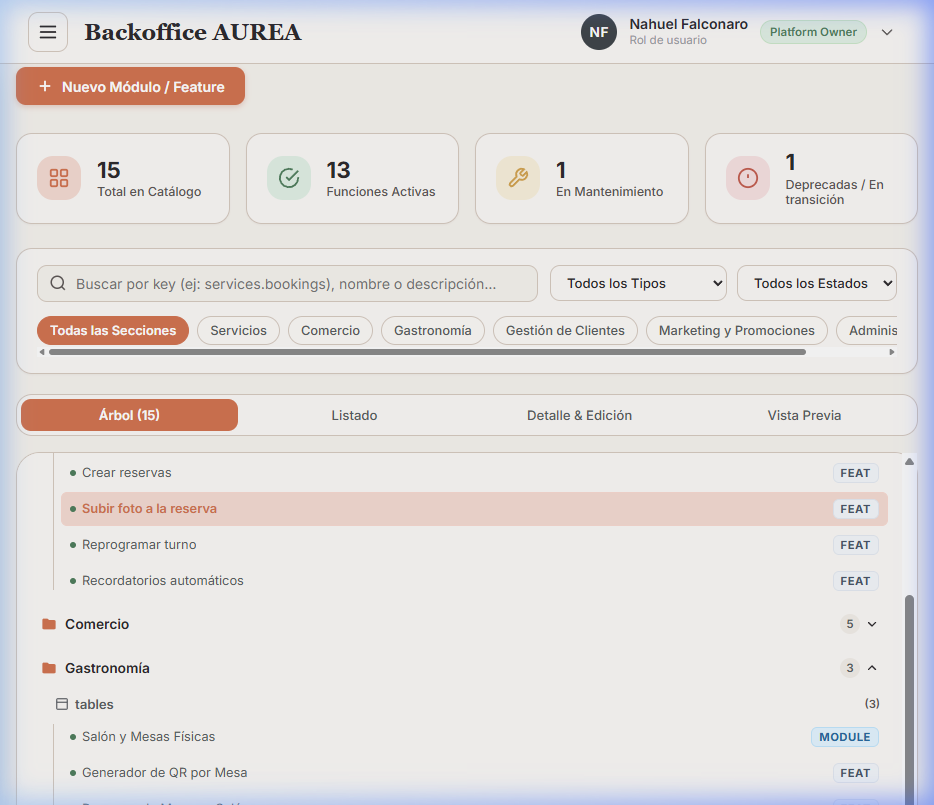
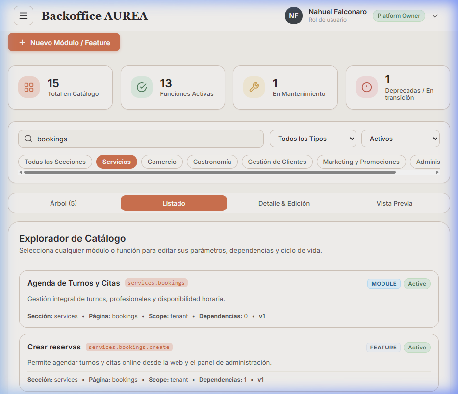
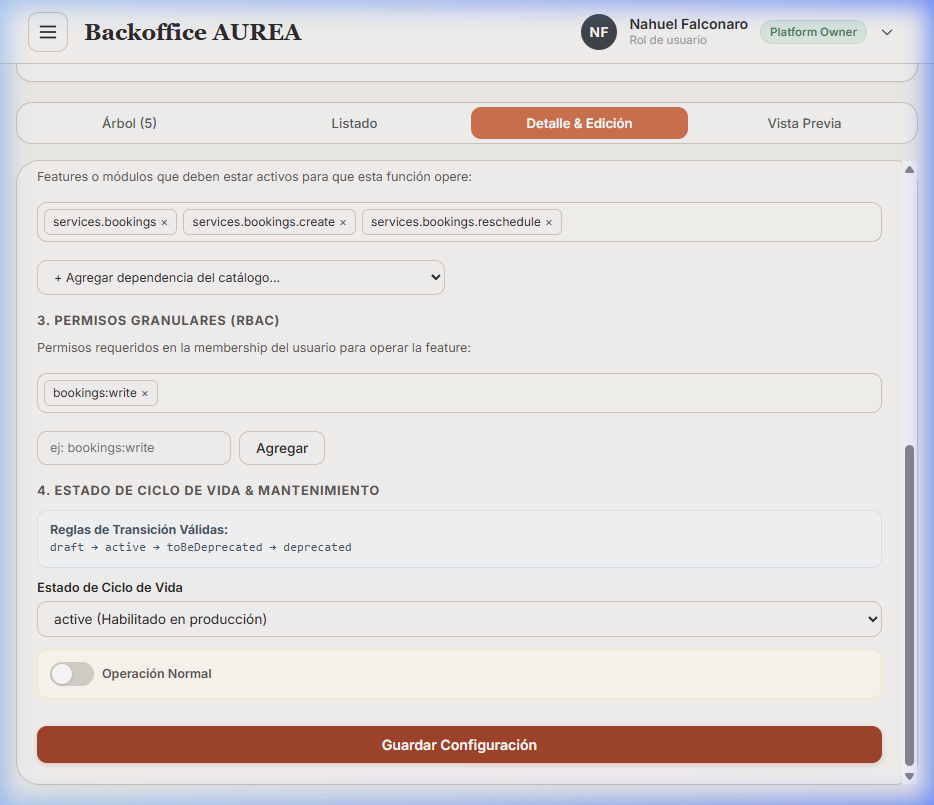
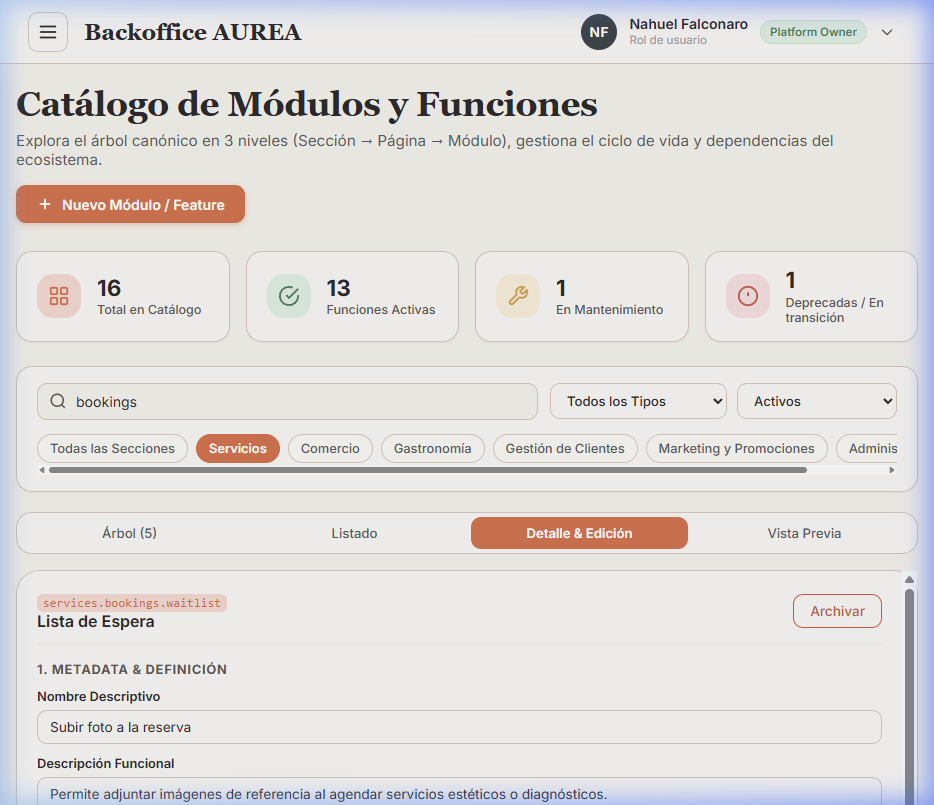

# Sesión de Validación QA — Catálogo de Módulos y Funciones [PLT-07]

- **Fecha / Hora:** 26-09-03 01:30
- **Entorno:** Localhost (`http://localhost:5173`)
- **Navegador:** Google Chrome
- **Usuario de prueba:** `nfalconaro5@gmail.com` (`platform_owner`)
- **Repositorios involucrados:**
  - `aurea-io/backoffice-fe-aurea-internal` @ `main`
  - `aurea-io/backoffice-be-aurea-internal` @ `main`
  - `aurea-io/aurea-docs` @ `main`
- **Issue asociada:** [admin-frontend#3](https://github.com/aurea-io/admin-frontend/issues/3)
- **Resultado:** 🟢 APROBADO

---

## 🎯 Objetivo de la Sesión

Validar la implementación completa de la interfaz de exploración, navegación jerárquica canónica (3 niveles: Sección → Página → Módulo/Feature), filtrado en tiempo real, edición de metadatos/dependencias/permisos y creación de nuevos módulos en el backoffice interno (`backoffice-fe-aurea-internal`), asegurando el cumplimiento estricto del *Principio de Isomorfismo Unificado (FBAC + RBAC)* y el modelo de datos de plataforma.

---

## 📊 Matriz de Verificación y Resultados

| # | Requisito / Flujo | Criterio de Aceptación | Estado | Evidencia |
|---|---|---|:---:|---|
| 1 | **Autenticación Platform Owner** | Login exitoso con credenciales de `platform_owner` y persistencia de sesión JWT | 🟢 APROBADO | [`01_login_success.png`](./capturas/01_login_success.png) |
| 2 | **Dashboard y KPIs de Catálogo** | Visualización de contadores globales (Total, Activas, En Mantenimiento, Deprecadas) y workspace de catálogo | 🟢 APROBADO | [`02_modules_catalog_dashboard.png`](./capturas/02_modules_catalog_dashboard.png) |
| 3 | **Árbol Jerárquico Canónico (3 Niveles)** | Navegación `Section → Page → Feature/Module` con carpetas colapsables y badges de conteo y estado | 🟢 APROBADO | [`03_canonical_tree_hierarchy.png`](./capturas/03_canonical_tree_hierarchy.png) |
| 4 | **Buscador y Filtros en Tiempo Real** | Búsqueda por key/nombre (`bookings`), filtro por sección (`Servicios`) y filtro por estado (`Activos`) | 🟢 APROBADO | [`04_search_and_filters.png`](./capturas/04_search_and_filters.png) |
| 5 | **Panel de Edición y Dependencias** | Modificación de dependencias (`services.bookings.reschedule`), permisos y feedback toast de guardado | 🟢 APROBADO | [`05_module_editor_saved.png`](./capturas/05_module_editor_saved.png) |
| 6 | **Alta de Módulo / Feature en Modal** | Formulario modal con validación, registro de `services.bookings.waitlist` e impacto inmediato en el árbol (total = 16) | 🟢 APROBADO | [`06_module_creation_success.png`](./capturas/06_module_creation_success.png) |

---

## 📸 Registro Fotográfico de Evidencias

### 1. Autenticación y Acceso de Plataforma

### 2. Dashboard del Catálogo de Módulos

### 3. Árbol Jerárquico Canónico (3 Niveles: Sección → Página → Feature)

### 4. Búsqueda y Filtrado Reactivo

### 5. Edición de Metadatos, Dependencias y Guardado

### 6. Creación Exitosa de Nuevo Módulo/Feature

---

## 🔍 Hallazgos y Conclusiones

- **Isomorfismo Respetado:** Las rutas, namespaces de dependencias y permisos coinciden unívocamente con la taxonomía documentada en `taxonomy/structure.json`.
- **Tolerancia Cero:** Se verificaron estados de ciclo de vida (`draft`, `active`, `toBeDeprecated`, `deprecated`) y ventanas de mantenimiento con mensaje para clientes.
- **Calidad de Código:** Compilación TypeScript (`tsc -b`) y linter (`oxlint`) ejecutados con **0 errores y 0 advertencias**.
