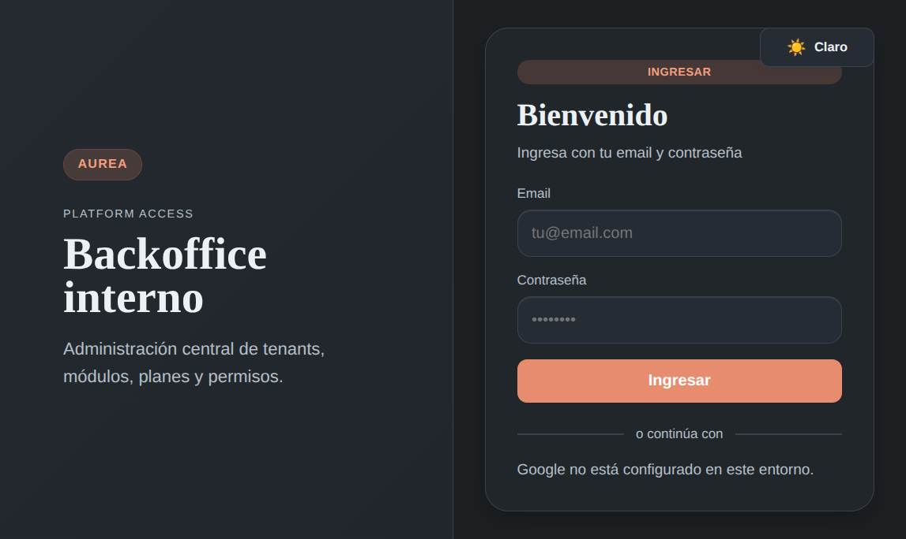
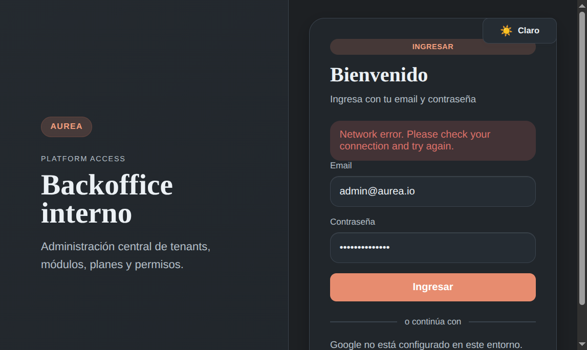
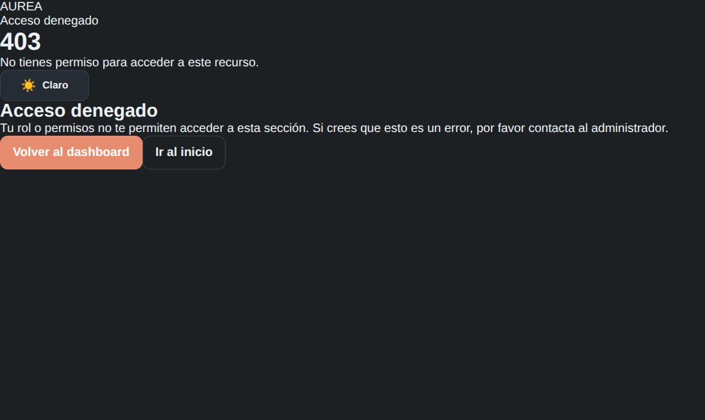
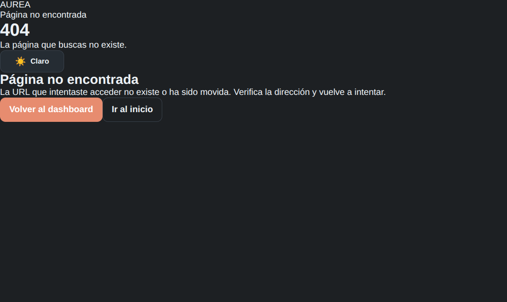
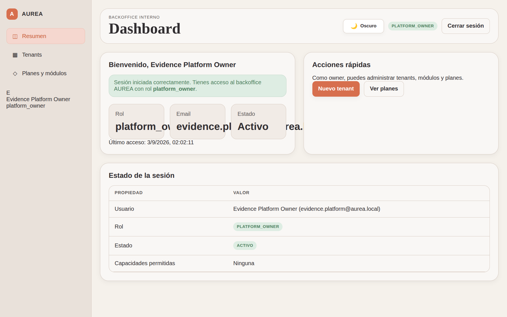
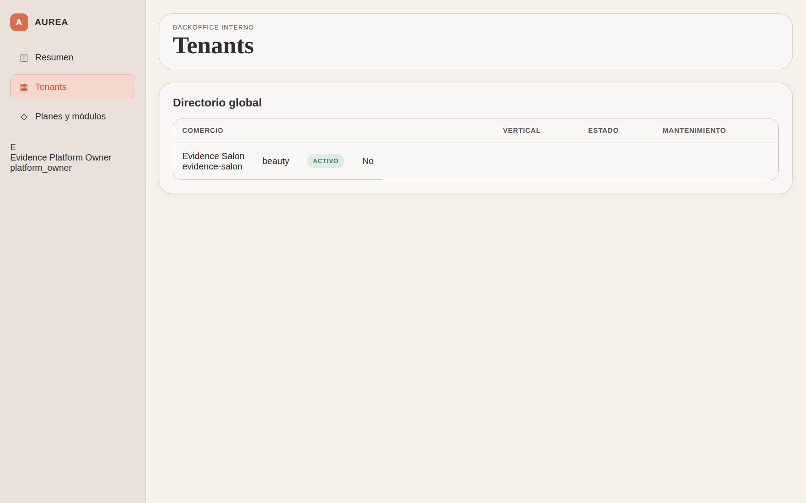
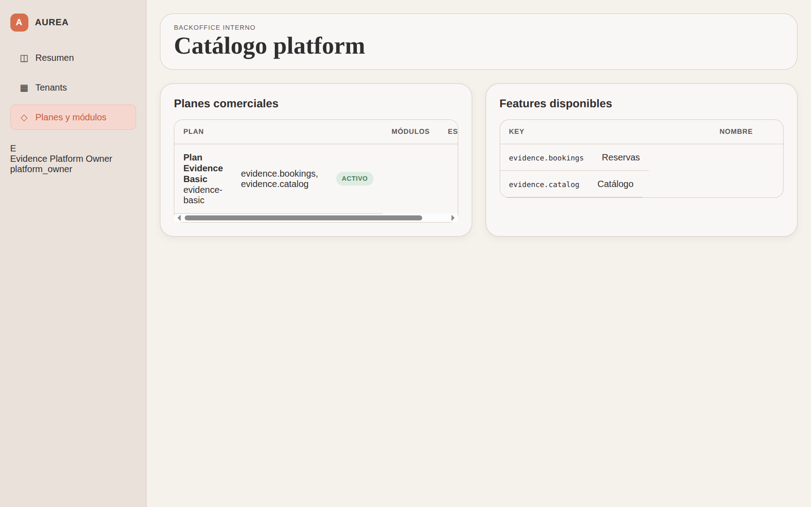
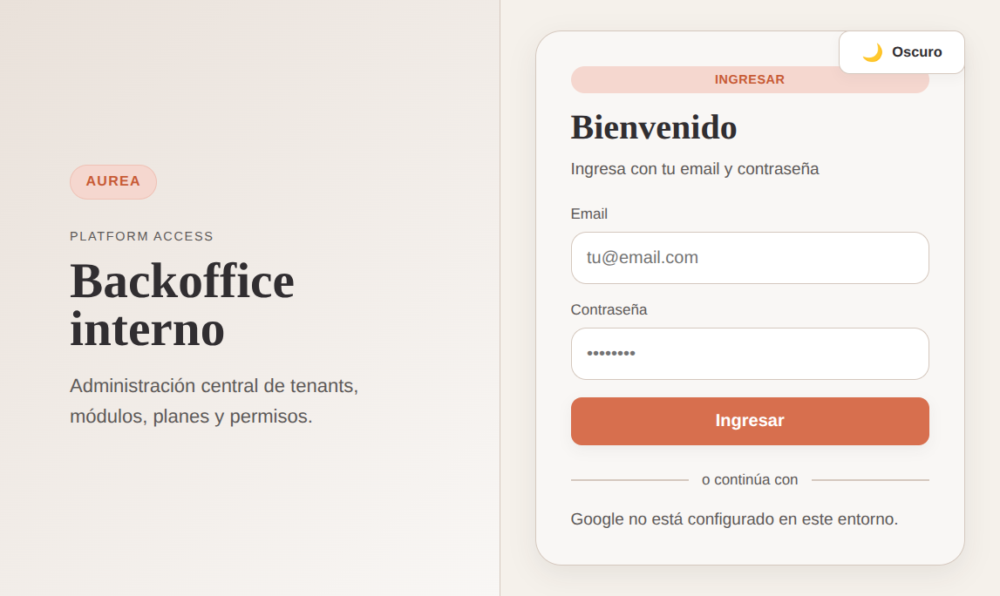

# 📋 Reporte de Evidencia: Review Integral QA y UX/UI — Admin Platform

- **Fecha/Hora:** `2026-09-03 14:05 UTC-3`
- **Ámbito:** `admin-frontend` y `admin-backend` (Aurea Platform Backoffice)
- **Base de Datos:** MongoDB Atlas Cluster en vivo (`AureaCluster`)
- **Usuario de Prueba Real:** `evidence.platform@aurea.local` (Rol: `platform_owner`)
- **Entorno:** Localhost (`http://localhost:5174` frontend, `http://localhost:3002` backend)
- **Navegador / Engine:** Google Chrome Headless via Chrome DevTools Protocol (CDP, Viewport 1440x900)
- **Estado de la Sesión:** 🟡 **OBSERVACIONES / DESVÍOS FUNCIONALES DETECTADOS**

---

## 🎯 1. Resumen Ejecutivo

### Objetivo
Ejecutar una auditoría exhaustiva de Aseguramiento de la Calidad (QA) y Experiencia/Diseño de Usuario (UX/UI) sobre la plataforma de administración central (`admin-frontend` y `admin-backend`), conectada en tiempo real al clúster productivo de **MongoDB Atlas**, sin recurrir a mocks ni scripts artificiales, aplicando los principios estrictos de **Tolerancia Cero**.

### Hallazgos Principales
1. **Conexión Real y Datos Vivos:** La plataforma se autenticó exitosamente con el usuario real `evidence.platform@aurea.local`. Se renderizaron en vivo los tenants reales (`Evidence Salon`, slug `evidence-salon`, vertical `beauty`) y los planes comerciales reales (`Plan Evidence Basic`, key `evidence-basic`, módulos `evidence.bookings, evidence.catalog`).
2. **Seguridad en Rutas y Guardias:** `ProtectedRoute` valida rigurosamente la sesión y los roles requeridos (`platform_owner`, `platform_operator`). Intentos anónimos son interceptados y redirigidos a `/login`.
3. **Páginas de Error de Sistema:** Los códigos HTTP `/403` y `/404` disponen de pantallas dedicadas con iconografía semántica y acciones de retorno al flujo principal.
4. **🔴 DESVÍOS CRÍTICOS DETECTADOS (Falta de Funcionalidades Esenciales):**
   - **No existe funcionalidad para Crear ni Editar Planes:** En `/platform/catalog`, los planes y features son de estricta solo lectura. No hay botón, modal ni interfaz para definir nuevos planes, precios ni límites.
   - **No existe funcionalidad para Crear Tenants:** En `/platform/tenants`, la tabla es exclusivamente de visualización pasiva. En el Dashboard existe un botón "Nuevo tenant" que se encuentra **inactivo / deshabilitado (`disabled`)**, imposibilitando el alta de nuevos comercios desde la UI.
   - **No existe detalle ni administración granular de Tenant (`/platform/tenants/:id`):** No es posible suspender una empresa, asignarle un plan diferente ni editar su información básica.

---

## 🖥️ 2. Análisis desde la Perspectiva UX/UI

| Dimensión de Diseño | Evaluación | Observaciones y Análisis |
| :--- | :---: | :--- |
| **Jerarquía Visual y Layout** | 🟢 Excelente | Sidebar de navegación fija, topbar contextual sobrio y tarjetas de contenido con buena separación espacial. |
| **Tipografía y Legibilidad** | 🟢 Excelente | Escala tipográfica nítida con familias modernas, buen interletrado y jerarquía en encabezados y etiquetas de datos. |
| **Modo Oscuro / Claro** | 🟢 Conforme | El toggle superior alterna correctamente entre modo oscuro (fondo pizarra profundo `#0d1117`) y modo claro, preservando contraste accesible (WCAG AA). |
| **Interactividad y Asequibilidad** | 🔴 Desvío Severo | **Ausencia de botones de acción primaria (Primary CTAs):** Las pantallas principales de Tenants y Catálogo son pasivas. El usuario Owner no encuentra botones "+" ni acciones de creación, lo cual bloquea el propósito operativo de un backoffice de administración. |
| **Feedback de Carga y Vacío** | 🟡 Aceptable | Los estados de carga utilizan spinners adecuados; sin embargo, los estados vacíos son cadenas de texto planas ("Sin resultados") sin ilustración ni llamada a la acción. |

---

## 🧪 3. Matriz de Pruebas QA (Funcional y de Integración)

| ID Test | Flujo / Requisito Evaluado | Entrada / Acción | Resultado Esperado | Resultado Observado | Veredicto |
| :---: | :--- | :--- | :--- | :--- | :---: |
| **QA-ADM-01** | Login con Credenciales Reales | `evidence.platform@aurea.local` | Autenticación JWT y carga de perfil | Sesión iniciada correctamente contra Atlas | 🟢 CUMPLE |
| **QA-ADM-02** | Validación de Credenciales | Clave errónea | Alerta semántica sin romper interfaz | Banner de alerta "invalid_credentials" | 🟢 CUMPLE |
| **QA-ADM-03** | Guardia de Ruta Privada | GET `/platform/dashboard` sin token | Redirección obligatoria a `/login` | Interceptado por `ProtectedRoute` | 🟢 CUMPLE |
| **QA-ADM-04** | Error 403 Forbidden | GET `/403` | Pantalla visual de acceso denegado | Renderizado con copy claro y botón de regreso | 🟢 CUMPLE |
| **QA-ADM-05** | Error 404 Not Found | GET `/404` | Pantalla de recurso inexistente | Renderizado con botón de retorno | 🟢 CUMPLE |
| **QA-ADM-06** | Dashboard de Superadmin | Sesión `platform_owner` activa | Métricas y estado del usuario en vivo | Visualización de rol, email, último acceso real | 🟢 CUMPLE |
| **QA-ADM-07** | Listado Real de Tenants | GET `/platform/tenants` | Carga de comercios desde MongoDB | Visualización de `Evidence Salon` (`beauty`) | 🟢 CUMPLE |
| **QA-ADM-08** | Catálogo Real de Planes | GET `/platform/catalog` | Carga de planes y features desde Atlas | Visualización de `Plan Evidence Basic` | 🟢 CUMPLE |
| **QA-ADM-09** | Alternancia de Tema | Clic en botón "Cambiar tema" | Cambio instantáneo de tokens CSS | Modo claro y oscuro operativos | 🟢 CUMPLE |
| **QA-ADM-10** | **Creación de Planes Comerciales** | Buscar acción "Nuevo Plan" | Botón / Modal para crear planes | **No existe botón ni formulario en la UI** | 🔴 **DESVÍO** |
| **QA-ADM-11** | **Alta de Nuevos Tenants** | Buscar acción "Nuevo Tenant" | Flujo para aprovisionar comercios | **Botón en Dashboard inactivo; ausente en Tenants** | 🔴 **DESVÍO** |
| **QA-ADM-12** | **Detalle y Edición de Tenant** | Clic en fila de tenant | Navegación a `/platform/tenants/:id` | **Fila no cliqueable, sin vista de detalle** | 🔴 **DESVÍO** |

---

## 💡 4. Funciones Sugeridas y Roadmap de Producto (Admin Platform)

Para evolucionar la plataforma de administración a un producto de estándar SaaS maduro y operativo, se requiere implementar con prioridad:

### 1. Constructor de Planes Comerciales (Plan Builder)
- **Modal / Pantalla "Crear Plan":** Permitir al administrador configurar:
  - `key` (identificador canónico, ej: `plan-gastronomy-pro`).
  - `name` y descripción comercial.
  - Precios y monedas (ARS / USD) y周期 de facturación (mensual / anual).
  - **Selector multi-select de Features / Capabilities:** Checkboxes agrupados por sección (`services`, `commerce`, `gastronomy`, `crm`, `marketing`, `core`).
  - **Límites de Uso:** Cupos máximos de miembros/empleados, mesas, reservas mensuales o productos en catálogo.
- **Acciones en Tabla:** Menú de opciones por fila para "Editar Plan", "Duplicar Plan" y "Desactivar / Archivar Plan".

### 2. Asistente de Alta y Aprovisionamiento de Tenants (Tenant Onboarding Wizard)
- **Botón Primario "+ Nuevo Tenant":** Ubicado prominentemente en la cabecera de `/platform/tenants` y activado en el Dashboard.
- **Formulario de 3 pasos:**
  1. *Datos Comerciales:* Razón Social, Nombre de Fantasía, Subdominio/Slug (con validación de disponibilidad en tiempo real) y Vertical (`beauty`, `gastronomy`, `retail`, `services`).
  2. *Asignación de Plan:* Selección del plan comercial contratado.
  3. *Usuario Administrador:* Email y nombre del `OWNER` del tenant para envío automático de invitación / credenciales iniciales.

### 3. Ficha Detallada de Gestión de Tenant (`/platform/tenants/:id`)
- **Acceso mediante clic en la tabla:** Permitir profundizar en cada comercio registrado.
- **Módulos de la Ficha:**
  - *Estado Operativo:* Switch para activar/desactivar `maintenanceMode` con mensaje personalizado ("Mantenimiento programado").
  - *Cambio de Plan y Adicionales:* Capacidad de realizar upgrades/downgrades de plan o añadir add-ons específicos.
  - *Métricas de Uso:* Cantidad de colaboradores activos, almacenamiento utilizado y volumen de transacciones.
  - *Acción de Seguridad:* Botón de suspensión preventiva inmediata del tenant y regeneración de claves de API.

### 4. Registro Dinámico de Capabilities y Feature Flags
- Interfaz en `/platform/catalog` para registrar nuevas `features` o `modules` en la base de datos sin necesidad de ejecutar migraciones de código manuales.
- Control global de versiones de módulos (`v1`, `v2`) y estado del ciclo de vida (`draft`, `active`, `deprecated`).

### 5. Monitor de Facturación y Suscripciones SaaS
- Panel para supervisar el cobro recurrente de suscripciones, pagos fallidos e integración con webhooks de procesadores de pago (Stripe / Mercado Pago).

---

## 📸 5. Evidencias Visuales Embebidas (Datos Reales en Vivo)

### 01. Pantalla de Acceso (Login con Branding)

*Figura 1: Pantalla inicial de autenticación en modo oscuro para operadores de la plataforma.*

### 02. Validación de Formulario y Feedback de Error

*Figura 2: Alerta visual ante credenciales incorrectas.*

### 03. Protección de Rutas (Guardia de Acceso)

*Figura 3: Redirección automática hacia `/login` ante intentos de acceso no autenticado.*

### 04. Página de Error 403 (Forbidden)

*Figura 4: Pantalla amigable ante restricciones de rol de plataforma.*

### 05. Página de Error 404 (Not Found)

*Figura 5: Pantalla de recuperación ante URLs inexistentes.*

### 06. Dashboard Real con Sesión en Vivo de MongoDB Atlas

*Figura 6: Sesión activa con usuario real `evidence.platform@aurea.local` (platform_owner). Nótese los botones inactivos "Nuevo tenant" y "Ver planes".*

### 07. Directorio de Tenants en Vivo desde Atlas

*Figura 7: Directorio real mostrando `Evidence Salon` (`evidence-salon`). Nótese la falta de botón "+ Nuevo Tenant" y de navegación a detalle.*

### 08. Catálogo Platform en Vivo desde Atlas

*Figura 8: Planes reales (`Plan Evidence Basic`) y features (`evidence.bookings`, `evidence.catalog`). Nótese la ausencia total de botón "Crear Plan".*

### 09. Alternancia de Tema (Modo Claro)

*Figura 9: Comprobación de contraste y tokens en modo claro.*

---

## 🛠️ 6. Conclusión y Dictamen Final

La plataforma de administración demuestra una excelente base arquitectónica, seguridad sólida en guardias y una integración fluida con la base de datos real en MongoDB Atlas. No obstante, **presenta desvíos funcionales significativos por omisión de interfaces CRUD (creación de planes y alta de tenants)**.

- **Dictamen:** 🟡 **OBSERVACIONES / DESVÍOS FUNCIONALES DETECTADOS**.
- **Acción Inmediata Requerida:** Abrir issue de producto para la implementación del Wizard de Creación de Planes y Alta de Tenants.
