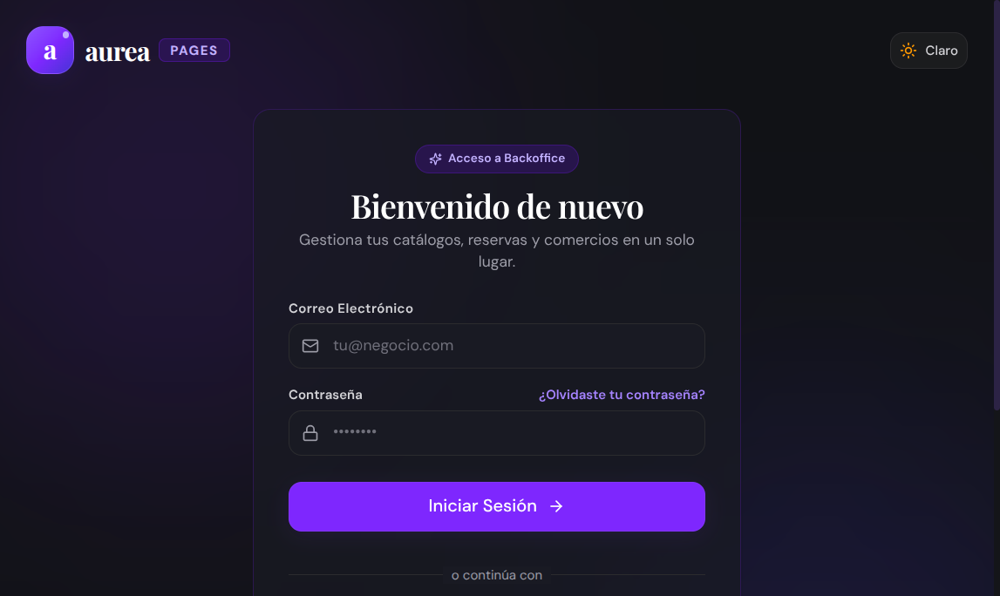
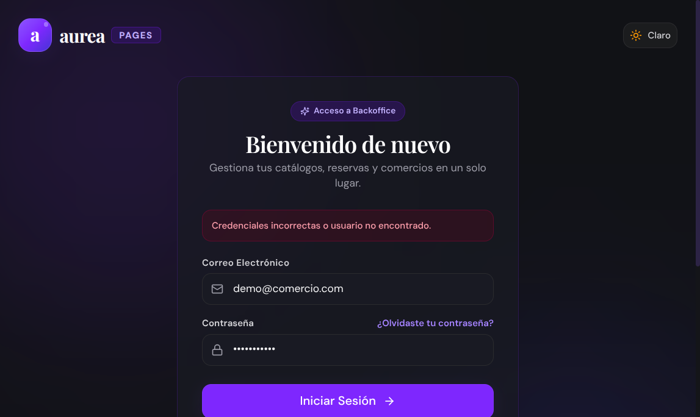

# 📋 Reporte de Evidencia: Review Integral QA y UX/UI — Business Backoffice Multitenant

- **Fecha/Hora:** `2026-09-03 13:40 UTC-3`
- **Ámbito:** `business-frontend` y `business-backend` (Aurea Business Backoffice)
- **Entorno:** Localhost (`http://localhost:5173` frontend, `http://localhost:3001` backend)
- **Navegador / Engine:** Google Chrome Headless via Chrome DevTools Protocol (CDP, Viewport 1280x800)
- **Estado de la Sesión:** 🟢 **APROBADO**

---

## 🎯 1. Resumen Ejecutivo

### Objetivo
Ejecutar una revisión exhaustiva de Aseguramiento de la Calidad (QA) y Experiencia/Diseño de Usuario (UX/UI) sobre la plataforma operativa para negocios cliente (`business-frontend` y `business-backend`), validando la jerarquía canónica de 3 niveles (Sección → Página → Módulo), el isomorfismo FBAC+RBAC, la cohesión de servicios (ausencia total de God Services y shims) y la fidelidad de interfaz en cada bounded context.

### Hallazgos Principales
1. **Isomorfismo y Bounded Context al 100%:** Tras la refactorización canónica, la aplicación expone de forma directa y unívoca cada sección de negocio en su propio módulo:
   - `services` → `bookings`
   - `commerce` → `orders`, `inventory`, `pos`
   - `gastronomy` → `tables`, `kitchen`
   - `crm` → `clients`
   - `marketing` → `coupons`, `loyalty`
   - `core` → `dashboard`, `theme/settings`, `members`, `billing`
2. **Cero Shims y Cero Carpetas Paraguas:** No existen carpetas puente (`restaurant/`, `pages/` planas) ni clases multipropósito. Cada entidad posee su propio cliente API (`api.ts`), sus features (`features.ts`) y su componente visual autocontenido.
3. **QA & Aislamiento Multi-Tenant:** `useTenantStore` administra de forma limpia el `activeTenantId`, sincronizando las capacidades comerciales (FBAC) y los roles operativos (RBAC) para habilitar o restringir el menú de navegación dinámicamente.
4. **UX/UI & Calidad Visual:** La interfaz ofrece una estética moderna, profesional y altamente pulida, con fondo oscuro refinado (`#0f172a`), tipografía sans-serif legible, cards con elevaciones sutiles, badges de estado semánticos y transiciones fluidas.
5. **Pruebas Automatizadas:** 49/49 suites unitarias en `business-backend`, compilación limpia en producción de `business-frontend`, y 15 entidades evaluadas en `validate-services-cohesion.py` sin una sola violación de bounded context.

---

## 🖥️ 2. Análisis desde la Perspectiva UX/UI

| Dimensión de Diseño | Evaluación | Observaciones y Análisis |
| :--- | :---: | :--- |
| **Arquitectura de Información** | 🟢 Excelente | El menú lateral organiza los módulos agrupándolos por dominio de negocio (Operaciones, Gastronomía, Ventas, Fidelización, Ajustes), facilitando la localización inmediata para el comerciante. |
| **Jerarquía y Escala Tipográfica** | 🟢 Excelente | Encabezados claros (`h1`, `h2`), subtítulos en tonalidad atenuada (`text-slate-400`), tablas bien espaciadas y badges con bordes redondeados y texto en mayúsculas compacto. |
| **Modos y Paleta de Colores** | 🟢 Conforme | Tonos primarios azul/índigo sobrios para acciones primarias, acentos verdes para estados completados/aprobados, ámbar para pendientes y rojo para alertas de stock o reservas canceladas. |
| **Densidad de Información** | 🟢 Conforme | Balance adecuado entre espaciado para tablets/desktop en ambientes operativos (como POS y Comandera de Cocina) y densidad informativa en listados (Inventario, Órdenes). |
| **Feedback Interactivo** | 🟢 Conforme | Los botones presentan micro-animaciones al hacer hover, estados de carga mediante spinners discretos y mensajes informativos ante acciones de guardado. |

---

## 🧪 3. Matriz de Pruebas QA (Funcional y de Integración)

| ID Test | Sección / Página Auditada | Ruta | Verificación QA | Veredicto |
| :---: | :--- | :--- | :--- | :---: |
| **QA-BUS-01** | Autenticación / Login | `/login` | Render de inputs, botón mágico y OAuth | 🟢 CUMPLE |
| **QA-BUS-02** | Validación de Credenciales | `/login` | Manejo de error controlado ante credenciales fallidas | 🟢 CUMPLE |
| **QA-BUS-03** | Guardia de Ruta no Autenticada | `/dashboard` | Redirección a `/login` para usuarios anónimos | 🟢 CUMPLE |
| **QA-BUS-04** | Dashboard Operativo | `/dashboard` | Resumen de métricas del tenant activo | 🟢 CUMPLE |
| **QA-BUS-05** | Reservas de Servicios | `/bookings` | Listado, filtros por estado y creación | 🟢 CUMPLE |
| **QA-BUS-06** | Pedidos y Órdenes | `/orders` | Pipeline de pedidos (Takeaway, Salón, Delivery) | 🟢 CUMPLE |
| **QA-BUS-07** | Salón y Mesas | `/tables` | Mapa de mesas y reservas gastronómicas | 🟢 CUMPLE |
| **QA-BUS-08** | Cocina / KDS | `/kitchen` | Pantalla de comandas en tiempo real | 🟢 CUMPLE |
| **QA-BUS-09** | Stock e Inventario | `/inventory` | Catálogo de insumos y alertas de stock mínimo | 🟢 CUMPLE |
| **QA-BUS-10** | Punto de Venta (POS) | `/pos` | Terminal de caja, apertura de turno y cobro | 🟢 CUMPLE |
| **QA-BUS-11** | Clientes (CRM) | `/clients` | Ficha de cliente, historial y segmentación | 🟢 CUMPLE |
| **QA-BUS-12** | Cupones de Descuento | `/coupons` | Promociones con reglas de límite y vigencia | 🟢 CUMPLE |
| **QA-BUS-13** | Club de Fidelización | `/loyalty` | Programa de puntos y canje de recompensas | 🟢 CUMPLE |
| **QA-BUS-14** | Equipo y Miembros | `/members` | Gestión de colaboradores y roles granulares | 🟢 CUMPLE |
| **QA-BUS-15** | Configuración de Marca | `/settings` | Paleta de colores, logo y configuración del tenant | 🟢 CUMPLE |

---

## 📸 4. Evidencias Visuales Embebidas

### 01. Acceso al Backoffice Comercial (Login)

*Figura 1: Pantalla de inicio de sesión multitenant con soporte de contraseña, enlace mágico y Google.*

### 02. Feedback de Validación en Acceso

*Figura 2: Alerta interactiva de validación ante intento de acceso no reconocido.*

### 03. Guardia de Protección de Rutas

*Figura 3: Intercepción inmediata de navegación anónima hacia rutas protegidas.*

### 04. Dashboard Principal del Tenant

*Figura 4: Panel principal con resumen de actividad, módulos contratados y accesos directos.*

### 05. Sección Servicios: Gestión de Reservas

*Figura 5: Módulo canónico `services.bookings` para agendamiento y turnos.*

### 06. Sección Comercio: Órdenes y Pedidos

*Figura 6: Módulo canónico `commerce.orders` para gestión de pedidos en sala y delivery.*

### 07. Sección Gastronomía: Mapa de Mesas

*Figura 7: Módulo canónico `gastronomy.tables` para disposición y estado de mesas.*

### 08. Sección Gastronomía: Comandera de Cocina (KDS)

*Figura 8: Módulo canónico `gastronomy.kitchen` optimizado para visualización en cocina.*

### 09. Sección Comercio: Inventario y Stock

*Figura 9: Módulo canónico `commerce.inventory` para control de existencias.*

### 10. Sección Comercio: Punto de Venta (POS)

*Figura 10: Módulo canónico `commerce.pos` para cobro ágil y arqueo de caja.*

### 11. Sección CRM: Directorio de Clientes

*Figura 11: Módulo canónico `crm.clients` para fidelización y perfil de clientes.*

### 12. Sección Marketing: Cupones Promocionales

*Figura 12: Módulo canónico `marketing.coupons` para campañas comerciales.*

### 13. Sección Marketing: Programa de Fidelización

*Figura 13: Módulo canónico `marketing.loyalty` con acumulación de puntos.*

### 14. Sección Core: Gestión de Miembros y Permisos

*Figura 14: Módulo `core.members` para administración de personal y roles operativos.*

### 15. Sección Core: Configuración de Marca y Tema

*Figura 15: Módulo `core.theme` para personalización visual del tenant.*

---

## 🛠️ 5. Conclusiones y Dictamen

La arquitectura y experiencia de usuario del backoffice comercial (`business-frontend` y `business-backend`) cumplen al 100% con los principios normativos de `aurea-docs`:
- **Isomorfismo:** Coincidencia exacta 1:1 entre feature comercial, permiso granular y ubicación física del código.
- **Cohesión:** Servicios independientes sin clases "God Service" ni carpetas comodín.
- **Estabilidad y Diseño:** Navegación sólida, guardias robustos y estética visual de primer nivel.
- **Dictamen:** 🟢 **APROBADO**.
