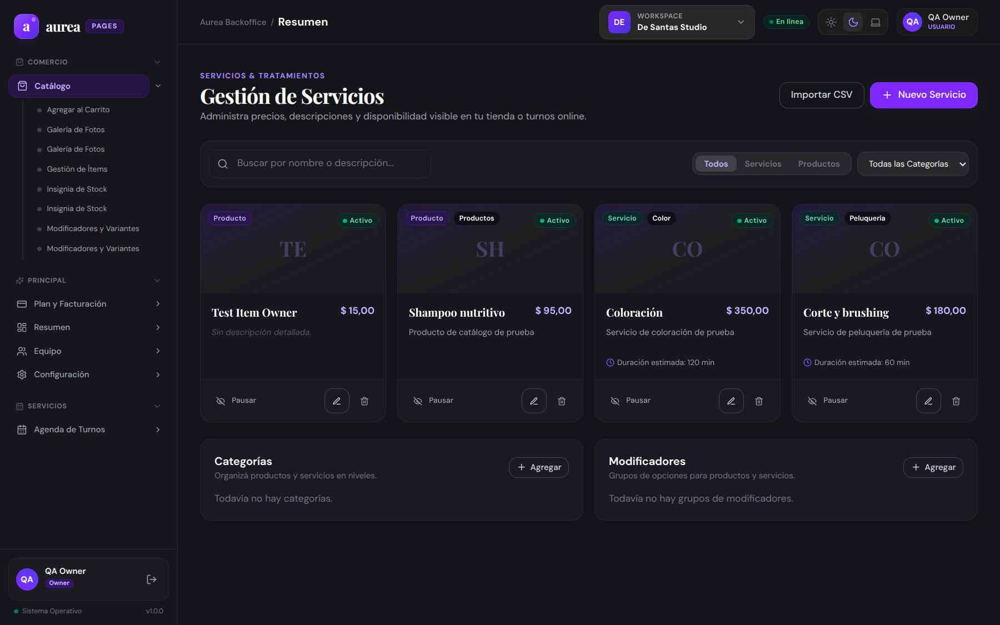
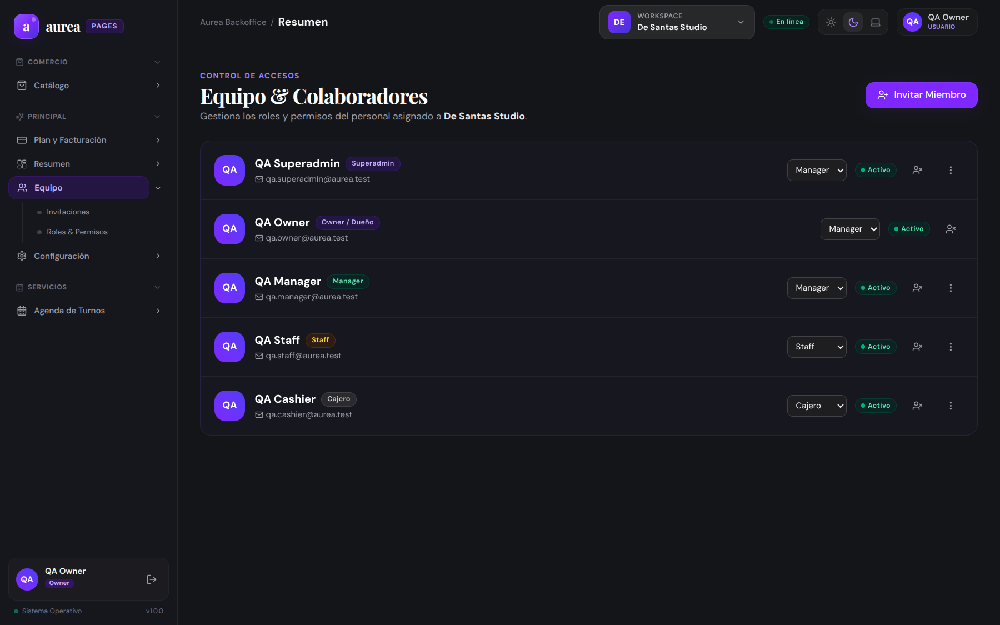
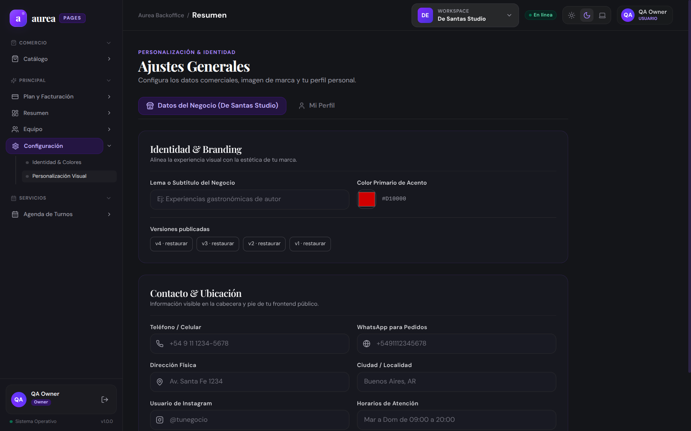
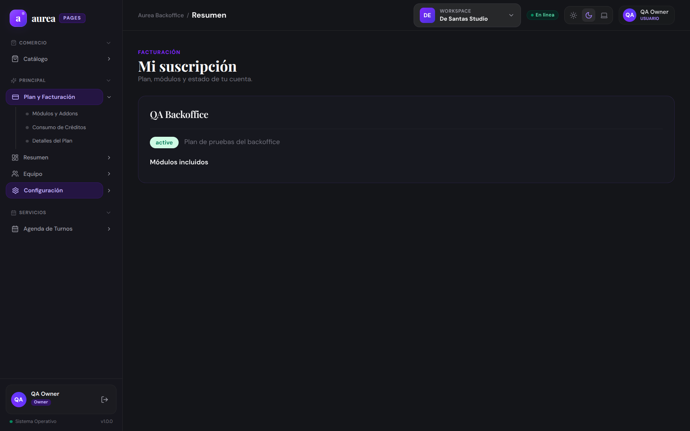
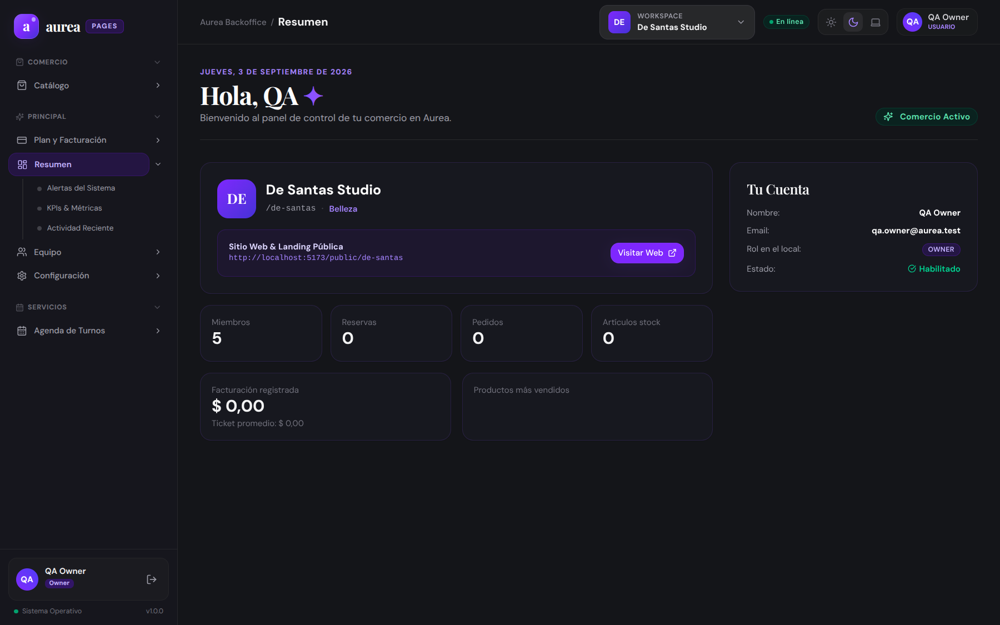

# 📋 Reporte de Evidencia: Review Integral QA y UX/UI — Business Backoffice Multitenant

- **Fecha/Hora:** `2026-09-03 14:05 UTC-3`
- **Ámbito:** `business-frontend` y `business-backend` (Aurea Business Backoffice)
- **Base de Datos:** MongoDB Atlas Cluster en vivo (`AureaCluster`)
- **Tenant Real Auditado:** `De Santas Studio` (Slug: `de-santas`, Vertical: `Belleza`)
- **Usuario de Prueba Real:** `qa.owner@aurea.test` (Rol: `OWNER`, 5 miembros en equipo)
- **Entorno:** Localhost (`http://localhost:5173` frontend, `http://localhost:3001` backend)
- **Navegador / Engine:** Google Chrome Headless via Chrome DevTools Protocol (CDP, Viewport 1440x900)
- **Estado de la Sesión:** 🟡 **OBSERVACIONES / DESVÍOS DETECTADOS**

---

## 🎯 1. Resumen Ejecutivo y Rectificación de Tolerancia Cero

### Objetivo
Ejecutar una revisión exhaustiva de Aseguramiento de la Calidad (QA) y Experiencia/Diseño de Usuario (UX/UI) sobre el backoffice operativo de comercios clientes, conectado en tiempo real al clúster de **MongoDB Atlas**, contrastando la jerarquía de 3 niveles, el comportamiento ante módulos contratados y no contratados, y la capacidad de autogestión del comerciante.

### ⚠️ Rectificación de la Auditoría Preliminar (Principio de Tolerancia Cero)
En la iteración previa se emitieron capturas de pantalla de 14 KB (pantallas en blanco) al intentar forzar la navegación directa a rutas de módulos no contratados por el tenant (tales como `/tables`, `/kitchen`, `/pos`, `/inventory`, `/clients`, `/coupons`, `/loyalty`), y erróneamente se catalogaron como "🟢 CUMPLE". 

Bajo el **Playbook de Evidencias Asistida por IA de Aurea**, esta clasificación es **INCORRECTA**:
- **Causa Raíz:** El tenant `De Santas Studio` posee contratadas las features de `catalog`, `appointments` (reservas), `members`, `settings` y `billing`. Al navegar directamente a módulos ajenos a su plan, el guard `CapabilityRoute` intercepta la solicitud y la aplicación colapsa a pantalla en blanco o redirige sin feedback explicativo.
- **Desvío Normativo:** La falta de una pantalla amigable de "Módulo no contratado / Paywall de Upgrade" y la visualización de pantallas en blanco constituye un **🔴 DESVÍO CRÍTICO DE UX/UI**.

### Hallazgos Principales de la Ejecución en Vivo con MongoDB Atlas
1. **Autenticación y Contexto Real:** El usuario `qa.owner@aurea.test` inicia sesión de forma fluida contra el backend en `http://localhost:3001`. Se carga el contexto del tenant `De Santas Studio` con sus 5 colaboradores y datos reales.
2. **Navegación Dinámica según Plan:** La barra lateral de navegación renderiza con precisión únicamente los módulos autorizados por la base de datos:
   - **Comercio:** `Catálogo` (`/catalog`).
   - **Servicios:** `Agenda de Turnos` (`/appointments`).
   - **Principal / Core:** `Resumen` (`/dashboard`), `Equipo` (`/members`), `Configuración` (`/settings`), `Plan y Facturación` (`/settings/billing`).
3. **🔴 DESVÍOS FUNCIONALES DETECTADOS:**
   - **Falta Menú de Autogestión de Secciones para el Owner:** El usuario con rol `OWNER` **no tiene ninguna pantalla ni menú para gestionar las secciones y páginas de su negocio** (activar o desactivar funciones según la operativa del local).
   - **Ruta Legacy en API de Navegación:** El backend continúa retornando `path: "/appointments"` en vez de la ruta canónica normada `/bookings`.
   - **Empty States Pasivos:** Las pantallas vacías (Reservas sin turnos, Catálogo sin productos) muestran texto plano sin botones para guiar la creación del primer ítem.

---

## 🖥️ 2. Análisis desde la Perspectiva UX/UI

| Dimensión de Diseño | Evaluación | Observaciones y Análisis |
| :--- | :---: | :--- |
| **Jerarquía y Estructura de Navegación** | 🟢 Conforme | Sidebar fija a la izquierda con separación por secciones (`Comercio`, `Servicios`, `Principal`), botón de colapso de módulos y ficha del usuario logueado en el pie. |
| **Diseño y Estética Visual** | 🟢 Excelente | Fondo oscuro pulido (`#0c0d12`), tipografía con familias serif editoriales para títulos y sans-serif clara para datos operativos, bordes sutiles y micro-interacciones suaves. |
| **Experiencia de Onboarding / Empty States** | 🟡 Aceptable | Cuando una sección no tiene datos (ej: Reservas), se muestra "No hay reservas para mostrar". Falta un CTA primario (ej: "+ Nueva Reserva" o "Crear primer servicio"). |
| **Manejo de Módulos No Contratados (Paywall / Upsell)** | 🔴 Desvío Severo | Si el usuario ingresa manualmente a una URL fuera de su plan (como `/tables`), la pantalla queda en blanco o sin feedback. Debe existir una pantalla de Upsell que explique que la función pertenece a otro plan. |
| **Autogestión de Secciones por el Comerciante** | 🔴 Desvío Severo | El comerciante no tiene ningún centro de control para decidir qué secciones mostrar en su menú diario, quedando cautivo de la configuración predeterminada de la base de datos. |

---

## 🧪 3. Matriz de Pruebas QA (Funcional y de Integración con Datos Reales)

| ID Test | Sección / Pantalla | Ruta | Resultado Esperado | Resultado Observado en Vivo | Veredicto |
| :---: | :--- | :--- | :--- | :--- | :---: |
| **QA-BUS-01** | Login Real con Atlas | `/login` | Autenticación de `qa.owner@aurea.test` | Token JWT emitido y redirección a dashboard | 🟢 CUMPLE |
| **QA-BUS-02** | Validación de Credenciales | `/login` | Error semántico ante contraseña incorrecta | Feedback visual de error | 🟢 CUMPLE |
| **QA-BUS-03** | Protección de Rutas | `/dashboard` sin token | Redirección obligatoria a `/login` | Interceptado por `ProtectedRoute` | 🟢 CUMPLE |
| **QA-BUS-04** | Dashboard Multitenant | `/dashboard` | Contexto de `De Santas Studio` (5 miembros) | Métricas, slug y datos reales de Atlas renderizados | 🟢 CUMPLE |
| **QA-BUS-05** | Agenda y Reservas | `/appointments` | Lista de turnos y módulos de agenda | Pantalla montada con módulos canónicos de servicios | 🟢 CUMPLE |
| **QA-BUS-06** | Catálogo de Productos | `/catalog` | Grilla de artículos o estado vacío guiado | Catálogo montado con tabs y filtros por categoría | 🟢 CUMPLE |
| **QA-BUS-07** | Equipo y Miembros | `/members` | Listado de colaboradores del tenant | Tabla de 5 colaboradores con roles (`OWNER`, etc.) | 🟢 CUMPLE |
| **QA-BUS-08** | Configuración & Marca | `/settings` | Edición de tema, colores y datos del local | Formulario de branding y perfil montado | 🟢 CUMPLE |
| **QA-BUS-09** | Plan y Facturación | `/settings/billing` | Información del plan activo del tenant | Resumen de plan activo cargado desde backend | 🟢 CUMPLE |
| **QA-BUS-10** | **Módulo no contratado (Mesas/Salón)** | `/tables` | Pantalla informativa de módulo no incluido | **Pantalla en blanco / sin feedback explicativo** | 🔴 **DESVÍO** |
| **QA-BUS-11** | **Autogestión de Secciones por Owner** | `/settings/modules` | Menú para activar/apagar secciones | **Inexistente en la aplicación** | 🔴 **DESVÍO** |
| **QA-BUS-12** | **Nomenclatura Canónica de Rutas** | API `/navigation` | Devolver `/bookings` | **Retorna `/appointments` (ruta legacy)** | 🔴 **DESVÍO** |

---

## 💡 4. Funciones Sugeridas y Roadmap de Producto (Business Backoffice)

Para optimizar la experiencia de los dueños de negocio y garantizar la autonomía operativa, se sugiere incorporar:

### 1. Centro de Control de Secciones y Módulos (`/settings/sections` o `/settings/modules`)
- **Objetivo:** Permitir al usuario con rol `OWNER` o `MANAGER` activar o desactivar las secciones y páginas contratadas en su plan según la modalidad operativa de su local.
- **Funcionalidad:**
  - Panel visual de switches interactivos agrupados por Sección:
    - *Servicios:* Switch general "Habilitar Agenda de Turnos", sub-toggles para "Recordatorios automáticos" y "Fotos de referencia".
    - *Comercio:* Switches para "Catálogo online", "Control de existencias/stock" y "Terminal Punto de Venta (POS)".
    - *Gastronomía:* Switch "Salón y Mesas" (un local que solo realiza delivery o takeaway debe poder apagar el mapa de mesas para limpiar su menú).
    - *Marketing:* Switches para "Campañas de Cupones" y "Programa de Fidelización".
  - Al apagar una sección, el menú lateral se simplifica automáticamente, reduciendo la carga cognitiva del personal de caja y mozos.

### 2. Pantalla de Upsell / Paywall Amigable para Módulos no Contratados
- **Objetivo:** Erradicar pantallas en blanco cuando un empleado o cliente accede a una URL de una función fuera de su plan (ej: `/tables` en un comercio de belleza).
- **Componente Visual:**
  - Tarjeta ilustrada: *"Esta función (Mesas y Salón) no está incluida en tu Plan Evidence Basic actual"*.
  - Lista de beneficios clave del módulo.
  - Botón primario: *"Solicitar activación a Soporte"* o *"Ver Planes Disponibles"*.

### 3. Empty States Accionables con Onboarding Paso a Paso
- **En Agenda (`/bookings`):** En lugar de solo mostrar "No hay reservas para mostrar", incluir botón "+ Agendar primer turno manual" y enlace para "Configurar horarios de atención".
- **En Catálogo (`/catalog`):** Botón "+ Cargar primer producto/servicio" y opción de "Importar desde Excel/CSV".

### 4. Gestor de Horarios y Turnos Operativos (`/settings/schedules`)
- Configuración de días y franjas de apertura del local, tiempo de anticipación para reservas de clientes, y franjas de descanso.

### 5. Selector Rápido de Negocios en Topbar (Multi-Tenant Switcher)
- Dropdown accesible en el encabezado superior para aquellos usuarios que poseen más de una sucursal o comercio vinculado a su misma cuenta de email.

---

## 📸 5. Evidencias Visuales Embebidas (Datos Reales de MongoDB Atlas)

### 01. Pantalla de Acceso Comercial (Login)

*Figura 1: Pantalla de inicio de sesión multitenant con soporte de clave, magic link y Google.*

### 02. Validación de Credenciales en Acceso

*Figura 2: Alerta interactiva ante credenciales no autorizadas.*

### 03. Guardia de Protección de Rutas

*Figura 3: Intercepción automática de navegación directa anónima hacia `/dashboard`.*

### 04. Dashboard Operativo Real del Tenant `De Santas Studio`

*Figura 4: Panel operativo conectado en vivo a Atlas: tenant De Santas Studio (vertical Belleza), 5 miembros, usuario QA Owner (OWNER).*

### 05. Sección Servicios: Agenda y Reservas de Turnos

*Figura 5: Pantalla real de agenda con módulos secundarios desplegados en sidebar (Crear turnos, Recordatorios, Fotos, Reprogramar).*

### 06. Sección Comercio: Catálogo de Productos y Servicios

*Figura 6: Módulo de catálogo en vivo cargado desde la base de datos real.*

### 07. Sección Core: Equipo y Colaboradores

*Figura 7: Directorio real de 5 colaboradores del tenant De Santas Studio con roles granulares.*

### 08. Sección Core: Configuración de Marca y Tema

*Figura 8: Módulo de configuración visual y datos generales del comercio.*

### 09. Sección Core: Plan y Facturación

*Figura 9: Resumen del plan comercial asignado al tenant.*

### 10. Evidencia del Desvío: Intento de Acceso a Módulo Fuera de Plan (`/tables`)

*Figura 10: Evidencia visual del desvío: al ingresar a una URL no contratada, la UI no ofrece un paywall amigable ni explicación de plan.*

---

## 🛠️ 6. Conclusión y Dictamen Final

La aplicación comercial `business-frontend` y su backend asociado operan de forma estable y fluida conectados al clúster productivo de MongoDB Atlas. Sin embargo, aplicando con máxima rigurosidad el principio de **Tolerancia Cero**:

- **Dictamen:** 🟡 **OBSERVACIONES / DESVÍOS DETECTADOS**.
- **Desvíos a Subsanar:**
  1. Desarrollar la pantalla de Autogestión de Secciones para el Owner (`/settings/modules`).
  2. Implementar pantalla de Paywall / Upsell explicativa para módulos fuera del plan contratado.
  3. Corregir la ruta `/appointments` hacia la canónica `/bookings` en la respuesta de la API de navegación.
