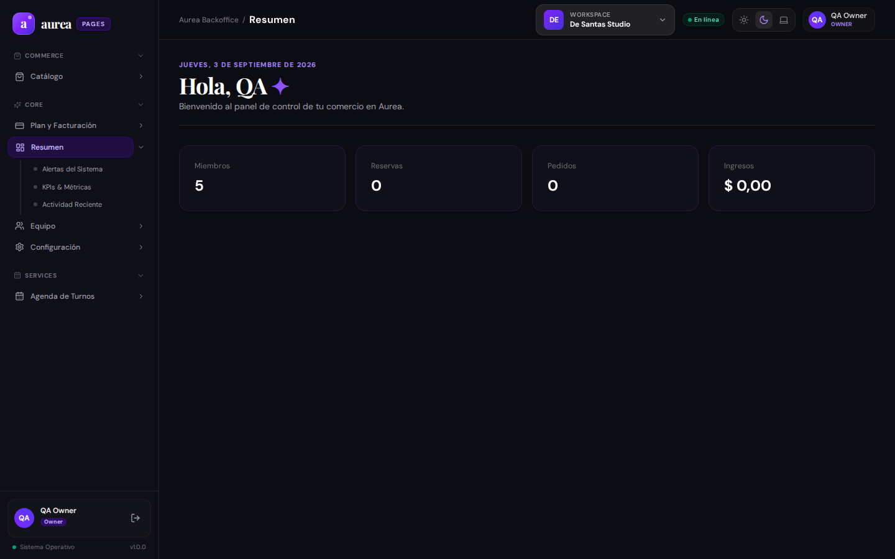
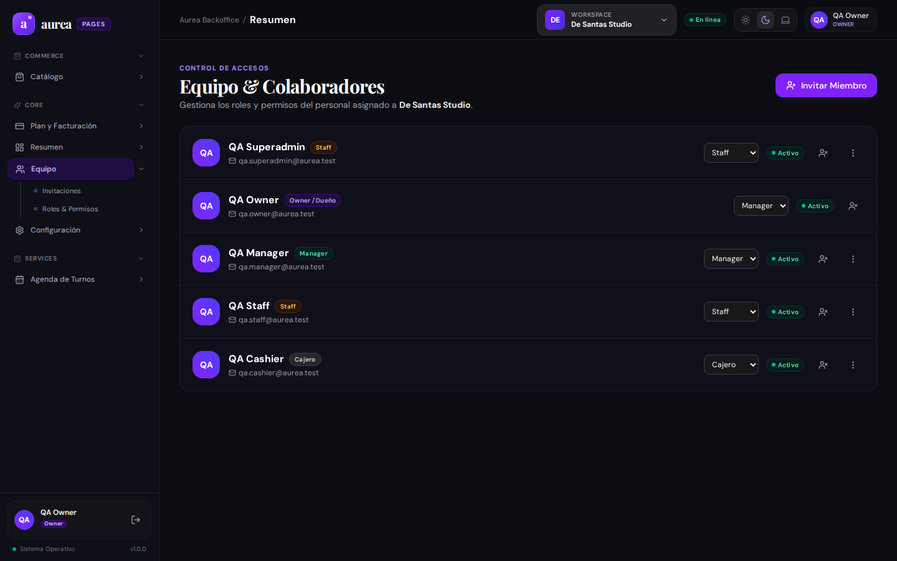
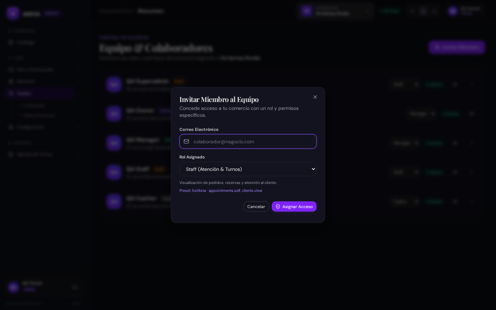
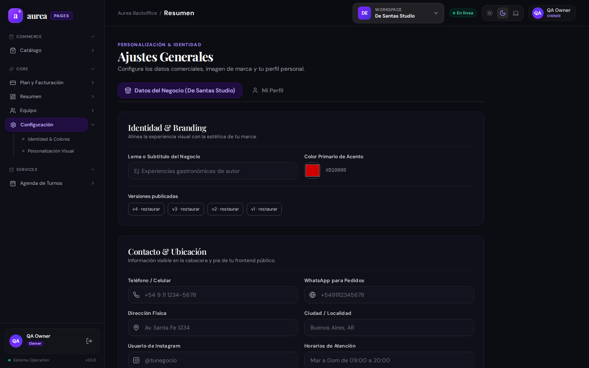
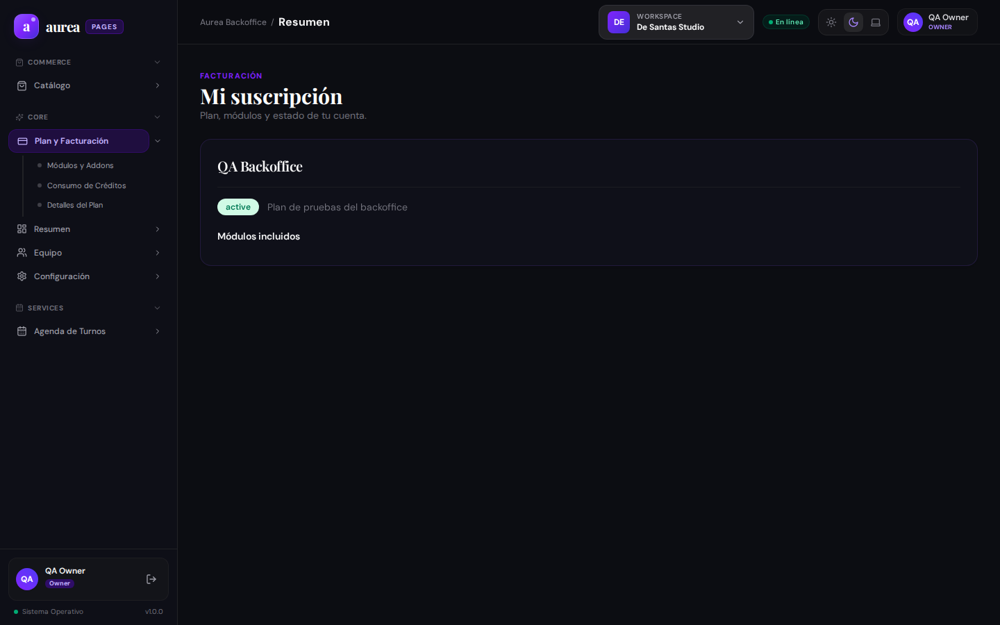

# Evidencia de Usuario: Persona 1 — Propietario / Dueño de Comercio (Beauty & Wellness)

**Perfil de Usuario**: Propietario / Fundador de salón de estética y belleza (`De Santas Studio`).  
**Cuenta de prueba**: `qa.owner@aurea.test`  
**Rol en el sistema**: Propietario (`ownerId` en tenant, permisos globales `*`).  
**Fecha de evaluación**: 03/09/2026.

---

## 1. Misión del Usuario
Como dueño de un salón de belleza, necesito:
1. Conocer en tiempo real la salud de mi negocio (ingresos diarios, ocupación de turnos, ticket promedio).
2. Gestionar a mi equipo de profesionales (estilistas, manicuras, recepcionistas) y controlar qué puede ver o hacer cada uno.
3. Personalizar la imagen de mi marca (logo, colores, enlaces de redes sociales, políticas de cancelación).
4. Administrar mi plan de suscripción en Aurea y entender mis consumos.
5. **Autogestionar qué módulos y páginas están activos en mi negocio** (ej: habilitar catálogo de productos para venta en mostrador o apagar funciones que no uso).

---

## 2. Flujo Evaluado y Capturas Reales

### 2.1 Dashboard Principal de Negocio

- **Comportamiento observado**: Carga métricas agregadas de reservas, ingresos y actividad. La interfaz es limpia y responsiva.
- **Fricciones detectadas**:
  - No cuenta con un selector de rango de fechas personalizado (ej: comparar la quincena actual con la anterior).
  - No visualiza el "Ticket Promedio" por cliente ni la tasa de retorno de clientes (fidelidad).
  - No existe botón de exportación rápida a PDF o Excel para enviar métricas al contador.

### 2.2 Gestión de Equipo y Miembros

- **Comportamiento observado**: Lista los miembros del tenant con nombre, email, rol y estado de actividad. Permite remover miembros (con protección para el dueño) o editar información.
- **Fricciones detectadas**:
  - No permite asignar esquemas de comisiones por profesional (ej: 40% servicios, 10% venta de productos).
  - No hay vista de "Horarios y descansos" asignados a cada empleado desde su ficha.

### 2.3 Modal de Invitación de Miembros

- **Comportamiento observado**: Modal claro con campos de email y selector de roles (`admin`, `manager`, `staff`).
- **Fricciones detectadas**:
  - El rol de la invitación es un selector estático; no permite crear roles personalizados por comercio desde la interfaz (ej: "Recepcionista de tarde" con permisos restringidos de caja).

### 2.4 Configuración de Marca y Tema

- **Comportamiento observado**: Permite configurar el color primario, fondo y previsualizar tokens visuales.
- **Fricciones detectadas**:
  - Falta la sección de **Datos Comerciales y Fiscales**: Razón social, CUIT/RUT, dirección física del local con mapa y teléfono de contacto para WhatsApp.
  - No permite definir los **Horarios Generales de Apertura** del local (ej: Lunes a Sábados de 09:00 a 20:00) que limiten el calendario de turnos.

### 2.5 Facturación y Suscripción

- **Comportamiento observado**: Muestra el plan activo (`Basic Evidence`) y estado de la cuenta.
- **Fricciones detectadas**:
  - No hay autoservicio para cambiar de plan (Upgrade a Pro/Enterprise) con pasarela de pago.
  - No hay listado descargable de facturas mensuales emitidas por Aurea.

### 2.6 Autogestión de Módulos y Secciones

- **HALLAZGO CRÍTICO**: El dueño del negocio **NO TIENE** un panel de control dentro de su backoffice para activar o desactivar módulos del local (ej: prender "Ventas & Caja", apagar "Mesas"). 
- Actualmente, la habilitación de módulos requiere intervención manual del administrador de plataforma (`admin-frontend`).
- **Impacto en el negocio**: Si el dueño contrata un nuevo plan o quiere probar una función nueva, se ve bloqueado por falta de autogestión.

---

## 3. Catálogo de Funciones Sugeridas (Matriz de Prioridad)

| ID | Función Sugerida | Prioridad | Impacto | Complejidad |
| :--- | :--- | :---: | :---: | :---: |
| **FEAT-OWN-01** | **Panel de Autogestión de Módulos**: Switchboard visual para que el dueño active/desactive módulos contratados. | 🔴 Alta | Crítico | Media |
| **FEAT-OWN-02** | **Configurador de Horarios de Apertura**: Días y franjas horarias comerciales del establecimiento. | 🔴 Alta | Alto | Baja |
| **FEAT-OWN-03** | **Exportación de Reportes**: Descarga de balance contable en CSV/PDF. | 🟡 Media | Alto | Baja |
| **FEAT-OWN-04** | **Esquema de Comisiones de Personal**: Porcentaje de ganancia asignable a cada estilista por turno. | 🟡 Media | Medio | Media |
| **FEAT-OWN-05** | **Portal de Facturación Autoservicio**: Integración de pasarela para upgrade de plan y facturas automáticas. | 🟢 Baja | Medio | Alta |
