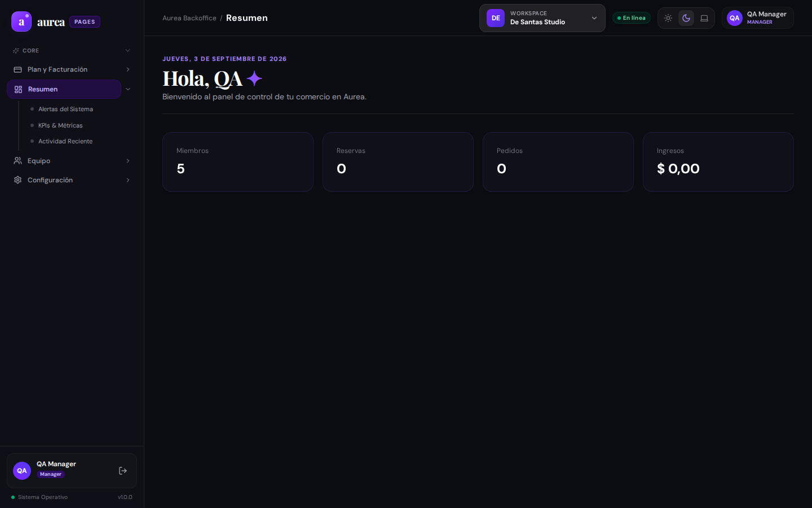

# Evidencia de Usuario: Persona 2 — Encargada Operativa / Manager de Salón

**Perfil de Usuario**: Encargada / Manager operativa de sucursal (`De Santas Studio`).  
**Cuenta de prueba**: `qa.manager@aurea.test`  
**Rol en el sistema**: Manager operativo (`roleKey: 'manager'`).  
**Fecha de evaluación**: 03/09/2026.

---

## 1. Misión del Usuario
Como encargada del salón, mi trabajo diario consiste en:
1. Coordinar la agenda de turnos en tiempo real, resolviendo sobreturnos, cancelaciones y reprogramaciones.
2. Atender el teléfono y dar de alta turnos manuales en menos de 30 segundos mientras hablo con el cliente.
3. Asignar cada servicio al estilista correspondiente y controlar los tiempos de atención para evitar retrasos.
4. Mantener al día la carta de servicios y el stock de productos de venta en salón (shampoos, cremas, accesorios).

---

## 2. Flujo Evaluado y Capturas Reales

### 2.1 Calendario y Agenda de Turnos

- **Comportamiento observado**: Muestra la grilla de reservas con estados (Confirmado, Pendiente, etc.) y los turnos agendados.
- **HALLAZGO CRÍTICO DE UX**:
  - **Falta botón visible `+ Nuevo Turno` o `+ Agendar Cita` en la vista principal**:
    Cuando llama una clienta para pedir turno para "mañana a las 16hs", la recepcionista no encuentra un botón directo ni un atajo de teclado para crear la cita rápidamente.
  - **Falta Vista de Columnas por Profesional**:
    En salones de belleza, la encargada necesita ver en pantalla dividida qué está haciendo cada estilista en simultáneo (Columna 1: Romina, Columna 2: Sofía, Columna 3: Camila). Actualmente solo hay una vista cronológica plana.
  - **Bloqueo de Horarios No Laborales**:
    No hay opción rápida de "Bloquear franja horaria" (ej: almuerzo del profesional de 13 a 14 hs o médico imprevisto).

### 2.2 Gestión del Catálogo de Servicios y Productos

- **Comportamiento observado**: Lista los servicios y productos con precio y categoría.
- **Fricciones detectadas**:
  - **Ambigüedad entre Servicio y Producto**:
    Ambos se muestran en la misma cuadrícula. Un "Servicio" (ej: Balayage) requiere duración estimada (ej: 180 min) y recursos humanos asignados; mientras que un "Producto" (ej: Serum Kérastase) requiere control de stock físico. La interfaz no hace esta distinción en sus filtros principales.
  - **Falta de Modificación Rápida de Precios (Quick Edit)**:
    Si hay una actualización de precios por inflación, la encargada debe editar uno por uno cada ítem abriendo el formulario completo, en lugar de contar con una tabla con edición rápida en línea (inline editing) o aumento porcentual masivo (+15% a toda la categoría "Coloración").

---

## 3. Catálogo de Funciones Sugeridas (Matriz de Prioridad)

| ID | Función Sugerida | Prioridad | Impacto | Complejidad |
| :--- | :--- | :---: | :---: | :---: |
| **FEAT-MGR-01** | **Botón Rápido "+ Nuevo Turno"**: Modal veloz de reserva manual (Cliente, Teléfono, Servicio, Profesional, Fecha/Hora). | 🔴 Alta | Crítico | Baja |
| **FEAT-MGR-02** | **Vista Multi-Profesional (Column View)**: Grilla diaria con una columna por empleado para visualización simultánea. | 🔴 Alta | Alto | Media |
| **FEAT-MGR-03** | **Bloqueo de Franjas Horarias**: Bloquear horas para descansos, reuniones o feriados. | 🟡 Media | Alto | Baja |
| **FEAT-MGR-04** | **Duración Estimada por Servicio**: Configurar duración en minutos por servicio para bloquear automáticamente el slot de tiempo. | 🟡 Media | Alto | Baja |
| **FEAT-MGR-05** | **Notificación por WhatsApp**: Botón de un solo toque para enviar recordatorio de turno a la clienta. | 🟢 Baja | Alto | Media |
