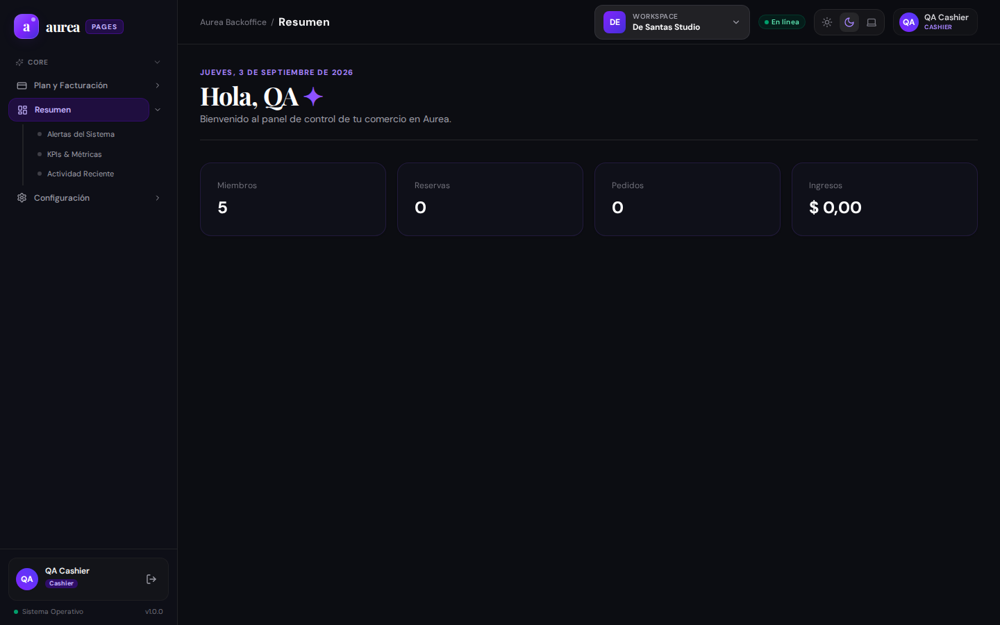

# Evidencia de Usuario: Persona 3 — Empleado de Caja y Ventas / Staff Operativo

**Perfil de Usuario**: Cajero de mostrador y ventas en salón / tienda retail.  
**Cuenta de prueba**: `qa.cashier@aurea.test`  
**Rol en el sistema**: Staff de ventas y caja (`roleKey: 'cashier'`).  
**Fecha de evaluación**: 03/09/2026.

---

## 1. Misión del Usuario
Como empleado de caja y mostrador, mi prioridad es la velocidad y precisión:
1. Abrir la caja con el fondo inicial en efectivo al comenzar la jornada.
2. Cobrar rápidamente los servicios realizados y productos adquiridos por los clientes que se van.
3. Aceptar pagos mixtos (ej: pagar mitad en efectivo y mitad con Mercado Pago / tarjeta).
4. Consultar stock disponible de un producto sin abandonar la pantalla de cobro.
5. Identificar al cliente en el sistema para sumar puntos de fidelidad o registrar notas de atención.
6. Realizar el cierre ciego de caja al finalizar el turno, sin diferencias de dinero.

---

## 2. Flujo Evaluado y Capturas Reales

### 2.1 Terminal de Punto de Venta (POS)

- **Comportamiento observado**: Muestra la interfaz de cobro.
- **HALLAZGOS CRÍTICOS**:
  - **Sin Flujo de Apertura de Caja**: No existe un paso obligatorio donde el cajero declare el monto de efectivo con el que abre el día (fondo de cambio).
  - **Falta de Pagos Divididos (Split Payment)**: La UI solo contempla un único método de pago por operación. En la realidad comercial, más del 30% de los clientes piden pagar parte en efectivo y parte con tarjeta.
  - **Sin Arqueo Ciego / Cierre de Turno**: No hay un modal de cierre de turno donde el cajero ingrese cuánto efectivo físico tiene en el cajón y el sistema calcule el sobrante o faltante.

### 2.2 Inventario y Control de Stock

- **Comportamiento observado**: Lista de artículos con cantidades en inventario y botón para registrar ajustes.
- **Fricciones detectadas**:
  - No hay un filtro directo para ver únicamente productos en **"Stock Crítico / Por Agotarse"**.
  - No cuenta con búsqueda por código de barras compatible con lectores USB tipo pistola.
  - No permite registrar el motivo del ajuste de stock (ej: "Rotura en transporte", "Vencimiento", "Consumo interno de salón").

### 2.3 CRM y Ficha de Clientes

- **Comportamiento observado**: Muestra el directorio de clientes con email y teléfono.
- **Fricciones detectadas**:
  - Al abrir un cliente, no se observa una **Línea de Tiempo (Timeline)** clara con los turnos anteriores, qué profesional lo atendió y cuánto dinero gastó en el último año (Lifetime Value).
  - No existe un campo destacado de **"Notas Médicas o Alergias"** (ej: "Alergia a tintura sin amoníaco / Piel sensible").

### 2.4 Cupones y Fidelización

- **Comportamiento observado**: Lista los cupones activos del comercio.
- **Fricciones detectadas**:
  - Desde el POS no hay un campo veloz "Ingresar código de descuento" que valide en tiempo real si el cupón está vigente y calcule la bonificación automáticamente.

---

## 3. Catálogo de Funciones Sugeridas (Matriz de Prioridad)

| ID | Función Sugerida | Prioridad | Impacto | Complejidad |
| :--- | :--- | :---: | :---: | :---: |
| **FEAT-POS-01** | **Apertura y Cierre Ciego de Caja**: Declaración de saldo inicial, control de arqueo y reporte de sobrante/faltante. | 🔴 Alta | Crítico | Media |
| **FEAT-POS-02** | **Pago Dividido (Split Payment)**: Permitir combinar dos o más medios de pago en la misma venta. | 🔴 Alta | Crítico | Media |
| **FEAT-POS-03** | **Alerta de Stock Crítico**: Notificación visual y filtro rápido de productos por debajo del umbral mínimo. | 🟡 Media | Alto | Baja |
| **FEAT-POS-04** | **Timeline de Historial de Cliente**: Historial completo de citas, gastos y notas clínicas/estéticas. | 🟡 Media | Alto | Media |
| **FEAT-POS-05** | **Aplicación de Cupón en POS**: Input directo en el carrito de cobro para validar cupones promocionales. | 🟡 Media | Medio | Baja |
