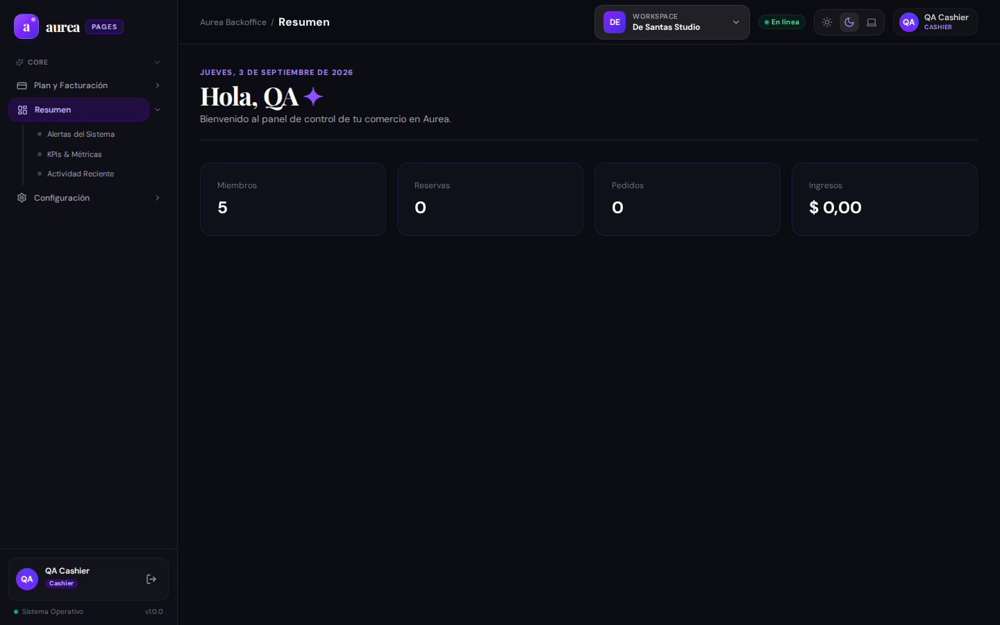

# Evidencia de Usuario: Persona 4 — Comerciante y Personal Gastronómico (Restaurante / Bar / Café)

**Perfil de Usuario**: Dueño de Restaurante / Encargado de Salón y Mozo.  
**Contexto**: Evaluación de la vertical gastronómica de Aurea para un local de comidas.  
**Fecha de evaluación**: 03/09/2026.

---

## 1. Misión del Usuario
Como operador gastronómico, los desafíos críticos son la rotación de mesas y la sincronización con cocina:
1. Ver el plano del salón en tiempo real: saber qué mesas están libres, ocupadas, pidiendo la cuenta o reservadas.
2. Abrir una mesa, cargar pedidos y enviar la comanda automáticamente a la pantalla de cocina (KDS).
3. Modificar pedidos (ej: "hamburguesa sin cebolla, punto medio") sin tener que correr hasta la cocina.
4. Generar códigos QR para que los clientes puedan escanear la carta digital o pedir desde la mesa.
5. Permitir a la cocina marcar los platos como "Listos" para que el mozo los retire inmediatamente.

---

## 2. Flujo Evaluado y Capturas Reales

### 2.1 Salón y Control de Mesas

- **Comportamiento observado**: Lista las mesas registradas con su identificador y capacidad.
- **Fricciones detectadas**:
  - **Falta de Plano Gráfico del Salón (Floor Plan 2D)**:
    Los gastronómicos no operan con una tabla alfabética de mesas; necesitan ver un mapa visual (Terraza, Planta Baja, Barra) con mesas redondas/cuadradas ubicadas como en el local real.
  - **Sin Indicador de Tiempo de Ocupación**:
    No se puede ver de un vistazo cuánto tiempo lleva sentada cada mesa (ej: Mesa 3 lleva 75 minutos, Mesa 8 recién se sentó). Esto impide optimizar la rotación en horas pico.

### 2.2 Reservas de Mesas

- **Comportamiento observado**: Registro de reservas de mesas por horario y comensales.
- **Fricciones detectadas**:
  - No hay asignación automática inteligente: si entran 4 personas, el sistema no sugiere ni bloquea automáticamente una mesa libre con capacidad para 4 en ese turno.
  - No hay gestión de turnos de cena (primer turno 20:30 a 22:30, segundo turno 22:30 al cierre).

### 2.3 Pantalla de Cocina / KDS (Kitchen Display System)

- **Comportamiento observado**: Muestra los pedidos entrantes pendientes de elaboración.
- **Fricciones detectadas**:
  - **Falta de Alerta Sonora**: En una cocina ruidosa, un nuevo pedido que entra debe emitir un "beep" o sonido de alerta audible para el jefe de cocina.
  - **Sin Semáforo de Tiempo de Espera**: Falta cambiar el color del ticket (Verde < 10m, Naranja 10-20m, Rojo parpadeante > 20m) para priorizar los platos demorados.

---

## 3. Catálogo de Funciones Sugeridas (Matriz de Prioridad)

| ID | Función Sugerida | Prioridad | Impacto | Complejidad |
| :--- | :--- | :---: | :---: | :---: |
| **FEAT-GAS-01** | **Plano Visual de Salón (Visual Floorplan)**: Mapa 2D arrastrable para representar la distribución real de mesas por sectores. | 🔴 Alta | Alto | Alta |
| **FEAT-GAS-02** | **Cronómetro de Mesa**: Badge de tiempo transcurrido desde la apertura de la mesa. | 🟡 Media | Alto | Baja |
| **FEAT-GAS-03** | **Alertas Sonoras y Semáforo en KDS**: Feedback sonoro y colores por demora en la pantalla de cocina. | 🟡 Media | Alto | Baja |
| **FEAT-GAS-04** | **Turnos de Servicio Gastronómico**: Configuración de doble turno para reservas de almuerzo y cena. | 🟢 Baja | Medio | Media |
| **FEAT-GAS-05** | **División de Cuenta por Comensal**: Split bill por mesa según lo consumido por cada persona. | 🟢 Baja | Medio | Media |
