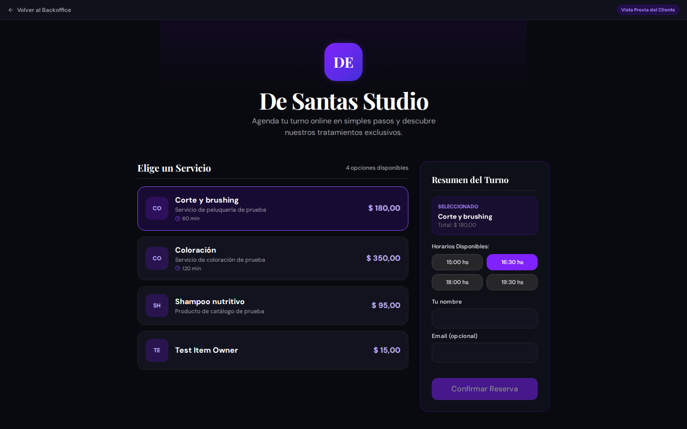
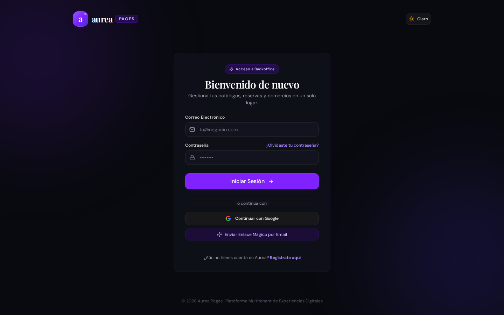
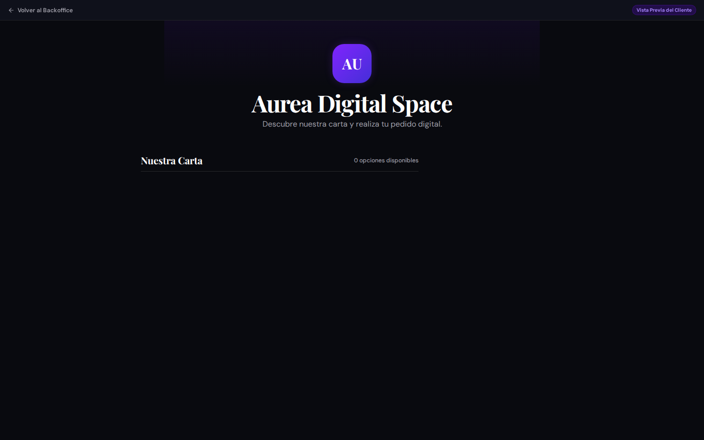

# Evidencia de Usuario: Persona 5 — Cliente Final (Consumidor Externo)

**Perfil de Usuario**: Cliente particular / Consumidor que desea agendar un servicio o comprar en el local.  
**Contexto**: Navegación anónima desde smartphone o PC en el portal público del tenant (`/public/de-santas`).  
**Fecha de evaluación**: 03/09/2026.

---

## 1. Misión del Usuario
Como clienta que busca atenderse en el salón de belleza:
1. Ver claramente la carta de servicios, precios actualizados y fotos de trabajos realizados.
2. Agendar un turno online en 3 pasos: elegir servicio, profesional de preferencia y horario disponible.
3. Recibir una confirmación inmediata por WhatsApp o email con opción de agregarlo a Google Calendar / Apple Calendar.
4. Conocer la dirección exacta, cómo llegar (Google Maps) y políticas del local (tolerancia horaria, señas).

---

## 2. Flujo Evaluado y Capturas Reales

### 2.1 Portal Público del Comercio

- **Comportamiento observado**: Carga la landing pública de `De Santas Studio` con los servicios disponibles (Balayage, Corte de Pelo, Manicuría).
- **HALLAZGOS CRÍTICOS**:
  - **Falta Flujo de Auto-Reserva Integral**:
    El botón de agendar no abre un asistente paso a paso completo donde la clienta elija fecha y horario disponible en tiempo real desde la web.
  - **Sin Social Proof / Opiniones**:
    No se muestran valoraciones con estrellas (Google Reviews) ni fotos de "antes y después". En el rubro estético, la decisión de compra depende en un 80% de la prueba visual.
  - **Falta de Integración con Google Maps / WhatsApp**:
    No hay un botón flotante de WhatsApp directo para resolver dudas rápidas ("¿tienen lugar para hoy?") ni enlace de "Cómo llegar" con navegación GPS.

### 2.2 Control de Seguridad e Incompatibilidad de Rutas

- **Comportamiento observado**:
  - Si un usuario no autenticado intenta escribir una URL interna de administración (`/core/dashboard`), el sistema lo expulsa y redirige inmediatamente al login con un estado limpio.
  - Si un cliente accede a una URL de un local que no existe (`/public/local-inexistente-12345`), la aplicación renderiza una página de error 404 amigable ("Tenant no encontrado") evitando pantallas en blanco o cuelgues.

---

## 3. Catálogo de Funciones Sugeridas (Matriz de Prioridad)

| ID | Función Sugerida | Prioridad | Impacto | Complejidad |
| :--- | :--- | :---: | :---: | :---: |
| **FEAT-CUS-01** | **Asistente de Reserva Online (3 Clics)**: Flujo público para elegir servicio, estilista, fecha/hora y dejar datos de contacto. | 🔴 Alta | Crítico | Media |
| **FEAT-CUS-02** | **Botón Flotante de WhatsApp**: Chat directo con la recepción del salón con mensaje predeterminado. | 🔴 Alta | Alto | Baja |
| **FEAT-CUS-03** | **Integración de Google Calendar**: Botón "Añadir a mi calendario" al confirmar el turno. | 🟡 Media | Medio | Baja |
| **FEAT-CUS-04** | **Galería de Trabajos (Lookbook)**: Carrusel de fotos reales de servicios realizados en el local. | 🟡 Media | Alto | Baja |
| **FEAT-CUS-05** | **Cobro de Seña Online**: Integración de seña previa con Mercado Pago para evitar inasistencias (no-shows). | 🟢 Baja | Alto | Alta |
