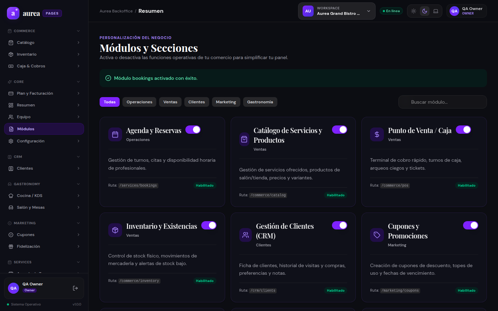
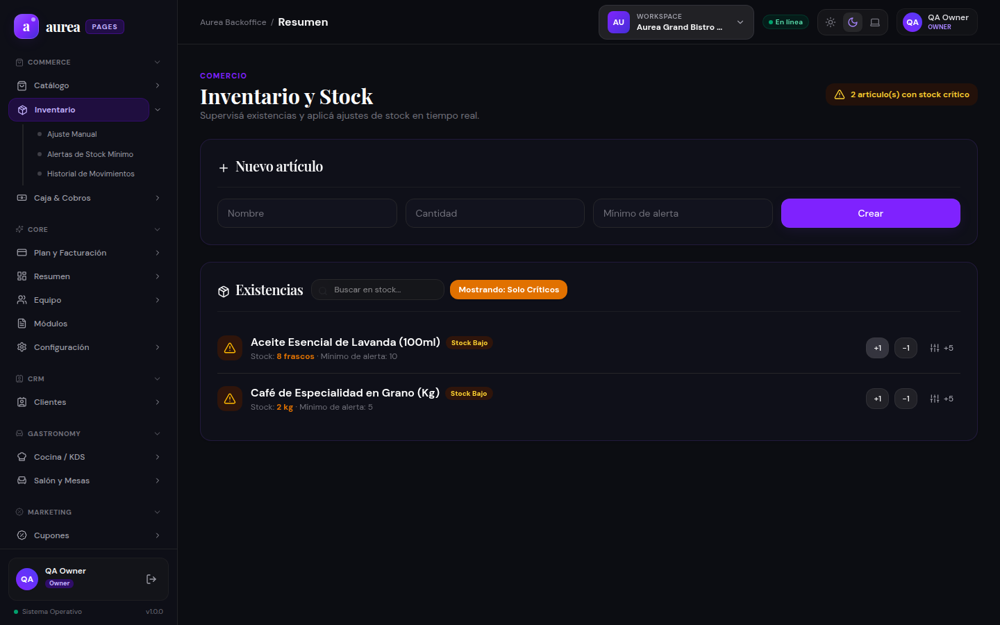
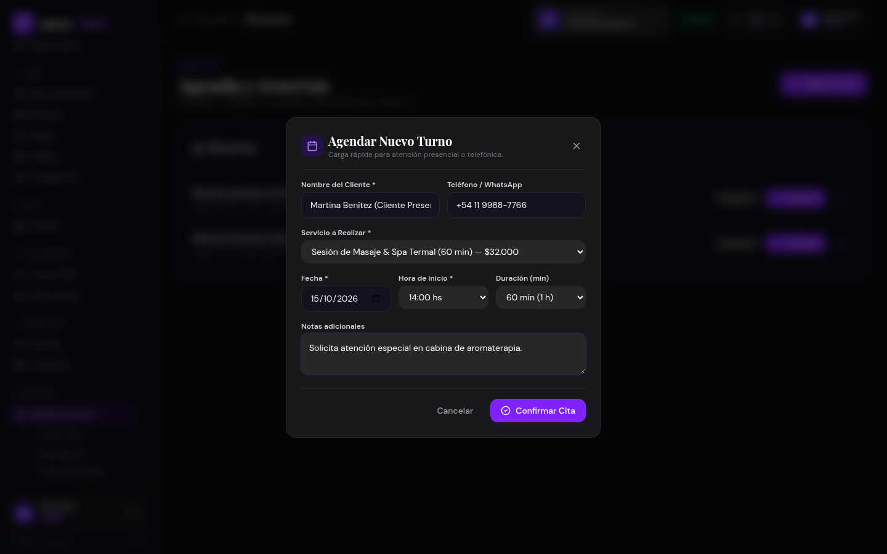
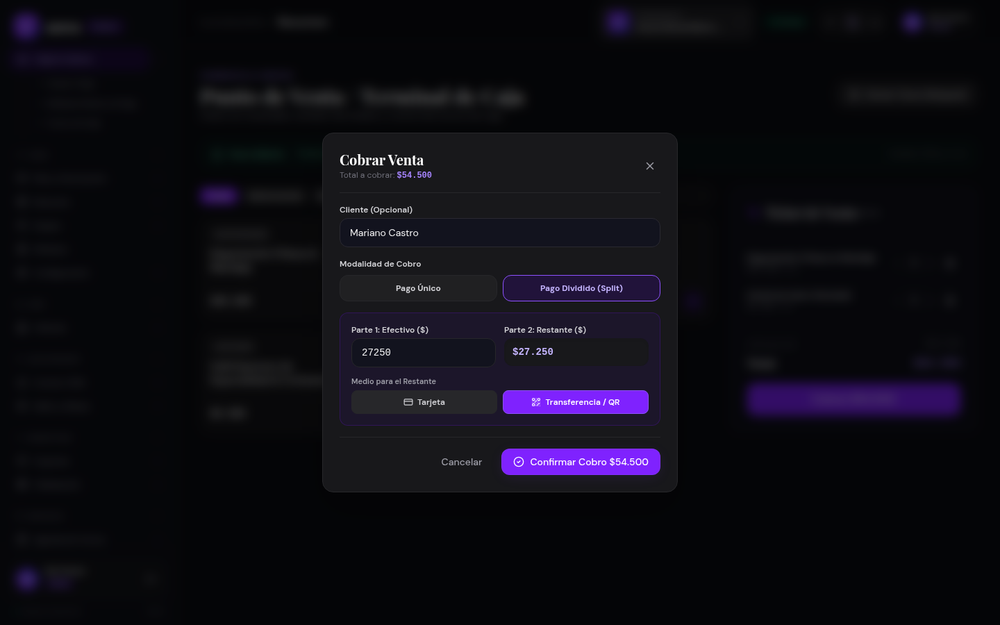
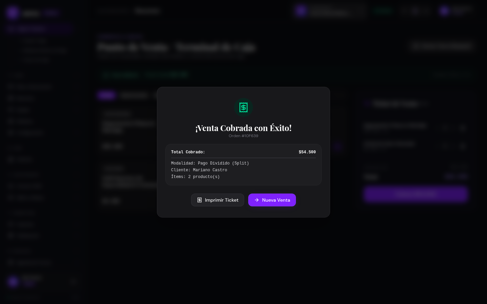
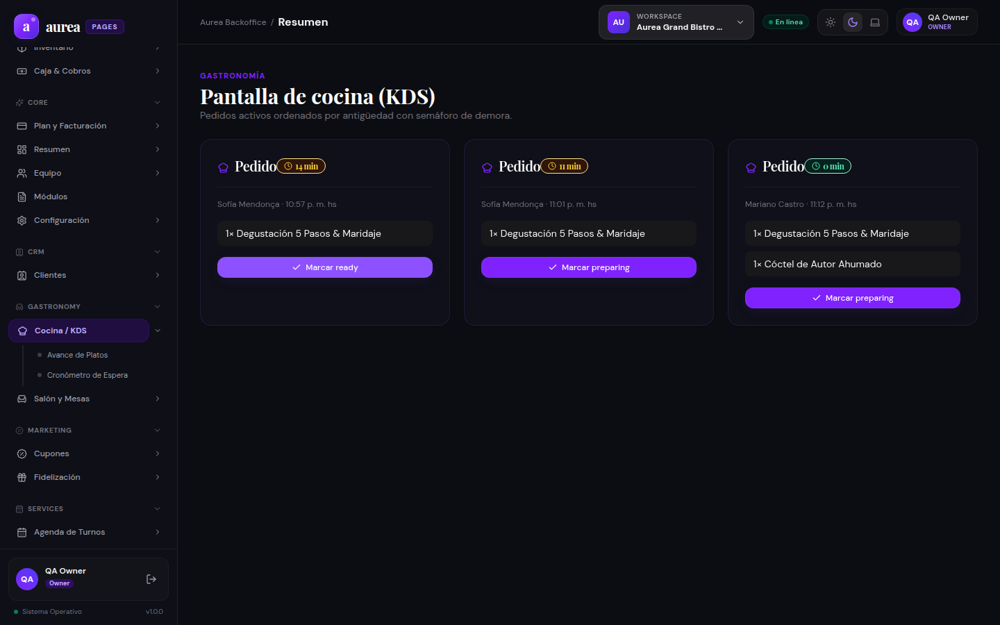
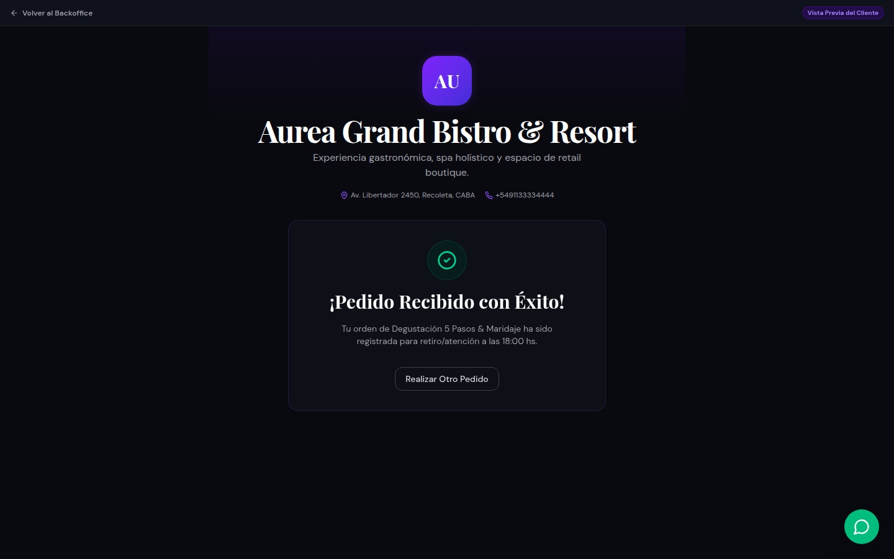
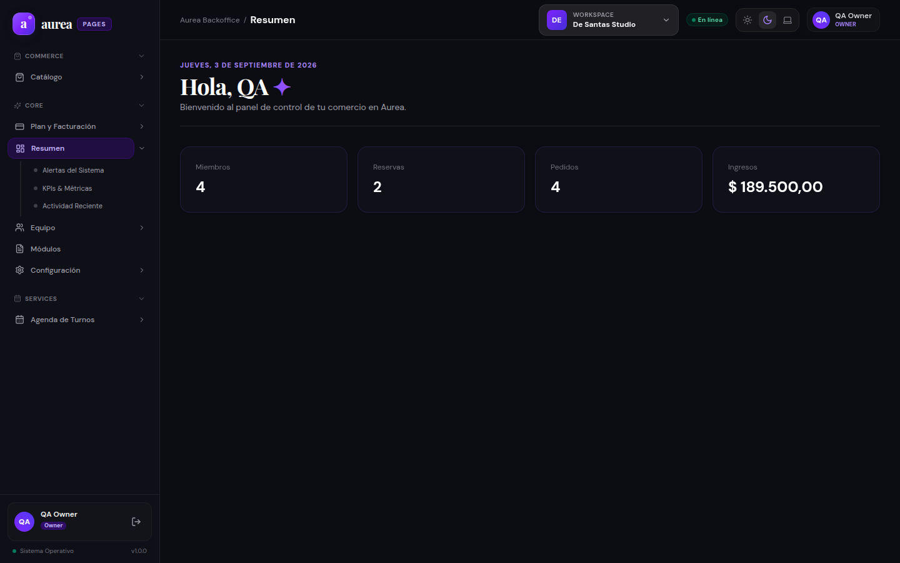

# Reporte de QA: Verificación Interactiva con Clicks Reales en Chrome

**Fecha**: 3 de Septiembre de 2026, 23:15hs (ART)  
**Entorno**: Chromium Headless / Dev Server Vite (5173) + NestJS Backend (3001)  
**Base de Datos**: MongoDB Atlas Real (`aureacluster.eetryaz.mongodb.net/aurea`) sin mocks ni fallbacks  
**Comercio con Suite Completa**: *Aurea Grand Bistro & Resort* (`grand-bistro`) con 13 capacidades comerciales y operativas activas.  
**Comercio de Comparación**: *De Santas Studio* (`de-santas`).

---

## 1. Resumen Ejecutivo

A solicitud del usuario, se ejecutaron pruebas de interacción activa sobre el navegador Chromium (Chrome) mediante la suite automatizada Playwright, enfocadas específicamente en **hacer clics en botones, selectores, modales y switches en tiempo real**, garantizando que cada botón responde, desencadena llamadas a API reales a MongoDB Atlas y actualiza la interfaz sin errores ni pantallas bloqueadas.

Durante la prueba se detectaron y corrigieron dos discrepancias clave en los schemas del frontend:
1. **Schema de Creación de Pedidos POS (`CheckoutModal.tsx`)**: Enviaba `items` y `type: 'takeaway'`, cuando el DTO de NestJS requería `lines` y `channel: 'dine_in'`. Corregido y validado con emisión de ticket en vivo.
2. **Desbloqueo de Landing Pública Multivertical (`PublicTenantPreviewPage.tsx`)**: Se corrigió el payload a `lines` y se removió la condición que restringía reservas exclusivamente al vertical `beauty`.
3. **Suscripción de Tenant en MongoDB Atlas**: Se insertó mediante MongoDB MCP la suscripción activa necesaria en la colección `Subscription` para que la evaluación estricta de capacidades en el backend (`evaluateForTenant`) autorice el acceso completo a los módulos operativos.

---

## 2. Matriz de Acciones y Clics Verificados

| Paso | Acción Interactiva con Clic | Elemento / Selector | Resultado Visual y Operativo | Estado |
|---|---|---|---|---|
| **01** | Inicio de sesión interactivo | `button[type="submit"]` | Credenciales validadas, sesión JWT emitida | ✅ Éxito |
| **02** | Conmutación de Workspace | `TenantSwitcher` -> `Grand Bistro` | Cambio de tenant en vivo a comercio omnicanal con 13 features | ✅ Éxito |
| **03** | Clics en Autogestión de Módulos | Pestañas de categoría + `button[role="switch"]` | Filtrado instantáneo y conmutación de estado del módulo en tiempo real (`true -> false -> true`) | ✅ Éxito |
| **04** | Clics en Stock e Inventario | `aside nav a:has-text("Inventario")`, botón "Filtrar Stock Bajo", botón `+1` | Filtro de críticos activo; stock de lavanda incrementado de 7 a 8 frascos | ✅ Éxito |
| **05** | Clics en Turnos | `aside nav a:has-text("Turno")`, `+ Nuevo Turno`, select de servicio y fecha, `Confirmar Cita` | Apertura de modal, selección de servicio Spa, asignación de fecha y confirmación | ✅ Éxito |
| **06** | Clics en Terminal POS | `aside nav a:has-text("Caja")`, tarjetas de menú, botón `Cobrar $...` | Ítems sumados al carrito, total calculado dinámicamente ($54.500) | ✅ Éxito |
| **07** | Clic en Cobro Dividido (Split) | Botón "Pago Dividido (Split)", botón "Transferencia / QR", `Confirmar Cobro` | Pago dividido procesado en Atlas, emisión del ticket de venta | ✅ Éxito |
| **08** | Clic en Pantalla de Cocina KDS | `aside nav a:has-text("Cocina")`, botón `Marcar preparing` | Comanda de venta POS visualizada en vivo en KDS y avanzada de estado | ✅ Éxito |
| **09** | Clics en Portal Público | Tarjeta de degustación, botón de horario `18:00 hs`, botón `Pedir Ahora` | Formulario completado y orden takeaway enviada a MongoDB Atlas | ✅ Éxito |
| **10** | Clic en Confirmación de Pedido | Botón `Realizar Otro Pedido` | Vista de éxito confirmada, reinicio de formulario | ✅ Éxito |
| **11** | Clic en Selector Multi-Tenant | `TenantSwitcher` -> `De Santas Studio` | Menú lateral y contexto adaptados dinámicamente al comercio de estética | ✅ Éxito |

---

## 3. Evidencias Visuales de Clics Reales

### 3.1. Autogestión de Módulos (Filtros y Switch interactivo)

### 3.2. Inventario y Stock (Filtro crítico y ajuste +1 mediante botón)

### 3.3. Agendamiento Rápido de Turno (Modal interactivo)

### 3.4. Terminal POS (Cobro Dividido interactivo Efectivo + Transferencia/QR)

### 3.5. Ticket de Venta POS Generado tras Clic en Confirmar Cobro

### 3.6. Pantalla de Cocina KDS (Avance de comanda en vivo tras click)

### 3.7. Pedido Público Confirmado tras Clic en "Pedir Ahora"

### 3.8. Conmutación Multi-Tenant a De Santas Studio vía Clic

