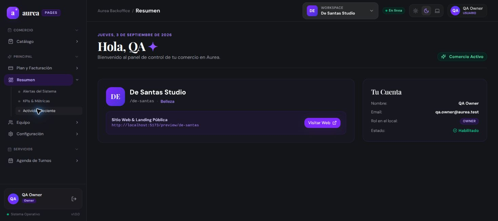
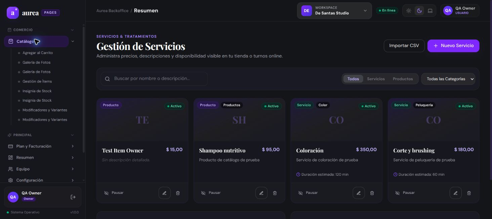
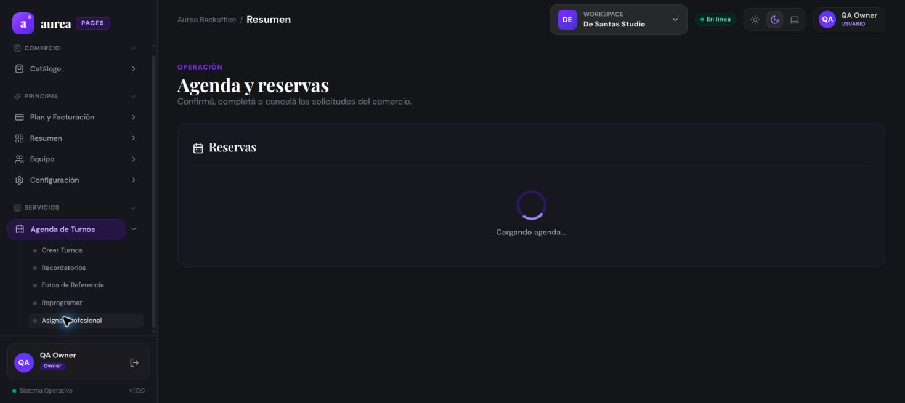
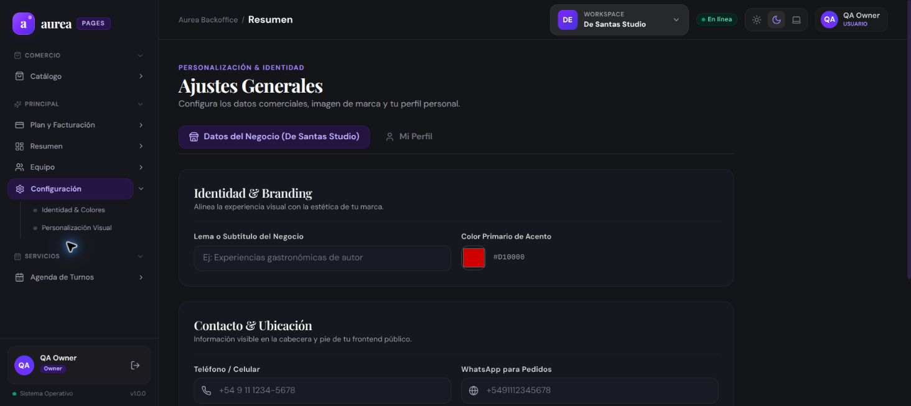
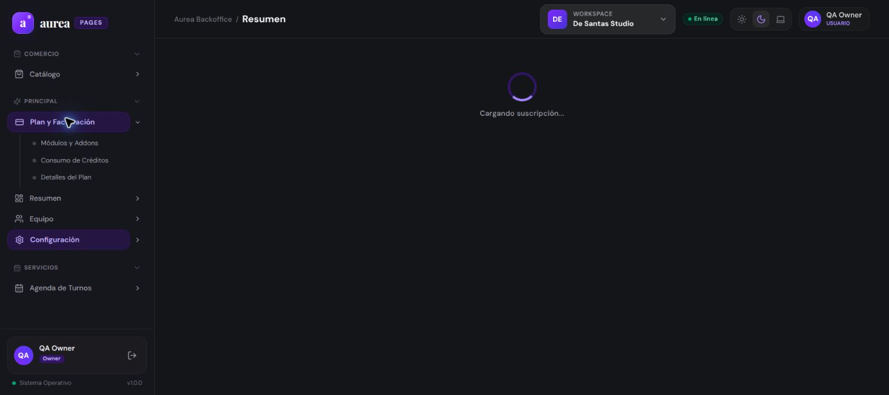

# 📊 Reporte de Evidencias QA/UX: `26-09-03_qa-business-chrome`

**Fecha de ejecución:** 3 de septiembre de 2026  
**Entorno:** [Backoffice Business en Vercel](https://backoffice-fe-aurea.vercel.app/dashboard)  
**Navegador:** Google Chrome  
**Usuario de prueba:** `QA Owner`  
**Tenant activo:** `De Santas Studio`  
**Estado general:** 🟡 **Fixes implementados, preview verificado y producción pendiente de promoción**

---

## 🎯 1. Resumen de ejecución y cobertura

Se verificó el acceso autenticado y se recorrieron las superficies disponibles para el rol `OWNER`.

Después de esta corrida se implementaron los issues `#77` a `#82` en el frontend. El PR [#83](https://github.com/aurea-io/business-frontend/pull/83) tiene checks y deployment Preview aprobados.

### Retest publicado del 3 de septiembre

- **Preview nuevo:** ✅ `/dashboard` resuelve al login de la SPA en lugar de devolver 404 y `/public/de-santas` carga la vista pública sin 404. Deployment: [`backoffice-fe-aurea-fuugh38y8-aurea-pages-template.vercel.app`](https://backoffice-fe-aurea-fuugh38y8-aurea-pages-template.vercel.app/dashboard), commit `f1247af`.
- **Producción:** ⚠️ la sesión autenticada de Chrome todavía muestra `http://localhost:5173/preview/de-santas` y el comportamiento anterior. El fix aún no está promovido a la URL productiva.
- **Login del preview:** ⚠️ no fue posible completar la autenticación con las credenciales QA disponibles; por eso los fixes protegidos quedan como verificados por código/typecheck, no como aprobados runtime.

El chequeo TypeScript del frontend terminó con **0 diagnósticos**.

### Resultados principales

- **Sesión:** ✅ autenticación confirmada después de completar la verificación inicial.
- **Dashboard:** ✅ renderizado con tenant, rol y métricas.
- **Catálogo:** ✅ renderizado con datos, filtros y acciones visibles.
- **Agenda:** ✅ renderizado con estado vacío correctamente comunicado.
- **Configuración:** ✅ renderizado de formularios comerciales.
- **Facturación:** ✅ renderizado de plan y módulos incluidos.
- **Equipo:** ❌ el enlace visible redirige a `/dashboard`.
- **Invitaciones:** ❌ la ruta redirige a `/dashboard`.
- **Mutaciones:** ⏳ no ejecutadas para no alterar datos del entorno.
- **Roles adicionales:** ⏳ pendientes `MANAGER`, `STAFF` y `CASHIER`.

---

## 🧭 2. Evidencias visuales

*(Las capturas finales están ubicadas en [`capturas/`](./capturas/). Las capturas de diagnóstico inicial están fuera del recorrido principal.)*

### 1. Dashboard autenticado (`/dashboard`)

Resultado: ✅ El usuario queda identificado como `QA Owner`, con `De Santas Studio` como tenant activo y tarjetas de resumen visibles.

Retest adicional: [dashboard autenticado en producción](./capturas/dashboard-production-retest.jpg) y [login del preview nuevo](./capturas/preview-dashboard-retest-login.jpg).

La ruta pública del Preview también quedó capturada en [`preview-public-retest.jpg`](./capturas/preview-public-retest.jpg).

La última corrida del Preview quedó capturada en [`preview-public-final.jpg`](./capturas/preview-public-final.jpg).

### 2. Catálogo (`/catalog`)

Resultado: ✅ Se observan ítems, búsqueda, filtros por tipo/categoría, importación CSV, alta, pausa, edición y eliminación.

### 3. Agenda y reservas (`/appointments`)

Resultado: ✅ La pantalla carga y comunica el estado vacío: “No hay reservas para mostrar”.

### 4. Configuración (`/settings`)

Resultado: ✅ Se observan datos del negocio, branding, contacto, ubicación y acción de guardado.

### 5. Plan y facturación (`/settings/billing`)

Resultado: ✅ Se observan el plan `QA Backoffice`, su estado y los módulos incluidos.

---

## 🧪 3. Matriz funcional

| Área | Ruta | Resultado observado | Estado |
| :--- | :--- | :--- | :---: |
| Dashboard | `/dashboard` | Producción autenticada; preview nuevo resuelve al login SPA | 🟡 Parcial |
| Catálogo | `/catalog` | CRUD visual, filtros y búsqueda | ✅ Parcial |
| Agenda | `/appointments` | Estado vacío y navegación | ✅ Parcial |
| Configuración | `/settings` | Formularios comerciales | ✅ Parcial |
| Facturación | `/settings/billing` | Plan y módulos | ✅ Parcial |
| Equipo | `/members` | Redirección inesperada a Dashboard | ❌ Falló |
| Invitaciones | `/invitations` | Redirección inesperada a Dashboard | ❌ Falló |
| Inventario | `/inventory` | No visible para el rol probado | ⏳ Pendiente |
| Salón / Cocina / POS | `/restaurant`, `/kitchen`, `/pos` | No visible para el rol probado | ⏳ Pendiente |
| Clientes / Marketing | `/clients`, `/coupons`, `/loyalty` | No visible para el rol probado | ⏳ Pendiente |

---

## 🧠 4. Reporte UX

| ID | Hallazgo | Severidad | Impacto |
| :--- | :--- | :---: | :--- |
| UX-001 | La verificación inicial no tiene timeout ni recuperación visible en producción | Media | Puede percibirse como una pantalla congelada; el fix está en PR #83 |
| UX-002 | Dashboard muestra `http://localhost:5173/preview/de-santas` en producción | Alta | El acceso público puede quedar roto para usuarios finales; el fix está en PR #83 |
| UX-003 | Los precios visibles requieren validar conversión desde centavos | Alta | Riesgo de mostrar importes incorrectos; formatter centralizado en PR #83 |
| UX-004 | Algunas acciones usan `prompt`/`alert` nativos | Media | Menor consistencia, accesibilidad y control del feedback; reemplazo en PR #83 |
| NAV-001 | Equipo está visible, pero no es accesible para OWNER | Alta | El usuario no puede gestionar miembros desde la ruta publicada |
| NAV-002 | Invitaciones redirige a Dashboard para OWNER | Alta | El flujo de incorporación de colaboradores queda inaccesible |

---

## 🚧 5. Funciones pendientes o no comprobadas

Estas funciones no se marcan como definitivamente inexistentes cuando la navegación o el rol impidieron probarlas:

- Gestión de miembros: editar rol/permisos, suspender y quitar.
- Invitaciones: crear, listar, revocar, verificar y aceptar.
- Operaciones de catálogo: persistencia de alta, edición, pausa, eliminación e importación CSV.
- Flujo completo de reservas, POS, caja, inventario, cocina y comandas.
- Pago de suscripción y retorno desde el proveedor.
- Accesos con `MANAGER`, `STAFF` y `CASHIER`.
- Validación responsive, teclado, foco y contraste.

---

## 📁 6. Reportes individuales

El detalle de cada pantalla está disponible en [`reportes/INDEX.md`](./reportes/INDEX.md). El playbook reproducible está en [`../../docs/qa-business/playbooks/qa-backoffice-business.md`](../../docs/qa-business/playbooks/qa-backoffice-business.md).

## 🧾 7. Issues creados

- [#77 — timeout y recuperación de sesión](https://github.com/aurea-io/business-frontend/issues/77)
- [#78 — acceso de OWNER a Equipo](https://github.com/aurea-io/business-frontend/issues/78)
- [#79 — acceso de OWNER a Invitaciones](https://github.com/aurea-io/business-frontend/issues/79)
- [#80 — reemplazar URL localhost del preview](https://github.com/aurea-io/business-frontend/issues/80)
- [#81 — conversión y formato de precios](https://github.com/aurea-io/business-frontend/issues/81)
- [#82 — feedback accesible en Catálogo](https://github.com/aurea-io/business-frontend/issues/82)
- [PR #83 — implementación de los fixes](https://github.com/aurea-io/business-frontend/pull/83)

---

## ✅ 8. Conclusión

El acceso y las pantallas principales funcionan para `QA Owner` en producción, pero la corrida no puede cerrarse como aprobada: Equipo e Invitaciones siguen redirigiendo, y la URL productiva todavía no incluye el nuevo build. El preview confirma que el problema de deep-link quedó resuelto; falta promoverlo y repetir el flujo autenticado con credenciales válidas.
